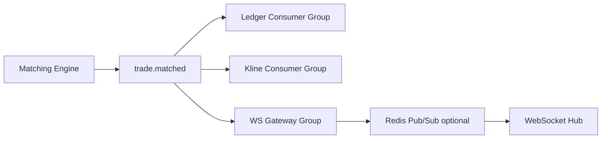

# Kafka 交易事件总线：成交广播与 lag 治理

## 30 秒版（开场）

> 交易所常见 **撮合 → Kafka 成交 topic → 多下游**（账务、风控、行情、WebSocket）。Kafka 做 **持久化事件总线**，Consumer Group 各自 lag 独立。生产关键词：**symbol 分区、consumer lag、HPA 扩缩 rebalance、WS 网关 fan-out**。

## 3 分钟版（一面深度）

1. **是什么**：撮合引擎产出 `TradeMatched` 事件写 Kafka；下游 Consumer Group 并行消费：账务入账、K 线聚合、推送网关。
2. **为什么**：解耦撮合与慢路径；可回放补账；比 Redis Pub/Sub **可持久、可重放**（见 [S-NET-05](../../06-network-governance/S-NET-05-websocket-gateway.md)）。
3. **怎么做**：topic 按业务拆分（`trade.matched` / `order.updates`）；key=`symbol`；监控 lag；扩 consumer 不超过 partition 数；WS 网关独立 group 或 Redis 中转 fan-out。

## 10 分钟版（架构）



| 下游 | Group | 关注点 |
|------|-------|--------|
| 账务 | `ledger-cg` | 幂等 `tradeId`、事务写库 |
| K 线 | `kline-cg` | 窗口聚合（[S-EXCH-10](../../14-dex-cex-engineering/S-EXCH-10-kline-event-aggregation.md)） |
| 风控 | `risk-cg` | 实时规则、可稍滞后 |
| 行情推送 | `ws-cg` | 低延迟；可只推 ticker 摘要 |

**lag 治理**

| 手段 | 说明 |
|------|------|
| 加 consumer | ≤ partition 数；否则 idle |
| 加 partition | 需规划；不能缩减 |
| 批量消费 | 提高吞吐，牺牲单条延迟 |
| 隔离慢消费 | 独立 topic/group，防阻塞账务 |
| K8s HPA on lag | 扩缩触发 rebalance（[S-CLOUD-05](../../09-cloud-native/S-CLOUD-05-hpa-autoscaling.md)） |

**与 RabbitMQ 选型**

- **Kafka**：高吞吐成交 flood、多 group 重复读、审计回放
- **RabbitMQ**：链上索引下游任务路由（见 [S-RAB-01](../rabbitmq/S-RAB-01-exchange-async-pipeline.md)）

## 生产场景

- **开盘 burst**：lag 飙升 → 预扩容 consumer + cooperative rebalance
- **补账回放**：重置 offset 或新建 group 从头消费（需幂等）
- **DEX 链上成交**：索引器写 Kafka 再驱动 K 线，与 CEX 撮合对称

## 排查与工具

```bash
kafka-consumer-groups.sh --bootstrap-server kafka:9092 \
  --describe --group ledger-cg
# 看 LAG、CURRENT-OFFSET、STATE
```

| 指标 | 告警 |
|------|------|
| `consumer_lag` | 持续 > 阈值 |
| rebalance rate | 扩缩过于频繁 |
| 端到端延迟 | produce → 消费完成 |

## 追问链

1. **WS 直连 Kafka 还是经 Redis？** → 小集群 Kafka 直推；多 WS 节点用 Redis/Kafka 二次 fan-out 减连接压力。
2. **成交顺序错了？** → 检查 key；消费端是否多 goroutine 乱序 commit。
3. **和 [S-EXCH-01](../../14-dex-cex-engineering/S-EXCH-01-cex-matching-engine.md) 关系？** → 撮合产事件；本题讲 **事件下游**。
4. **lag 能为 0 吗？** → 持续接近 0 是目标；burst 允许短暂堆积。

## 反模式与事故

- 账务与 K 线同 group 竞争 → 慢 K 线拖死账务
- 无 `tradeId` 幂等回放 → 重复入账
- HPA 激进 scale down → rebalance 风暴
- WS 网关消费全量 depth 推送 → 带宽打满

## 延伸阅读

- [S-KAFKA-01 架构](./S-KAFKA-01-architecture-storage.md)
- [S-DIST-04 消费语义](./S-DIST-04-kafka-semantics.md)
- [S-EXCH-11 WebSocket 行情 Hub](../../14-dex-cex-engineering/S-EXCH-11-websocket-market-hub.md)
