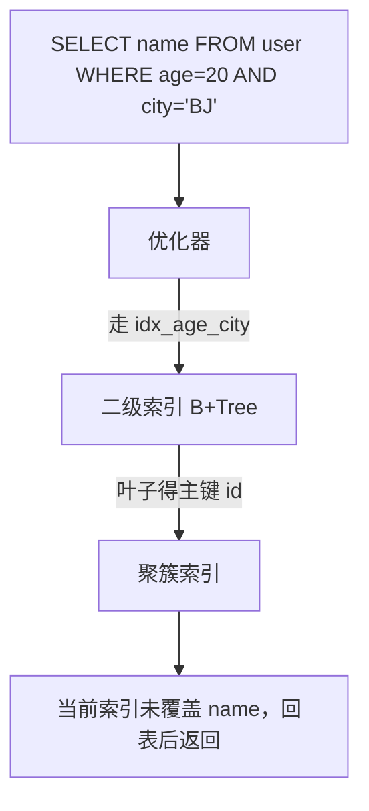

# MySQL 索引原理与最左前缀

<a id="oral-card"></a>

## 要点卡

[返回高频核心锚点](../../../high-frequency-roadmap.md)

!!! abstract "30 秒回答"

    InnoDB 用 B+Tree 聚簇索引组织行，二级索引叶子保存索引列和聚簇索引键；查询列未被覆盖
    时再按聚簇键回表。联合索引 `(a,b,c)` 的普通查找遵循最左前缀，可以利用 `(a)`、
    `(a,b)`、`(a,b,c)`，跳过 `a` 通常不能做普通前缀定位。索引设计必须结合 WHERE、JOIN、
    ORDER BY、回表成本和真实数据分布，用 `EXPLAIN ANALYZE` 验证。

**3 分钟展开**

1. 聚簇索引叶子是完整行；二级索引是独立 B+Tree，因此主键过宽会放大所有二级索引。
2. 联合索引列顺序先匹配查询模式：等值前缀、范围边界和排序，再评估选择性，不是机械地把
   最高选择性列永远放最左。
3. 范围条件后的列通常不能继续缩小扫描区间，但仍可能用于 ICP 或覆盖；MySQL 特定版本还可能
   选择 skip scan，不能把“最左前缀”说成优化器绝无例外。
4. 覆盖索引减少回表，但索引越宽，写放大、缓存占用和 DDL 成本越高。

| 记忆槽 | 内容 |
|--------|------|
| 三个不变量 | 索引服务于查询模式；二级索引回表取决于是否覆盖；最终以执行计划和真实分布为准 |
| 手画图 | `secondary B+Tree leaf(index cols + PK) → clustered B+Tree leaf(full row)` |
| 项目落点 | 订单/交易/返佣列表按租户或用户过滤并按时间排序，展示联合索引与 `EXPLAIN ANALYZE` 前后差异 |
| 一个取舍 | 覆盖索引降低读延迟，却增加写放大和存储；高写入表只保留收益可证明的索引 |

**错误表达**

- ❌ “范围条件右边的列全部失效；`SELECT *` 一定回表；选择性最高的列永远放最左。”
- ✅ “区分扫描区间、ICP、覆盖和聚簇访问，并以具体执行计划解释。”

**自测追问**：没有显式主键时 InnoDB 如何选聚簇键？为什么随机宽 UUID 可能增加索引成本？

## 10 分钟版（原理 + 图示）

**B+Tree 要点**

| 概念 | 说明 |
|------|------|
| 聚簇索引 | 叶子存完整行，一张表一个；优先使用主键，缺失时按唯一非空索引/隐藏索引规则选择 |
| 二级索引 | 叶子存索引列 + 聚簇索引键；聚簇索引是主键时通常表现为“存主键” |
| 回表 | 二级索引未覆盖所需列时，再按聚簇索引键读取完整行 |
| 覆盖索引 | 查询列全在索引中，Extra: Using index |
| ICP | 5.6+ 存储引擎层过滤，减少回表 |



**最左前缀**：索引 `(age, city, status)` — `WHERE age=20` ✓；`WHERE age=20 AND city='BJ'` ✓；`WHERE city='BJ'` ✗（除非优化器 index skip scan 8.0.13+ 特定场景）；`WHERE age=20 ORDER BY city` ✓ 可利用索引排序。

**常见限制**：对列函数/不匹配的隐式转换可能妨碍索引；`LIKE '%abc'` 不能用普通 B+Tree 前缀定位；联合索引遇到范围列后，右侧列通常不能继续缩小索引扫描区间，但仍可能用于 ICP 过滤或覆盖查询，不能笼统说“全部失效”。

## 生产场景

- **用户列表 `WHERE tenant_id=? ORDER BY created_at DESC`**：联合索引 `(tenant_id, created_at)` 覆盖过滤+排序。
- **登录 `WHERE email=?`**：唯一索引；邮箱过长用前缀索引需控制选择性。
- **慢查询 `LIKE 'prefix%'`**：可走索引；`%suffix` 只能全文或 ES。

## 排查与工具

| 工具 | 用途 |
|------|------|
| `EXPLAIN FORMAT=TREE` | 8.0 执行计划树 |
| `SHOW INDEX FROM t` | Cardinality 是否过期 |
| `pt-query-digest` | 慢 SQL 聚合 |
| Performance Schema | 未使用索引扫描 |

路径：慢查询 → EXPLAIN → type=ALL/rows 巨大 → 调整联合索引顺序或覆盖列 → 验证 `Using index`。

## 架构取舍

| 方案 | 适用 | 不适用 |
|------|------|--------|
| 联合索引 | 多条件组合查询 | 每列单独低选择性 |
| 覆盖索引 | 读多报表 | 索引过宽写慢 |
| 前缀索引 | 长字符串 | 无法 ORDER BY 该列 |
| 冗余索引合并 | 维护成本 | 已有左前缀覆盖 |
| ES/OLAP | 复杂搜索分析 | 强一致点查 |

## 深挖问答

1. **为什么用 B+Tree 不用 B-Tree？** → 叶子链表便于范围扫描；非叶子不存数据，扇出大。
2. **为什么常见自增主键？一定要用吗？** → 单调键通常能减少随机页写和页分裂，但也可能形成尾页热点、暴露规模，并不适合所有分布式 ID 场景。随机 UUID 通常更分散且索引更宽，应按写入局部性、分片和安全需求取舍。
3. **一个表多少索引？** → 没有通用 3~5 个上限；按读收益、写放大、存储和重复前缀评估，并用真实 workload 验证。
4. **Hash 索引？** → Memory 引擎支持；InnoDB 自适应 Hash 内部用，无用户 Hash 索引。
5. **Change Buffer？** → 二级索引非唯一、页不在 buffer 时延迟合并，写优化。

## 反模式与事故

- 每个 WHERE 列各建单列索引——优化器 merge 效率差、占空间。
- `SELECT *` 往往让二级索引难以覆盖并增加回表/网络开销，但若本来走聚簇索引就不存在“二次回表”；应按计划解释。
- 把 `ALGORITHM=INPLACE` 当成“无锁/瞬时完成”——`INPLACE` 不等于 `INSTANT`，也不自动等于 `LOCK=NONE`；是否允许并发 DML 取决于具体操作和 MySQL 版本，开始/结束阶段的 metadata lock、旧事务与资源开销仍可能阻塞业务。上线前要显式验证算法、锁级别和回滚方案。
- 凭直觉建 `(created_at, user_id)` 而查询总是先 `user_id`——最左原则用反。

## 代码示例

```sql
-- 联合索引 + 覆盖查询
CREATE INDEX idx_tenant_created ON orders (tenant_id, created_at DESC);

EXPLAIN SELECT id, created_at FROM orders
  WHERE tenant_id = 1001
  ORDER BY created_at DESC
  LIMIT 20;
-- Extra: Using index 表示覆盖，无回表
```

Go/GORM 侧确保 `Where("tenant_id = ?", id).Order("created_at desc")` 与索引列顺序一致。

## 延伸阅读

- [MySQL Index Optimization](https://dev.mysql.com/doc/refman/8.4/en/optimization-indexes.html)
- [InnoDB Clustered and Secondary Indexes](https://dev.mysql.com/doc/refman/8.4/en/innodb-index-types.html)
- [InnoDB Online DDL Operations](https://dev.mysql.com/doc/refman/8.4/en/innodb-online-ddl-operations.html)
- [EXPLAIN Output](https://dev.mysql.com/doc/refman/8.4/en/explain-output.html)
- [高性能 MySQL 索引章节](https://www.oreilly.com/library/view/high-performance-mysql/9780596101718/)
