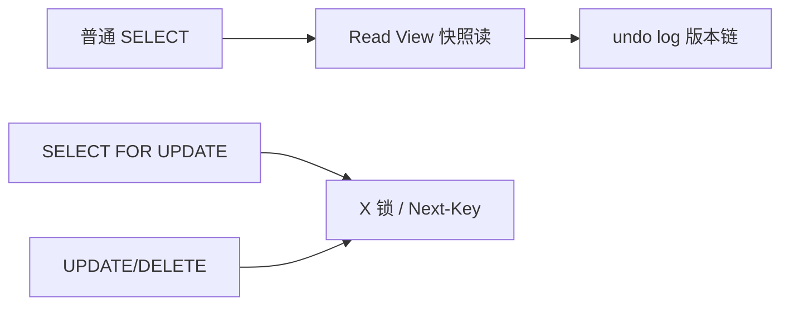

# 事务隔离级别与 MVCC

## 30 秒版（开场）

> InnoDB 默认 **REPEATABLE READ + MVCC**。普通一致性读复用快照，不会因为别的事务新插入而出现新的结果行；锁定读/DML 读取当前可用版本并加锁，范围条件通常用 **next-key lock（记录+间隙）** 阻止并发插入。不要把两种读法都笼统解释成“RR 靠间隙锁防幻读”。生产关键词：**长事务、undo 链、间隙锁死锁**。

## 3 分钟版（一面深度）

1. **是什么**：事务 ACID 中 I（隔离）由隔离级别定义；MVCC 用 undo log 多版本 + Read View 实现非锁定一致性读。
2. **为什么**：读写互斥锁吞吐低；快照读提高并发；写仍需锁保证正确性。
3. **怎么做**：RR/RC 的选择取决于语义和锁冲突；余额正确性来自条件更新、锁和事务不变量，不是“银行就选某个隔离级别”。避免长事务撑大 undo；高并发范围写需评估 next-key lock。

## 10 分钟版（原理 + 图示）

**隔离级别现象**

| 级别 | 脏读 | 不可重复读 | 幻读 |
|------|------|------------|------|
| READ UNCOMMITTED | 可能 | 可能 | 可能 |
| READ COMMITTED | 否 | 可能 | 可能 |
| REPEATABLE READ | 否 | 否 | 一致性读靠固定快照；锁定范围读通常靠 next-key lock |
| SERIALIZABLE | 否 | 否 | 否 |



**MVCC**：每行隐藏列 `DB_TRX_ID`、`DB_ROLL_PTR`；Read View 判定版本可见性。RR 默认在事务内第一次**一致性读**时建立快照并复用（也可显式以 consistent snapshot 开始）；RC 每次一致性读建立新快照。锁定读不是复用这个历史快照。

**当前读与锁**：`FOR UPDATE`、`FOR SHARE`（旧写法 `LOCK IN SHARE MODE`）和 DML 会读取当前可用版本并加锁；**Record Lock** 锁索引记录，**Gap Lock** 锁间隙，**Next-Key** = 记录+前方间隙，用于阻止锁定范围内插入。唯一索引等值命中通常只需记录锁；范围扫描的锁范围取决于实际使用的索引。RC 通常禁用 gap locking，但外键和重复键检查等仍有例外。

## 生产场景

- **余额扣减**：`BEGIN; SELECT balance FROM account WHERE id=1 FOR UPDATE; UPDATE ...` 当前读防并发超扣。
- **报表统计**：RC 的不同语句可能看到其各自语句开始前已提交的新数据；RR 的普通一致性读默认复用第一次一致性读建立的快照。
- **批量删 `WHERE status=0 LIMIT 1000`**：RR 下可能 gap lock 相邻范围，与插入死锁——改 RC 或小批次。

## 排查与工具

| 工具 | 用途 |
|------|------|
| `SHOW ENGINE INNODB STATUS` | 死锁、锁等待 |
| `information_schema.innodb_trx` | 长事务 trx_started |
| `performance_schema.data_locks` | 8.0 锁详情 |
| `SELECT @@transaction_isolation` | 当前级别 |

路径：死锁日志 → 两事务 next-key 冲突 → 是否 RR + 范围更新 → 改索引精确行或降 RC。

## 架构取舍

| 方案 | 适用 | 不适用 |
|------|------|--------|
| RR 默认 | 通用 OLTP | 高并发插入+范围查 |
| RC | 减少间隙锁、Oracle 习惯 | 需防不可重复读 |
| 乐观锁 version | 读多冲突少 | 高冲突扣库存 |
| 悲观锁 FOR UPDATE | 强一致扣减 | 长临界区 |
| 分库分表 | 锁粒度缩小 | 跨库无 MVCC |

## 深挖问答

1. **快照读和当前读？** → 普通 SELECT vs 锁定读/DML。
2. **RR 如何避免幻读？** → 快照读 MVCC；当前读 next-key lock。
3. **undo log 作用？** → 回滚、MVCC 旧版本；长事务阻止 purge 致空间膨胀。
4. **幻读例子？** → 事务 A 两次 `SELECT COUNT(*)` 之间 B 插入满足条件行。
5. **Go sql.Tx 隔离？** → 可请求 `db.BeginTx(ctx, &sql.TxOptions{Isolation: sql.LevelRepeatableRead})`，但驱动/数据库是否支持该级别、如何映射以及不支持时返回什么错误都要实测，不能只看 Go 常量。

## 反模式与事故

- 事务内调 HTTP 30s——锁/Read View 持有，阻塞 purge 与别的事务。
- 无合适索引的 `UPDATE` 会扫描并锁住大量记录/间隙，效果可能接近“整表被堵”，但不是简单的一把 table lock。
- 把“RR 防幻读”背成所有读法完全相同：一致性读靠固定快照，锁定读靠 next-key lock；混用快照读与当前读时要明确各自语义。
- 误以为 GORM 会把整个 HTTP 请求自动包成一个事务——默认事务主要保护单次 create/update/delete；多步业务不变量仍需显式事务、超时和隔离策略。

## 代码示例

```go
tx, err := db.BeginTx(ctx, &sql.TxOptions{Isolation: sql.LevelReadCommitted})
if err != nil {
    return err
}
defer tx.Rollback()

var balance int64
err = tx.QueryRowContext(ctx,
    "SELECT balance FROM account WHERE id = ? FOR UPDATE", id).Scan(&balance)
// 检查余额后 UPDATE，Commit
```

## 延伸阅读

- [InnoDB Isolation Levels](https://dev.mysql.com/doc/refman/8.4/en/innodb-transaction-isolation-levels.html)
- [Consistent Nonlocking Reads](https://dev.mysql.com/doc/refman/8.4/en/innodb-consistent-read.html)
- [Locking Reads](https://dev.mysql.com/doc/refman/8.4/en/innodb-locking-reads.html)
- [MySQL 锁与 MVCC（极客时间摘要）](https://time.geekbang.org/column/article/696613)
