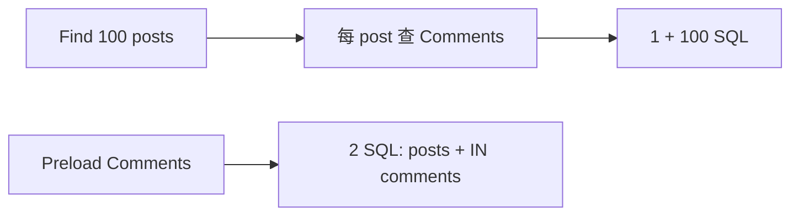

# GORM 预加载 N+1 与事务陷阱

## 30 秒版（开场）

> **N+1**：查 N 条主记录后对每条再查关联，SQL 爆炸。GORM 用 **`Preload`/`Joins`** 预加载；`Find` 嵌套 struct 不会自动加载。**事务陷阱**：`Transaction` 回调和 Hook 中都要沿用 GORM 传入的 `tx`；Hook 的 `tx` 与当前写操作处于同一事务，真正会逃逸的是改用捕获的全局 `DB`。生产关键词：**Session、Clauses、连接池、软删 Scope**。

## 3 分钟版（一面深度）

1. **是什么**：ORM 便利但易隐藏查询；N+1 是循环访问关联；事务中混用全局 `DB` 与 `tx` 导致部分提交或锁失效。
2. **为什么**：GORM 不会因访问 struct 字段自动懒加载；N+1 常来自应用在循环里显式再查关联。`Logger`/trace 能暴露多条 SELECT；钩子必须使用传入的 `tx *gorm.DB`。
3. **怎么做**：列表用 `Preload("Comments")` 或 `Joins`+`Select`；批量用 `Preload(clause.Associations)` 谨慎；写操作用 `db.Transaction(func(tx *gorm.DB) error { ... })`；调试开 `DryRun`/`Debug()`。

## 10 分钟版（原理 + 图示）

**N+1 对比**

| 写法 | SQL 数 | 说明 |
|------|--------|------|
| `Find(&posts)` 后循环 `post.Comments` | 1+N | 典型 N+1 |
| `Preload("Comments").Find(&posts)` | 2 | IN 查子表 |
| Join preload | 1 | 官方关联 Join Preload 主要面向 one-to-one；has-many 需显式 JOIN/Scan 并处理行膨胀 |
| 传统 API `Preload(... Limit(5))` | 通常 2 | `Limit` 作用于整条关联查询，不等于每个父记录各 5 条 |



**事务陷阱**：Transaction 回调中误用全局 `db.Create` 会脱离 `tx`；Hook 内误用全局 DB 也一样。GORM 默认把 create/update/delete 包在事务中，只有显式 `SkipDefaultTransaction` 才关闭该保护；跨多条业务语句仍必须自己开启事务。

**其他坑**：`Updates(struct)` 默认忽略零值，`Updates(map)` 会更新指定零值且正常 update hooks 仍可能执行；要跳过 hooks 需明确使用相应 Session/方法。另注意软删 Scope、`ErrRecordNotFound` 与大 `IN` 列表。

## 生产场景

- **博客列表带评论作者**：`Preload("Comments").Preload("Comments.User")` 通常是固定 3 条查询（posts、comments、users），不是 2 条；收益是把随父/子行数增长的 N+1 降成固定查询数（见 demo）。
- **转账**：`db.Transaction` 内两笔 `tx.Model().Update` + 行锁 `clause.Locking{Strength: "UPDATE"}`。
- **钩子更新计数**：`AfterCreate` 应使用 Hook 参数 `tx` 更新 `posts_count`；若误用全局 DB，更新可能逃离当前事务，主记录回滚后计数却已提交。

## 排查与工具

| 工具 | 用途 |
|------|------|
| GORM Logger Info | 打印每条 SQL |
| `db.DryRun` | 只看 SQL 不执行 |
| APM（Datadog/Jaeger） | DB span 数量 |
| go-sqlmock | 单测断言查询次数 |

路径：接口 RT 随列表长度线性涨 → 开 SQL log 数条数 → 加 Preload → 压测对比。

## 架构取舍

| 方案 | 适用 | 不适用 |
|------|------|--------|
| Preload | 一对多、多对多 | 极大关联集 |
| Joins | 需过滤关联字段 | 多对多重复行 |
| 原生 SQL | 复杂报表 | 简单 CRUD |
| 禁用钩子 | 性能敏感 | 依赖计数一致性 |
| sqlx | 轻量可控 | 快速迭代 |

## 追问链

1. **Preload 和 Joins 区别？** → Preload 用额外 SQL 装配关联；Join Preload 适合 one-to-one。has-many 若手写 JOIN，会产生父行重复，需明确 Scan/聚合方式，不能只加 `Distinct` 就假定关联自动装好。
2. **钩子事务？** → 回调参数 `tx` 与创建操作同一事务。
3. **如何避免 N+1 无 Preload？** → 手动 `WHERE post_id IN (?)` 一次查评论再组装 map。
4. **GORM 连接池？** → 底层 `*sql.DB` 设 `SetMaxOpenConns` 等。
5. **软删影响 Preload？** → 默认带 `deleted_at IS NULL`；`Unscoped` 可查已删。

若需要“每个父记录最多 N 条关联”，使用支持 `LimitPerRecord` 的 GORM generics preload、窗口函数/原生 SQL，不能把传统 Preload 的全局 `Limit(N)` 当作 per-parent limit。

## 反模式与事故

- 列表 100 条未 Preload——101 次查询打满连接池。
- Transaction 内用 `DB.Create` 非 `tx.Create`——半成功脏数据。
- `Updates(struct)` 想更新零值字段——应用 `map` 或 `Select`。
- 钩子里再调 HTTP——事务长时间持锁。

## 代码示例

```go
// 正确：Preload 避免 N+1（摘自 gorm/demo）
func getUserPostsWithComments(userID uint) ([]Post, error) {
    var posts []Post
    err := DB.Where("user_id = ?", userID).
        Preload("Comments").
        Preload("Comments.User").
        Find(&posts).Error
    return posts, err
}

// 正确：事务 + 钩子使用 tx
func transfer(db *gorm.DB, from, to uint, amount int64) error {
    return db.Transaction(func(tx *gorm.DB) error {
        if err := tx.Clauses(clause.Locking{Strength: "UPDATE"}).
            First(&Account{}, from).Error; err != nil {
            return err
        }
        // tx.Model(...).Update(...)
        return nil
    })
}
```

可运行示例见 [`gorm/demo/main.go`](https://github.com/twodog-tt/Golang-development-manual/blob/master/gorm/demo/main.go)（关联查询、钩子与 Preload SQL 日志）。

## 延伸阅读

- [GORM Preload](https://gorm.io/docs/preload.html)
- [GORM Transactions](https://gorm.io/docs/transactions.html)
- [GORM Hooks](https://gorm.io/docs/hooks.html)
