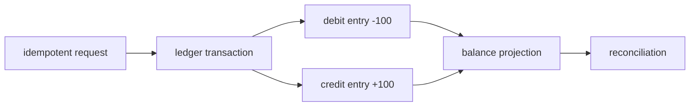

# 资金类表设计：DECIMAL、约束、锁与死锁

## 30 秒版（开场）

> 金额不能用 `FLOAT/DOUBLE` 做账。先定义资产精度和最大范围，再选整数最小单位、`DECIMAL(p,s)` 或原始大整数编码；MySQL `DECIMAL` 最大精度有限，不能直接假设可容纳所有 uint256。账本流水应不可变，并在同一账簿、资产/币种和计量单位内保持借贷平衡；幂等键和唯一约束负责防重复，余额只是投影。entry、余额投影和 outbox 等原子状态要在同一数据库事务中提交。并发更新要固定完整资源键的锁顺序、缩短事务，并安全重试 deadlock。

## 3 分钟版（一面深度）

1. **数值域**：法币通常固定小数位；链上 token decimals 与总量各异，必须按资产元数据验证。
2. **账本模型**：transaction/header + 多条 immutable entries；平衡不变量必须限定在同一 tenant/book、资产/币种和计量单位内。跨资产兑换通常要为每个资产分别形成平衡分录，不能把 BTC 与 USDT 的名义数量直接相加后声称“总和为零”。
3. **幂等与约束**：`UNIQUE(tenant_id, idempotency_key)`、外部引用唯一、状态 CHECK；跨行平衡仍需同事务应用逻辑。
4. **并发**：按规范化资源键（例如 `tenant_id, book_id, account_id, asset_id`）排序加锁；发生 deadlock 回滚后，从事务最外层带退避重试，副作用必须幂等。

## 10 分钟版（原理 + 图示）



**金额存储选择**

| 方案 | 适用 | 边界 |
|------|------|------|
| `BIGINT` 最小单位 | 范围可证明的资产 | 溢出前必须校验 |
| `DECIMAL(p,s)` | 固定业务精度、SQL 聚合 | `p/s` 是领域约束，不是越大越好 |
| 32-byte/字符串大整数 | 原始 uint256、跨链保真 | SQL 算术不便，需应用层安全解析 |

MySQL `DECIMAL` 的最大精度是 65 位，而 uint256 最大值需要 78 个十进制数字。因此“统一 `DECIMAL(65,0)` 存所有 EVM uint256”是错误表达。常见做法是同时保留链上 raw amount（可无损编码）与受业务资产范围约束的 ledger amount。

**简化表结构**

```sql
CREATE TABLE ledger_transactions (
  id BIGINT PRIMARY KEY,
  tenant_id BIGINT NOT NULL,
  idempotency_key VARBINARY(64) NOT NULL,
  status VARCHAR(16) NOT NULL,
  created_at TIMESTAMP(6) NOT NULL,
  UNIQUE KEY uk_tenant_idempotency (tenant_id, idempotency_key),
  CHECK (status IN ('posted', 'reversed'))
);

CREATE TABLE ledger_entries (
  id BIGINT PRIMARY KEY,
  transaction_id BIGINT NOT NULL,
  account_id BIGINT NOT NULL,
  asset_id BIGINT NOT NULL,
  amount DECIMAL(36, 18) NOT NULL,
  created_at TIMESTAMP(6) NOT NULL,
  KEY ix_account_time (account_id, created_at, id)
);
```

`DECIMAL(36,18)` 只是示例，真实精度要由支持资产范围推导。SQL CHECK 不能验证多行 entry 的平衡；应用应在同一数据库事务内按 tenant/book/asset/单位校验并写入全部 entry 与余额投影，再由离线审计复核。

**锁与死锁**

两个转账若分别先锁 A 后 B、先锁 B 后 A，就可能死锁。统一按完整资源键而不是只按裸 `account_id` 排序获取锁，可避免多租户/多资产下排序不一致并大幅降低死锁概率；但索引范围、gap lock、其他语句和外键仍可能形成环，因此仍要处理 deadlock。

## 生产场景

- 转账：在同一数据库事务中锁定/条件更新余额投影、写 immutable entries 与 outbox；事务提交后再由 relay 发布事件。
- 链上充值：observation、业务入账和最终性状态分离；reorg 用 reversal transaction，不删除原流水。
- 提现：available → reserved → broadcast → finalized/failed，预占和释放都有独立流水。

## 排查与工具

```sql
SHOW ENGINE INNODB STATUS;
SELECT * FROM performance_schema.data_locks;
SELECT * FROM performance_schema.data_lock_waits;
```

记录 deadlock victim、SQL digest、事务耗时和重试次数。重试必须从事务最外层重新执行；不要在已经产生外部 RPC/消息副作用后盲重试。

## 架构取舍

缓存余额可加速读，但数据库账本/可审计事件仍是事实来源。直接覆盖余额字段最简单，却无法解释历史、冲正和对账差异；资金系统通常值得承担双分录与投影复杂度。

## 追问链

1. **为什么不用 float64？** → 二进制浮点不能精确表示多数十进制小数，累加和比较会产生账差。
2. **DECIMAL 越大越好吗？** → 否；要明确范围、精度、索引/存储与应用映射，而且仍容纳不了全部 uint256。
3. **死锁是不是 bug？** → 可能由锁顺序 bug 放大，但在并发数据库中仍应视为可发生并实现安全重试。
4. **余额怎么防负数？** → 同事务锁定/条件更新 + 领域约束；单行 CHECK 不能覆盖所有跨行语义。
5. **外部 RPC 放事务里吗？** → 不放；会长时间持锁。用状态机、outbox 和幂等补偿衔接。

## 反模式与事故

- 链上 amount 先转 `float64` 再入库，出现精度损失。
- 余额投影、entry 或 outbox 分开提交，进程崩溃留下不可审计状态或已入账但未发事件。
- deadlock 后只重试最后一条 SQL，而事务早已整体回滚。
- 在事务中调用链节点/HSM，网络抖动导致锁等待扩散。

## 延伸阅读

- [DECIMAL Characteristics](https://dev.mysql.com/doc/refman/8.4/en/precision-math-decimal-characteristics.html)
- [InnoDB Locking](https://dev.mysql.com/doc/refman/8.4/en/innodb-locking.html)
- [Deadlocks in InnoDB](https://dev.mysql.com/doc/refman/8.4/en/innodb-deadlocks.html)
- [CHECK Constraints](https://dev.mysql.com/doc/refman/8.4/en/create-table-check-constraints.html)
