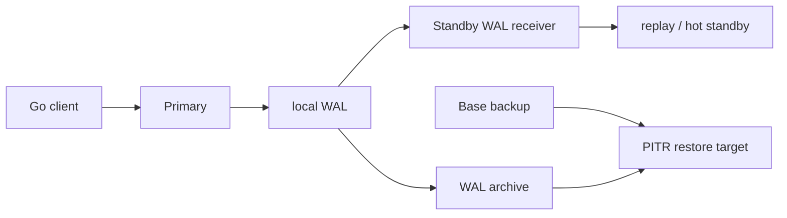

# PostgreSQL WAL、复制、故障切换与 pgx 连接治理

<a id="oral-card"></a>

## 口述卡（高频必背）

[返回 P0 知识图谱](../../_meta/p0-knowledge-graph.md)

!!! abstract "30 秒回答"

    WAL 的核心是不先把脏数据页当成提交证据，而是先把描述变更的日志持久化；但客户端收到 commit 成功究竟证明了“本机落盘、备机收到、备机落盘还是备机已回放”，取决于 `synchronous_commit` 和同步备配置。流复制默认异步，failover 仍要定义 RPO/RTO、leader fencing、timeline 与重接策略。Go 侧的 `pgxpool` 只是连接复用器，不会替你处理事务回滚、池容量、慢查询、主备陈旧读和 unknown commit。

**3 分钟展开**

1. **WAL**：修改数据页前，相关 WAL 必须先到达规定的持久化边界；恢复时可 redo 已记录变更。
2. **物理流复制**：standby 接收并回放 WAL；默认异步，primary 成功不代表 standby 已收到。
3. **归档 + base backup**：用于 PITR；“有一台 replica”不等于有可恢复到任意时间点的备份。
4. **failover**：不仅是把 VIP/域名切走，还要阻止旧 primary 继续接受写入、确认新 timeline、
   处理连接池和陈旧 DNS，并验证数据损失窗口。
5. **pgxpool**：池上限按数据库总连接预算分配；事务占用一条连接，必须 commit/rollback；
   初始化后应 `Ping` 验证可达性，并监控 acquire 等待。

| 记忆槽 | 内容 |
|--------|------|
| 三个不变量 | commit ACK 证据取决于 WAL/同步提交配置；流复制默认异步；failover 必须 fencing；连接池不提供 HA 语义 |
| 手画图 | `client → primary WAL → standby receive/flush/replay`，旁接 archive+base backup 与 fencing |
| 项目落点 | 用实际订单/账本数据库说明 RPO/RTO、主切换、连接重建和 unknown commit 对账；只引用本人实际参与部分和可解释指标 |
| 一个取舍 | 同步提交降低 RPO 但增加 RTT/可用性耦合；异步延迟低却必须接受并量化数据损失窗口 |

**错误表达**

- ❌ “有 replica 就是零 RPO 且等于备份；pgxpool 会自动安全处理主备切换和未知提交。”
- ✅ “复制、备份、PITR、failover 是不同能力；客户端必须重连、重试分类并查询权威事实。”

**自测追问**：`remote_write`、`on`、`remote_apply` 分别等待到哪里？旧 primary 如何防止恢复后继续写？

## 10 分钟版（提交证据与 HA）

### commit ACK 到底证明什么

`synchronous_commit` 常见取值可这样回答：

| 值 | 提交等待边界（简化） | 仍然存在的风险 |
|----|----------------------|----------------|
| `off` | 不等待本地 WAL flush | 数据库崩溃可能丢失近期已 ACK 事务，但不会因此产生数据库不一致 |
| `local` | 等本地 WAL flush | 不等同步 standby |
| `remote_write` | 还等同步 standby 的 OS 收到并写出 | standby OS 崩溃仍可能未持久化 |
| `on` | 还等同步 standby flush 到持久存储 | standby 可能尚未 replay，读仍看不到 |
| `remote_apply` | 还等同步 standby replay | 延迟更高，且仍要考虑同步备数量与失效策略 |

表格是面试用简化；真实保证还取决于 `fsync`、存储、`synchronous_standby_names`、同步备数量、
故障模式和运维是否真的阻止双主。如果 `synchronous_standby_names` 为空，
`remote_apply`、`remote_write`、`local` 在远端等待方面都不会凭空增加保证，非 `off`
模式只等待本地 WAL flush；不要把参数名直接翻译成“绝对零丢失”。

### 复制、slot 与 PITR



- replication slot 可防止 primary 过早删除消费者所需 WAL；消费者停滞也可能让 `pg_wal`
  无限增长，必须监控 retained bytes 和 slot 活性。
- hot standby 查询可能与 WAL replay 冲突。允许查询长期阻塞 replay 会放大陈旧读；
  `hot_standby_feedback` 可减少部分冲突，却可能让 primary 保留更多 dead tuple。
- 逻辑复制按逻辑变更发布/订阅，适合选择性迁移和集成；它不是物理 HA 的同义词，DDL、
  sequence、扩展和切换流程都要单独设计。
- PITR 需要可用 base backup、连续 WAL 归档、恢复配置和定期演练；只检查“文件上传成功”不够。

### failover 状态机

```text
detect -> establish quorum/authority -> fence old primary
       -> choose candidate by accepted loss policy
       -> promote and publish new epoch/timeline
       -> reroute clients -> verify writes/read freshness
       -> rebuild old node as replica, never rejoin as writer directly
```

核心不变量：

- 任一时刻只有被当前 authority 授权的 primary 能接受写入。
- 提升候选必须满足业务定义的 WAL/LSN 水位，不是“看起来最健康”。
- 应用对 commit 结果 unknown 的请求用业务幂等键查事实，不能盲目重放副作用。
- RPO/RTO 要通过故障演练测量；架构图上的“同步复制”不是验收记录。

读写分离还要声明一致性策略：强 read-after-write 走 primary，或携带已提交 LSN 并等待 replica
追到水位；单纯 sleep、随机挑 replica 或把负载均衡器健康等同于 replay 新鲜度都不可靠。

## pgxpool 连接治理

`pgxpool.New`/`NewWithConfig` 创建池时不保证已建立可用连接；启动门禁通常显式 `Ping`。关键参数
不是越大越好：

```text
应用总预算 = 数据库 max_connections
           - 超级用户/运维/迁移/复制保留
每实例 MaxConns <= 应用总预算 / 最大应用副本数
```

还要给故障扩容和滚动发布同时存在的新旧副本留余量。

```go
tx, err := pool.BeginTx(ctx, pgx.TxOptions{
    IsoLevel: pgx.Serializable,
})
if err != nil {
    return err
}
defer func() {
    // 不沿用可能已经取消的请求 ctx，也不使用无限期 Background。
    cleanupCtx, cancel := context.WithTimeout(context.Background(), 5*time.Second)
    defer cancel()
    _ = tx.Rollback(cleanupCtx) // Commit 成功后返回 ErrTxClosed，可忽略
}()

// 所有 SQL 显式使用有 deadline 的 context。
// ...
return tx.Commit(ctx)
```

需要知道的边界：

- `Begin`/`BeginTx` 的 context 只约束开始事务的命令，不会因后续 context 取消而自动 rollback。
- rollback cleanup 需要独立且有界的 context；沿用已取消的请求 context 可能无法发出
  `ROLLBACK`，无限期 `context.Background()` 又可能把清理卡住。
- 事务在结束前独占池连接；事务里等待外部 RPC 会迅速耗尽池。
- `MaxConnLifetime`、jitter、idle time 和 health check 用于连接生命周期，不会修复慢 SQL。
- 监控 `AcquiredConns`、`IdleConns`、`EmptyAcquireCount`、`AcquireDuration`、连接创建失败、
  SQL latency 和数据库端 active/idle-in-transaction。
- failover 后要允许旧连接失败并重建；不要无限重试同一个已失效连接，也不要把所有 SQLSTATE
  当瞬时网络错误。

## 生产故障定位

| 现象 | 先查 | 不应直接得出的结论 |
|------|------|--------------------|
| replica lag 上升 | receive/replay LSN、I/O、冲突查询、WAL 速率 | “网络慢” |
| primary `pg_wal` 爆满 | slot、归档失败、standby 状态 | “加磁盘就好了” |
| failover 后重复扣款 | unknown commit、幂等键、旧主 fencing | “数据库回滚失效” |
| Go 请求排队 | pool acquire 指标、事务时长、慢 SQL | “MaxConns 太小” |
| replica 查不到刚写数据 | replay 水位、路由、read-after-write 策略 | “复制坏了” |
| PITR 恢复失败 | base backup、WAL 连续性、目标 timeline | “备份文件存在就应可恢复” |

## 架构取舍

- **异步复制**：写延迟和可用性更好，但接受明确 RPO。
- **同步复制**：缩小部分故障下的 RPO，代价是延迟与同步备可用性；仍需正确 fencing。
- **`remote_apply`**：需要同步备可见性时有价值，不应默认给所有写路径付出成本。
- **连接代理/池化器**：可降低连接风暴，但 transaction/statement pooling 对 session state、
  prepared statement、临时对象等有语义影响。
- **逻辑迁移**：便于渐进切换；必须有 schema 兼容、lag、水位、校验和回滚计划。

## 追问链

1. **WAL 落盘是否表示数据页也已落盘？**  
   不需要；恢复可用 WAL redo 数据页，这是 write-ahead 的意义。
2. **同步复制是否保证零数据丢失？**  
   只能在声明的提交边界和故障假设内缩小 RPO；错误的同步备配置、双主、存储故障或运维误操作
   仍可能破坏目标。
3. **replication slot 为什么危险？**  
   它保护消费者所需 WAL，也可能因消费者停滞持续占满 primary 磁盘。
4. **为什么连接池不能开到数据库上限？**  
   还要给所有副本、运维、复制和部署重叠留预算；过多并发会把排队转移到数据库内部。
5. **commit 返回网络错误怎么办？**  
   结果是 unknown；以业务幂等键查询数据库事实，不能直接当失败重放。

## 反模式与错误表达

- “有 WAL 就不会丢数据。”
- “有 replica 就等于有备份和 PITR。”
- “同步复制就是任何故障下 RPO=0。”
- “负载均衡器健康就代表 replica 已追平。”
- “`pgxpool.New` 成功说明数据库已可用。”
- “context 取消后 pgx 会自动回滚事务。”
- “连接不够就一直调大 `MaxConns`。”

## 延伸阅读

- [WAL Reliability](https://www.postgresql.org/docs/current/wal-reliability.html)
- [Warm Standby and Streaming Replication](https://www.postgresql.org/docs/current/warm-standby.html)
- [Continuous Archiving and PITR](https://www.postgresql.org/docs/current/continuous-archiving.html)
- [pgxpool API](https://pkg.go.dev/github.com/jackc/pgx/v5/pgxpool)
