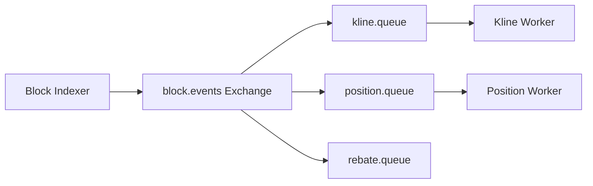

!!! tip "⭐ 重点准备"
    Web3 交易所 / 钱包方向高频题，见 [重点准备题单](../../../resume-focus-web3.md)。

# RabbitMQ 拆分链上监听与业务写入

## 30 秒版（开场）

> 链上 **RPC 扫块** 与 **业务写库** 必须解耦：监听进程只负责解析 logs → 发 **RabbitMQ** → 多消费者处理 K 线、持仓、返佣、排行榜。生产关键词：**Publisher Confirm、手动 ACK、DLX 死信、prefetch、队列隔离**。

## 3 分钟版（一面深度）

1. **是什么**：AMQP 模型 Exchange → Queue → Consumer；比 Kafka 更重 **路由灵活性**（direct/topic）。
2. **为什么**：DEX 后端常需 **多下游** 同事件不同处理速度；监听不能 blocked 在慢 SQL。
3. **怎么做**：`block.events` topic exchange；routing key `swap.{token}`；各业务独立 queue + consumer 组。

## 10 分钟版（拓扑）



| 模式 | 用途 |
|------|------|
| Topic Exchange | 按事件类型/Token 路由 |
| 手动 ACK | 处理成功再 ack；失败 nack 重试 |
| DLX + TTL |  poison message 进死信队列人工处理 |
| Prefetch | 限制 unacked 防 OOM |

**Go 客户端要点**（`amqp091-go`）

```go
ch.Qos(prefetch, 0, false) // 公平分发
deliveries, _ := ch.Consume(queue, "", false) // autoAck=false
for d := range deliveries {
    if err := handle(d.Body); err != nil {
        d.Nack(false, true) // requeue 或进 DLX
        continue
    }
    d.Ack(false)
}
```

## 生产场景

- **监听与写入解耦**：RPC 抖动时队列缓冲；lag 监控 `queue_depth`
- **与 Kafka 选型**：RabbitMQ 适合 **任务路由、较低吞吐**；Kafka 适合 **超高吞吐日志**（[S-RMQ-03](../rocketmq/S-RMQ-03-vs-kafka.md)）

## 追问链

1. **消息丢失？** → Publisher Confirm + 持久化 queue + 消费手动 ACK。
2. **顺序性？** → 单 queue 单 consumer；或按 token 分片 queue。
3. **和 RocketMQ 对比？** → 国内 CEX 常见 Kafka/RocketMQ；BSC DEX 项目常用 RabbitMQ 轻量部署。

## 反模式

- autoAck=true → 处理失败丢消息
- 所有事件一个 queue → 慢消费者阻塞快路径
- 无 DLX → 毒消息无限 requeue

## 延伸阅读

- [S-BC-05 索引器](../../12-blockchain-web3/S-BC-05-indexer-reorg.md)
- [S-RMQ-03 RocketMQ vs Kafka](../rocketmq/S-RMQ-03-vs-kafka.md)
