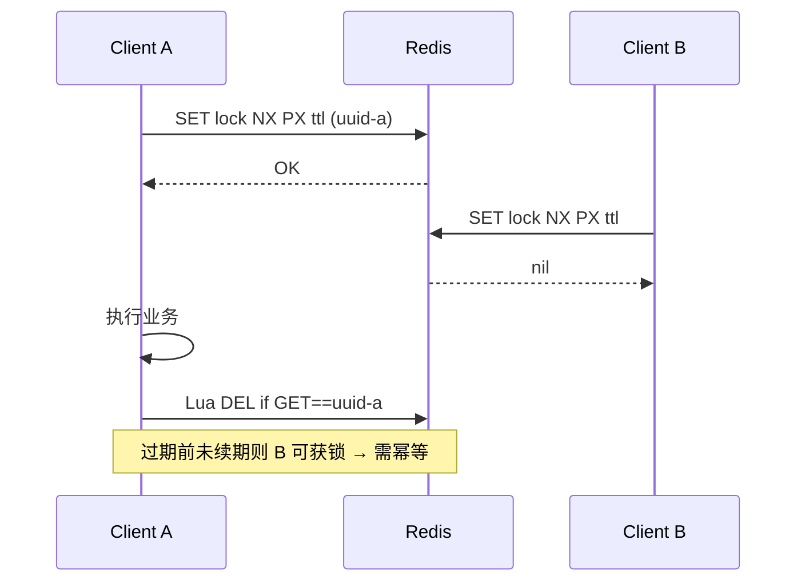

# 分布式锁与 Redlock 争议

## 30 秒版（开场）

> 分布式锁解决 **多进程/多机协调**，但“拿到锁”不等于旧持有者绝不会继续写。Redis `SET key NX PX` 适合可容忍极端重复执行的效率型锁；正确性关键场景还需数据库约束、幂等或 **fencing token**。Redlock 的时钟/暂停假设存在公开争议。

## 3 分钟版（一面深度）

1. **是什么**：在 Redis/etcd/ZooKeeper 上实现的跨实例协调原语，目标是在其时钟、租约、网络和存储故障假设成立时授予一个有效持有者。租约过期、进程暂停或异步故障转移时，新旧进程可能同时继续执行，因此不能把它表述为无条件的“任意时刻绝对只有一个执行者”。
2. **为什么**：数据库行锁无法覆盖跨服务资源（如定时任务、库存扣减前的全局序列）；进程内 `sync.Mutex` 无法跨 Pod。
3. **怎么做**：Redis 单主：`SET lock:order:123 uuid NX PX 30000`；释放/续期都用原子脚本校验 owner。watchdog 只能续租，不能覆盖进程暂停超过 TTL。正确性关键场景优先把约束放入 DB 事务/唯一键，或用 etcd lease + revision 生成 fencing token。

## 10 分钟版（原理 + 图示）

**Redis 单节点锁流程**



**Redlock**：向 N 个独立 Redis master 依次加锁，过半成功且总耗时 < TTL 视为成功；释放向所有节点发 Lua。争议点：进程 STW/GC 超过 TTL 后仍以为自己持锁；各节点时钟漂移；**无 fencing** 时旧持有者写可能覆盖新持有者。

**单主复制也不是正确性证明**：若锁只写入 Redis primary、尚未异步复制就发生故障转移，新 primary 可能让另一个客户端再次拿到同一锁。`SET NX PX` + owner 校验解决的是单实例上的原子获取/释放，不自动消除复制故障窗口。

**etcd 对比**：基于 Raft 的 `concurrency.Mutex`，session lease 过期自动释放；锁获取可线性一致，但暂停的旧进程仍可能在 lease 丢失后继续操作外部系统，因此同样要检查 session 或让下游拒绝旧 fencing token。

## 生产场景

- **定时任务单跑**：Cron 多副本同时触发时可用 `lock:job:daily-settle` 降低重复概率，但“最大耗时 + 缓冲”的 TTL 不是正确性证明；任务还需硬 deadline、幂等键/唯一约束，必要时用 fencing，让租约失效后的旧执行者不能提交结果。
- **订单号生成**：非锁方案更优（雪花/号段）；若用锁，粒度到 `user_id` 而非全局。
- **库存扣减**：应用层锁 + DB 乐观锁/Redis Lua 原子扣减组合，避免锁持有时间过长。

## 排查与工具

| 工具 | 用途 |
|------|------|
| `redis-cli --scan --pattern 'lock:*'` | 枚举候选锁 key；生产上避免阻塞式 `KEYS` |
| 对具体 key 执行 `GET key`、`PTTL key` | 查看 holder 与剩余租期；`GET/TTL` 不接受通配符 |
| 业务日志 uuid | 追踪谁持锁 |
| redsync / go-redis 指标 | 加锁失败率、等待时间 |

路径：任务重复执行 → 查锁 key 是否存在、TTL 是否过短 → GC pause 日志 → 考虑 etcd 或 DB 唯一约束替代。

## 架构取舍

| 方案 | 适用 | 不适用 |
|------|------|--------|
| Redis SET NX + Lua | 低延迟、可接受极端边界 | 金融级强一致 |
| Redlock 多主 | 历史方案，新系统慎用 | Kleppmann 指出的场景 |
| etcd Mutex | 强一致、lease 清晰 | 高 QPS 短锁 |
| DB 唯一索引 / 乐观锁 | 与事务一体 | 纯缓存层互斥 |
| 消息分区单消费者 | 顺序消费即互斥 | 需即时互斥 |

## 深挖问答

1. **为什么释放要用 Lua？** → GET+DEL 非原子，可能删掉别人的锁。
2. **TTL 设多少？** → 临界区必须有可证明的 deadline；TTL 要覆盖预算并配合续期。只看 P99 意味着仍有约 1% 操作可能越界，不能作为正确性证明。
3. **Redlock 问题本质？** → 锁过期与进程暂停不同步；缺少 fencing token 保护下游存储。
4. **什么是 fencing token？** → 单调递增 token，存储拒绝旧 token 写。
5. **可重入怎么做？** → owner 身份、重入计数、TTL 与释放必须由同一原子脚本维护；优先使用经过验证且语义匹配的库，不是单独一个 `HINCRBY` 就够。

## 反模式与事故

- 加锁后 panic 且没有 TTL——锁永久残留；有 TTL 但旧进程仍继续执行，则可能与新持有者重叠。
- 锁内调外部 HTTP 无超时——持锁时间不可控。
- 用 Redlock 当「银弹」忽视业务幂等——双写仍可能发生。
- `DEL lock` 不校验 owner——误删他人锁导致双写。

## 代码示例

```go
// Redis 单节点：加锁 + 安全释放（go-redis v9）
var unlockScript = redis.NewScript(`
  if redis.call("GET", KEYS[1]) == ARGV[1] then
    return redis.call("DEL", KEYS[1])
  else
    return 0
  end`)

func tryLock(ctx context.Context, rdb *redis.Client, key, token string, ttl time.Duration) (bool, error) {
    ok, err := rdb.SetNX(ctx, key, token, ttl).Result()
    return ok, err
}

func unlock(ctx context.Context, rdb *redis.Client, key, token string) error {
    return unlockScript.Run(ctx, rdb, []string{key}, token).Err()
}
```

若使用 [redsync](https://github.com/go-redsync/redsync)，应先确认业务能接受其故障模型；正确性关键路径仍优先依赖 **幂等、唯一约束、事务与 fencing**，不要把库名当安全证明。

## 延伸阅读

- [Redis Distributed Locks](https://redis.io/docs/latest/develop/use/patterns/distributed-locks/)
- [etcd Concurrency API](https://etcd.io/docs/v3.6/dev-guide/api_concurrency_reference_v3/)
- [How to do distributed locking (Kleppmann)](https://martin.kleppmann.com/2016/02/08/how-to-do-distributed-locking.html)
- [Is Redlock safe?](https://antirez.com/news/101)
