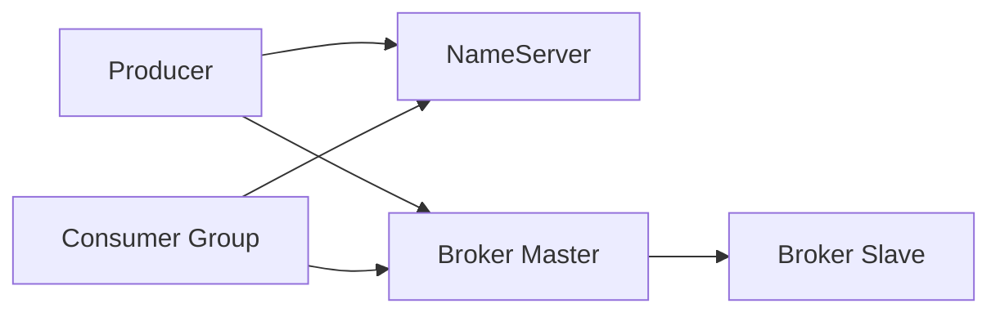

# RocketMQ 架构与核心概念

## 30 秒版（开场）

> RocketMQ 是 **NameServer（路由）+ Broker（存储）+ Producer/Consumer** 的分布式消息中间件。消息按 **Topic** 分类，队列 **Queue** 是消费并行单元；消费组 **Consumer Group** 负载均衡。与 Kafka 相比更强调 **事务消息、延迟消息、顺序消息** 开箱能力。Go 常用 `apache/rocketmq-client-go` 或社区封装。

## 3 分钟版（一面深度）

1. **是什么**：阿里开源 MQ，支持普通/顺序/事务/延迟消息；NameServer 无状态路由，Broker 主从/多副本存储 CommitLog。
2. **为什么**：国内业务、电商、支付场景常见；面试 JD 写 RocketMQ 时需讲清 **与 Kafka 差异**。
3. **怎么做**：Producer 发 `Topic:Tag`；Broker 写 CommitLog + ConsumeQueue 索引；Push/Pull 消费；Consumer Group 内 **集群消费**（一条消息只被一个实例消费）或 **广播消费**。

## 10 分钟版（原理 + 图示）



| 概念 | 说明 |
|------|------|
| Topic | 逻辑分类，如 `ORDER_TOPIC` |
| Tag | 子过滤，如 `create` / `pay` |
| Queue | Topic 下分片，顺序消息绑定单 Queue |
| Consumer Group | 同组竞争消费；不同组各自全量（广播语义） |
| Offset | 消费进度，Broker 或本地管理 |

**存储**：CommitLog 顺序写 + ConsumeQueue 定长索引（类似 Kafka 分区日志思想，实现不同）。

## 生产场景

- 订单创建 → 下游库存、积分、通知
- 需要 **延迟关单**、**事务消息**（半消息）的支付链路
- 运维：Broker 磁盘、CommitLog 清理、消费堆积告警

## 排查与工具

- RocketMQ Console：Topic 堆积、消费 TPS、DLQ
- `mqadmin`：集群状态、消费进度 reset（慎用）
- 日志：broker.log、慢消费、send timeout

## 架构取舍

| 选型 | 适用 |
|------|------|
| RocketMQ | 国内云、事务/延迟/顺序、电商 |
| Kafka | 超高吞吐日志流、大数据管道 |
| Redis Stream | 轻量、小规模 |

## 追问链

1. **NameServer 挂了？** → 短时用本地缓存路由；新 Broker 无法注册；已有连接可继续一段时间。
2. **Tag 和 Key 区别？** → Tag 订阅过滤；Key 业务索引、消息查询。
3. **Push 和 Pull？** → Push 实为 Broker 长轮询推；Pull 自主拉，灵活但复杂。
4. **Go 客户端注意？** → 消费幂等、Rebalance 时重复消费、优雅 Shutdown。

## 反模式与事故

- **Topic 过少、单 Queue 热点** → 并行度不足
- **消费慢不扩容 Consumer** → 堆积拖垮 Broker
- **广播消费误用于需分摊流量的场景** → 每台都处理全量

## 代码示例

```go
// 概念：Producer 发送（apache/rocketmq-client-go v2 风格示意）
msg := primitive.NewMessage("OrderTopic", body)
msg.WithTag("created")
msg.WithKeys([]string{orderID})
_, err := producer.SendSync(ctx, msg)
```

## 延伸阅读

- [RocketMQ 领域模型](https://rocketmq.apache.org/docs/domainModel/02message/)
- 对比：[S-RMQ-03 vs Kafka](./S-RMQ-03-vs-kafka.md)
- 排障：[S-RMQ-04 堆积与死信](./S-RMQ-04-ops-troubleshooting.md)
