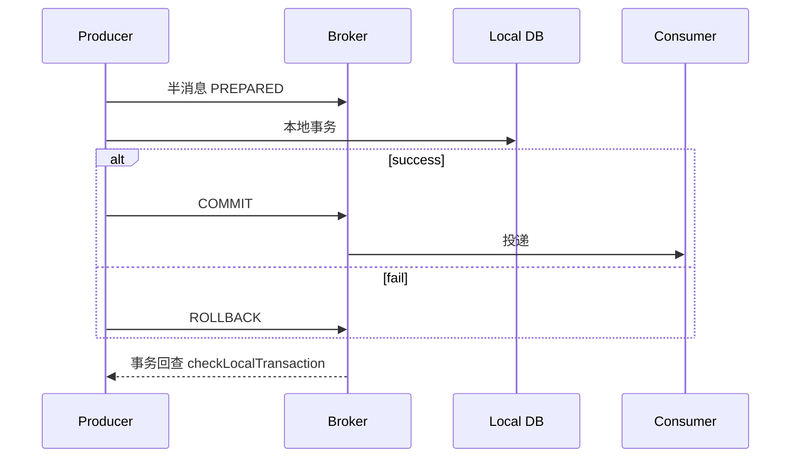

# RocketMQ 顺序消息、事务消息与延迟消息

## 30 秒版（开场）

> **顺序消息**：同一 **MessageQueue** 内 FIFO，用 **ShardingKey**（如 orderId）选 Queue。**事务消息**：半消息 → 本地事务 → commit/rollback，解决 **发消息与写库一致性**。**延迟消息**：固定 **18 个延迟级别**（非任意时间），适合关单、重试。面试高频：**与 Kafka 顺序分区、Outbox 模式对比**。

## 3 分钟版（一面深度）

1. **顺序**：全局顺序单 Queue（吞吐低）；分区顺序用 ShardingKey hash 到固定 Queue；消费端 **MessageListenerOrderly** 单线程 per Queue。
2. **事务**：`sendMessageInTransaction` → Broker 存半消息（对消费者不可见）→ 执行本地事务 → `commit` 可见或 `rollback` 删除；Broker 会 **回查** 本地事务状态。
3. **延迟**：`message.setDelayTimeLevel(3)` 非 timestamp；级别 1s 5s 10s… 到 2h；精确调度大量任务需 **时间轮 + 自建** 或外部调度。

## 10 分钟版（原理 + 图示）

**事务消息流程**



| 类型 | 关键点 | 坑 |
|------|--------|-----|
| 顺序 | ShardingKey 同 key 同 Queue | 消费失败阻塞该 Queue |
| 事务 | 回查接口必须可靠 | 回查风暴、状态不明 |
| 延迟 | 仅预设 level | 非任意 delay 需自建 |

## 生产场景

- **订单状态机**：同一 orderId 顺序消费状态变更
- **支付成功发积分**：事务消息保证「账已记才发 MQ」
- **30 分钟未支付关单**：延迟 level 或延迟 Topic + 定时扫描

## 排查与工具

- 事务消息堆积在 `RMQ_SYS_TRANS_HALF_TOPIC`
- 顺序消费卡住：看该 Queue  offset 是否停在某条 poison message
- DLQ：`%DLQ%{consumerGroup}`

## 架构取舍

| 方案 | 适用 |
|------|------|
| RocketMQ 事务消息 | 已有 RocketMQ、接受回查 |
| 本地消息表 / Outbox | 任意 MQ、DB 同事务写 outbox |
| Saga/TCC | 跨多服务长事务 |

## 追问链

1. **顺序消息消费失败？** → 重试阻塞同 Queue；需 skip 策略或 DLQ + 人工。
2. **事务回查做什么？** → 查本地事务表/订单状态，返回 COMMIT/ROLLBACK/UNKNOWN。
3. **延迟不准？** → level 粒度粗；海量定时用 Redis ZSET 或时间轮。
4. **和 Kafka 事务？** → Kafka 事务是 broker 层原子写多分区；RocketMQ 是业务本地事务 + 半消息。

## 反模式与事故

- **所有消息都走顺序** → 吞吐暴跌
- **回查逻辑返回 UNKNOWN 过久** → 半消息堆积
- **延迟 level 当精确调度** → 业务时间误差

## 代码示例

```go
// 顺序发送：同一 orderID 作为 ShardingKey
msg.WithShardingKey(orderID)

// 延迟：level 3 通常为 10s（以 broker 配置为准）
msg.WithDelayTimeLevel(3)
```

## 延伸阅读

- [顺序消息](https://rocketmq.apache.org/docs/featureBehavior/04orderlymessage/)
- [事务消息](https://rocketmq.apache.org/docs/featureBehavior/04transactionmessage/)
- 关联：[S-ARCH-11 延迟任务](../../03-system-design/S-ARCH-11-delayed-jobs.md)
