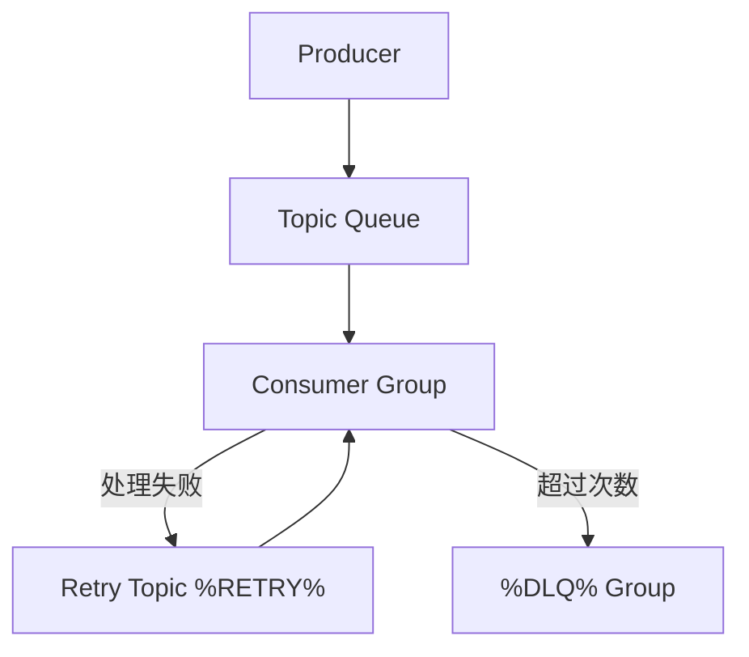

# RocketMQ 运维排障：堆积、重试与死信

## 30 秒版（开场）

> RocketMQ 线上问题集中在 **消费堆积、重复消费、消息进死信、Broker 磁盘满**。排查路径：**Console 看 diff（堆积量）→ 消费 TPS vs 生产 TPS → 慢消费/失败重试 → DLQ**。生产关键词：**maxReconsumeTimes、%DLQ% 主题、CommitLog 磁盘、resetOffset 慎用**。

## 3 分钟版（一面深度）

1. **是什么**：消费失败按 **重试级别** 延迟重投（非立即）；超过 `maxReconsumeTimes` 进入 **死信队列 `%DLQ%{consumerGroup}`**；堆积 = 生产 offset − 消费 offset。
2. **为什么**：下游 DB 慢、Bug 抛异常、Consumer 实例不足、Rebalance 导致短暂停消费都会表现为堆积。
3. **怎么做**：先扩 Consumer / 修 Bug；调 `consumeTimeout`、`maxReconsumeTimes`；DLQ 人工回放或修复后 re-send；Broker 监控 **磁盘使用率、putMessage 耗时**；禁止随意 `resetOffsetByTime`。

## 10 分钟版（原理 + 流程）



| 现象 | 常见根因 | 处理 |
|------|----------|------|
| 堆积持续涨 | 消费慢于生产 | 加实例、优化逻辑、限流生产 |
| 堆积突刺 | 发布/扩容 Rebalance | 等稳定；cooperative 思想靠少动实例 |
| 反复重试 | 下游超时、脏数据 | 修复 + 跳过 poison（进 DLQ） |
| DLQ 暴涨 | maxReconsumeTimes 过小或逻辑全失败 | 查消费日志、单条回放 |
| Broker 磁盘告警 | CommitLog/ConsumeQueue 未过期 | 调 retention、扩容磁盘、清理 |
| send timeout | Broker 忙、同步刷盘慢 | 异步刷盘权衡、分集群 |

**重试机制**

- 消费失败 → 消息发回 **Retry Topic**（`%RETRY%{group}`），延迟级别递增（10s、30s、1m…）
- 默认 `maxReconsumeTimes=16`（版本略有差异），耗尽 → **DLQ**
- **顺序消息**失败会 **阻塞同 Queue 后续消息** → 堆积更明显

**死信队列 DLQ**

- 命名：`%DLQ%{consumerGroup}`
- 需 **单独订阅 DLQ** 做告警、人工修复、补偿脚本
- 不要长期堆积无人处理 → 业务永久丢失

## 生产场景

- **风控规则消费**：单条 poison 卡死 → 捕获后写异常表 + return Success，避免无限重试
- **大促订单堆积**：临时扩 Consumer；生产端限流；事后 `mqadmin consumerProgress` 核对
- **事务消息半消息堆积**：查 `RMQ_SYS_TRANS_HALF_TOPIC` + 回查失败（见 [S-RMQ-02](./S-RMQ-02-order-transaction-delay.md)）

## 排查与工具

| 工具 | 命令/能力 |
|------|-----------|
| RocketMQ Console | Topic 堆积、Consumer 在线、TPS |
| `mqadmin clusterList` | Broker 存活 |
| `mqadmin consumerProgress -g {group}` | diff、lastOffset |
| `mqadmin queryMsgById` | 按 msgId 查轨迹 |
| `mqadmin resetOffsetByTime` | **慎用**：按时间重置进度 |
| Broker 日志 | `store error`、`flush timeout` |

**排查路径**

1. Console：哪个 Group、哪个 Queue diff 最大  
2. 该 Group 消费 TPS 是否 ≈ 0（全挂 vs 慢）  
3. 应用日志：异常栈、DB 超时  
4. 是否 DLQ / Retry Topic 也在涨  
5. Broker 磁盘、CPU、PageCache  

## 架构取舍

| 手段 | 适用 | 风险 |
|------|------|------|
| 扩 Consumer | 并行度未打满 Queue | 超过 Queue 数无效 |
| 提高并发消费线程 | IO 型消费 | 乱序、DB 连接池打满 |
| 调大 maxReconsumeTimes | 临时抖动 | poison 延迟进 DLQ |
| resetOffset | 补数、测试 | **生产误操作重复/丢消费** |
| 跳过失败消息 | 非关键链路 | 数据不一致 |

## 追问链

1. **和 Kafka lag 区别？** → 概念类似 diff/lag；RocketMQ 还有 Retry/DLQ 独立 Topic（见 [S-DIST-04](../kafka/S-DIST-04-kafka-semantics.md)）。
2. **重复消费怎么防？** → 业务幂等键；Rebalance 也会重复（[S-ARCH-04](../../03-system-design/S-ARCH-04-idempotency.md)）。
3. **顺序消息堆积？** → 单 Queue 单线程消费，不能简单加实例；需拆分 ShardingKey 或优化单条耗时。
4. **Go 优雅下线？** → SIGTERM → `Shutdown` consumer → 处理 in-flight → 再退出 Pod（[S-CODE-03](../../08-coding-senior/S-CODE-03-graceful-shutdown.md)）。
5. **Broker 主从切换？** → 同步复制下少量未同步消息可能丢；监控 slave fall behind。

## 反模式与事故

- 生产直接 `resetOffset` 到最新 → **大量消息未消费即丢弃**
- DLQ 无监控、无回放流程 → 静默丢单
- 消费逻辑抛 panic 未捕获 → 无限重试打满 Broker
- 只扩 Producer 不扩 Consumer → 堆积至磁盘满，全集群不可用
- 顺序消费开多线程 → 乱序、账务错误

## 代码示例

```go
// 消费失败：返回 RetryLater 会进入重试队列（rocketmq-client-go v2 示意）
type Handler struct{}

func (h *Handler) Consume(ctx context.Context, msgs ...*primitive.MessageExt) (consumer.ConsumeResult, error) {
    for _, m := range msgs {
        if err := process(m); err != nil {
            if isPoison(err) {
                // 记录 DLQ 上下文后返回 Success，避免阻塞；或依赖 maxReconsumeTimes 进 DLQ
                log.Error("poison", "msgId", m.MsgId, "err", err)
                return consumer.ConsumeSuccess, nil
            }
            return consumer.ConsumeRetryLater, nil
        }
    }
    return consumer.ConsumeSuccess, nil
}
```

## 延伸阅读

- [RocketMQ 重试策略](https://rocketmq.apache.org/docs/featureBehavior/03retrypolicy/)
- [mqadmin 工具](https://rocketmq.apache.org/docs/deploymentOperations/02admintool/)
- [S-RMQ-01 架构](./S-RMQ-01-architecture.md)
- [S-RMQ-02 事务/顺序/延迟](./S-RMQ-02-order-transaction-delay.md)
