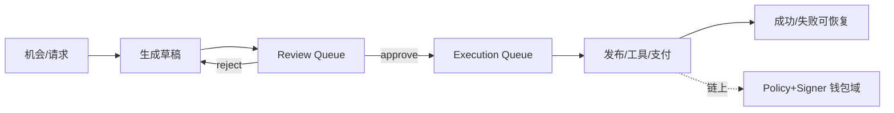

# 概念地图：Agent 控制面

> 5 分钟目标：能说明 Agent 平台的核心是 **可审计状态机 + 人工控制 + 副作用边界**，模型不能直接动钱。  
> 返回：[概念地图总览](./index.md)

## 1. 核心对象

| 对象 | 含义 |
|------|------|
| Workflow / 状态机 | draft → review → approve → execute/publish → terminal |
| HITL 队列 | Review / Execution：人审与受控执行解耦 |
| Persona / Memory | 分层上下文；学习规则需门槛与可启停 |
| Guardrails | 注入隔离、禁聊、风险分级、语言一致性 |
| Tool / MCP / A2A | 工具与互操作协议；不等于业务完成证明 |
| Cost / Token 账本 | 用量、预算、熔断 |
| 钱包执行边界 | 支付/链上动作必须走 Policy + Signer |

## 2. 权威事实源

| 问题 | 事实源 |
|------|--------|
| 任务进展到哪 | **工作流状态机 + 审计日志** |
| 是否允许执行副作用 | **审批结论 + 策略**（不是模型口头同意） |
| 是否已发布/已支付 | 下游系统回执（CMS、链上 receipt 等）+ 本地幂等键 |
| 模型输出是否可信 | 默认不可信；靠护栏、人审与结构化校验 |

## 3. 主状态机（可手画）

## 4. 典型失败模式

| 失败 | 正确处理 | 反模式 |
|------|----------|--------|
| 审批后重复执行 | 执行幂等键 + 原子抢占 | 靠「模型说过不要重复」 |
| 暂停/恢复丢上下文 | 显式 checkpoint 与版本 | 只靠会话聊天记录 |
| 模型诱导转账 | 禁止模型直连热签；intent 白名单 | Agent「有钱包私钥」 |
| 成本打爆 | 预算、冷却、熔断 | 无计量无限重试 |

## 5. 推荐阅读

| 顺序 | 文章 | 证据边界 |
|-----:|------|----------|
| 1 | [Agent 工作流、HITL 与可靠发布](../topics/10-ai-engineering/S-AI-09-agent-workflow-hitl-publishing.md) | explanation |
| 2 | [Persona、Memory 与反馈治理](../topics/10-ai-engineering/S-AI-10-persona-memory-feedback-governance.md) | explanation |
| 3 | [LLM 应用安全](../topics/10-ai-engineering/S-AI-05-llm-security.md) · [成本可观测](../topics/10-ai-engineering/S-AI-06-llm-observability-cost.md) | explanation |
| 4 | [Go LLM API](../topics/10-ai-engineering/S-AI-01-llm-api-integration.md) · [Tool Calling](../topics/10-ai-engineering/S-AI-03-agent-tool-calling.md) | deterministic_test（llmclient 等） |
| 5 | [MCP Server](../topics/10-ai-engineering/S-AI-07-mcp-server-go.md) · [MCP/A2A 互操作](../topics/10-ai-engineering/S-AI-11-mcp-a2a-vendor-neutral-interoperability.md) | deterministic_test / explanation |
| 6 | [Agent Commerce](../topics/10-ai-engineering/S-AI-13-x402-erc8183-agent-commerce.md) · [开放平台/Launchpad](../topics/10-ai-engineering/S-AI-14-crypto-agent-open-platform-marketplace-launchpad.md) | explanation |
| 7 | 动钱时必读：[钱包概念地图](./wallet-custody.md) · [托管≠MPC](./confusion-cards.md#custody-vs-mpc) | — |

专题目录：[10 AI 工程](../topics/10-ai-engineering/index.md)

## 6. 与相邻域

- 链上支付/提现 → [钱包与托管](./wallet-custody.md) · [交易所资金](./exchange-funds.md)
- 读取链上状态 → [Indexer](./indexer-node-data.md)（标明投影可重建）
- 平台限流熔断 → [S-ARCH-08](../topics/03-system-design/S-ARCH-08-rate-limiting.md) · [S-ARCH-09](../topics/03-system-design/S-ARCH-09-circuit-breaker.md)
