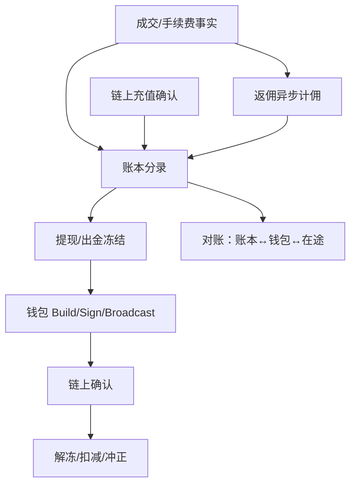

# 概念地图：交易所资金与对账

> 5 分钟目标：能分清 **撮合/行情** 与 **账本/充提/返佣** 的事实源，并讲清对账在证明什么。  
> 返回：[概念地图总览](./index.md)

## 1. 核心对象

| 对象 | 含义 |
|------|------|
| 账户账本 | 不可变分录；余额是派生视图 |
| 冻结 / 预留 | 提现、开仓、返佣待结算等占用 |
| 充提闭环 | 链上观察 ↔ 账本入账/出金（见钱包地图） |
| 返佣 / 极差 | 基于 canonical 成交与手续费事实计佣 |
| Vault / Withdrawal | 链上或托管出金通道与权限 |
| 对账任务 | 证明「用户债权 + 热冷钱包 + 在途」闭合 |

## 2. 权威事实源

| 问题 | 事实源 |
|------|--------|
| 成交是否发生（CEX） | 撮合/成交流水（协作边界；实现深度因系统而异） |
| 成交是否发生（DEX） | **链上合约事件 / canonical logs** |
| 用户能提多少 | **账本可用余额**（扣冻结） |
| 链上钱是否动了 | **Canonical receipt** + 钱包状态机 |
| 佣金是否该发 | canonical 手续费事实 + 规则版本 + 幂等分录 |

## 3. 主状态机（资金视角）

## 4. 典型失败模式

| 失败 | 正确处理 | 反模式 |
|------|----------|--------|
| 对账不平 | 分层定位：在途、冻结、未入账、reorg 冲正 | 直接改余额「抹平」 |
| 退费/reorg | 佣金与账本反向冲正；见 [冲正工作流](../topics/14-dex-cex-engineering/S-EXCH-28-affiliate-tiered-rate-rebate.md#rebate-reversal) | 改历史数字 |
| 热钱包超提 | 额度、熔断、冷热分层、审批 | 只靠「多签感觉安全」 |
| 把行情当账本 | 读模型最终一致；资金强一致 | 用 WS 推送改余额 |

## 5. 推荐阅读

| 顺序 | 文章 | 证据边界 |
|-----:|------|----------|
| 1 | [账户体系与资金账务](../topics/14-dex-cex-engineering/S-EXCH-03-account-ledger.md) | explanation |
| 2 | [充值、提现与链上钱包体系](../topics/14-dex-cex-engineering/S-EXCH-02-deposit-withdraw-wallet.md) | explanation |
| 3 | [清结算、对账与高可用](../topics/14-dex-cex-engineering/S-EXCH-15-settlement-ha-disaster-recovery.md) | explanation |
| 4 | [风控、对账与合规审计](../topics/14-dex-cex-engineering/S-EXCH-05-risk-reconciliation.md) | explanation |
| 5 | [极差返佣](../topics/14-dex-cex-engineering/S-EXCH-28-affiliate-tiered-rate-rebate.md#rebate-reversal) · [Launchpad/返佣](../topics/14-dex-cex-engineering/S-EXCH-12-token-launch-rebate.md) | explanation |
| 6 | [CEX 端到端架构](../topics/14-dex-cex-engineering/S-EXCH-13-cex-end-to-end-architecture.md) · [Web3 全栈](../topics/14-dex-cex-engineering/S-EXCH-14-web3-exchange-fullstack-architecture.md) | explanation |
| 7 | [支付账本/清结算](../topics/18-web3-payments-stablecoin/S-PAY-04-ledger-clearing-settlement-reconciliation.md) | explanation |
| 8 | 可运行撮合证据：[确定性撮合](../topics/14-dex-cex-engineering/S-EXCH-17-runnable-deterministic-matching-engine.md) · [WAL 回放](../topics/14-dex-cex-engineering/S-EXCH-18-wal-snapshot-replay.md) | deterministic_test（≠生产性能） |

专题目录：[14 交易所工程](../topics/14-dex-cex-engineering/index.md)

## 6. 与相邻域

- 出金签名与 UNKNOWN → [钱包与托管](./wallet-custody.md)
- DEX 事件投影 → [Indexer / 节点数据](./indexer-node-data.md)
- 易混：账本不可变 vs 索引可重建 → [易混概念专卡](./confusion-cards.md)
