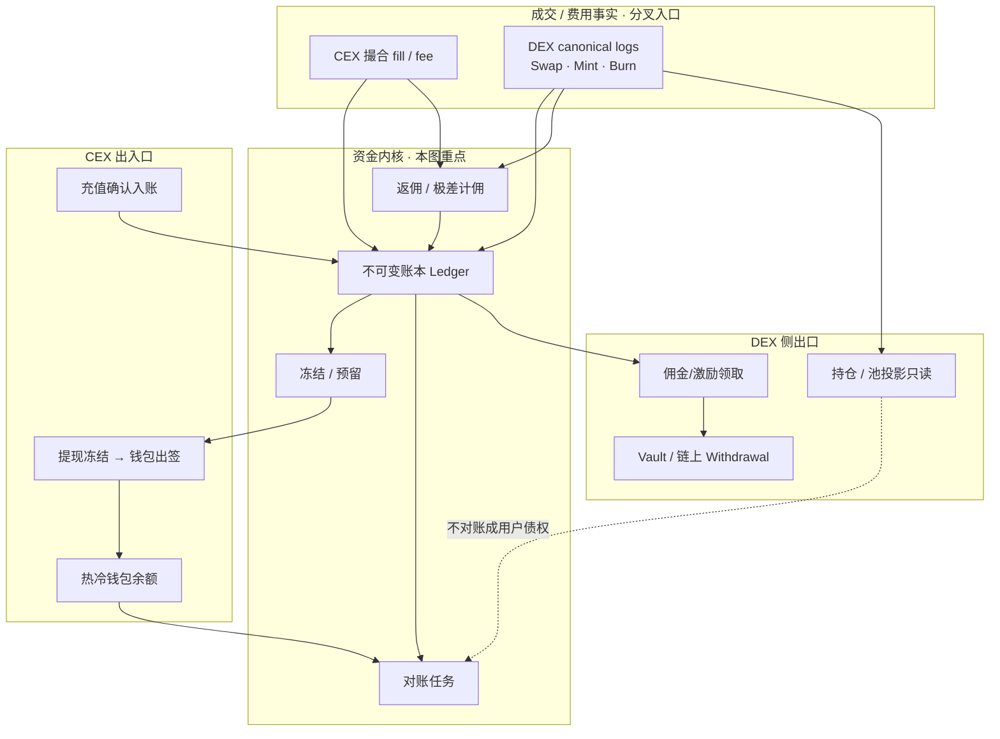
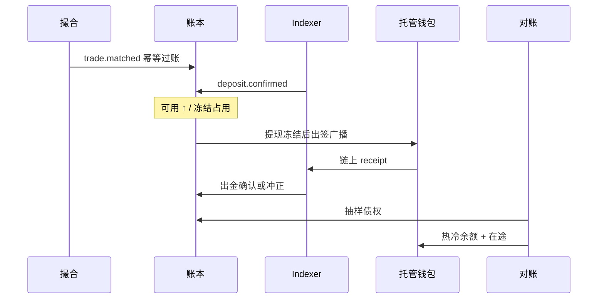
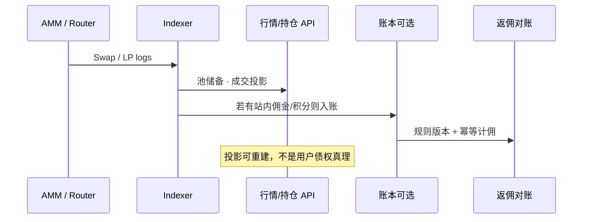
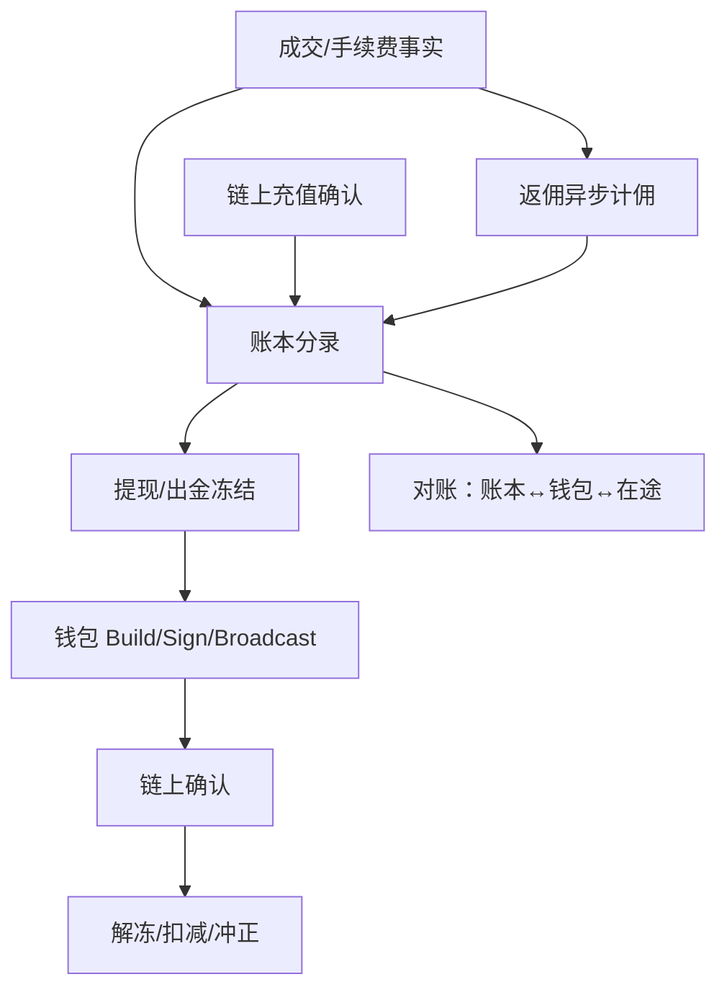

# 概念地图：交易所资金与对账

> 5 分钟目标：能分清 **撮合/行情** 与 **账本/充提/返佣** 的事实源，并讲清对账在证明什么。  
> 返回：[概念地图总览](./index.md)

## 0. 这是 CEX，还是 DEX？

**本图讲资金正确性：账本、冻结、充提闭环、返佣、对账。**  
CEX 与 DEX **共用「不可变账本 + 对账」骨架**；分叉在 **成交事实从哪来、钱如何进出链**。

| | CEX | DEX / Launchpad 类 |
|--|-----|-------------------|
| 成交事实 | **撮合引擎**成交流水（链下） | **链上合约事件**（经 Indexer 投影） |
| 用户余额像什么 | 托管账本债权；提现才上链 | 纯链上持仓 **或**「产品层账本 + 链上结算/出金」 |
| 充提 | 平台地址充值入账、热冷钱包出金 | 用户自签进池；若有站内余额/返佣账户，仍走账本 |
| 对账证明什么 | 用户债权 ≈ 热冷钱包 + 在途 + 清算挂账 | 佣金/激励/站内余额 ≈ canonical 手续费事实 + 规则版本；池子 TVL 不以账本冒充 |
| 本仓库落点 | [钱包地图](./wallet-custody.md) + 撮合/账本专题 | [Indexer 地图](./indexer-node-data.md) + AMM/返佣专题 |

纯无托管前端（只读链、不记用户债权）**几乎用不到本图的账本对账**；一旦出现「可提佣金 / 站内点卡 / 托管出金」，就回到本图。

## 1. 总分叉架构图

**读图顺序**

1. **左分叉进事实**：CEX 听撮合；DEX 听 Indexer 的 canonical 事件。  
2. **中间汇合**：都变成账本分录（或明确「只投影、不入账」）。  
3. **右分叉出资金**：CEX 走托管充提与热冷钱包；DEX 常见是链上持仓展示 + 可选佣金/Vault。  
4. **对账**：证明账本债权与链上/钱包/在途闭合；**不要把行情投影对成用户可提余额。**

## 2. CEX 场景（托管账本全链路）

| 场景 | 资金域做什么 | 事实源 |
|------|--------------|--------|
| 现货成交 | 冻结释放、余额划转、手续费分录 | 撮合 fill（非 WS 行情） |
| 充值 | credit 用户可用 | Indexer finality 事件 |
| 提现 | 冻结 → 广播 → 扣减/失败冲正 | 钱包状态机 + receipt |
| 日终/持续对账 | 债权合计 vs 钱包 vs 在途 | 账本 + 钱包 + 链 |

深读：[S-EXCH-03](../topics/14-dex-cex-engineering/S-EXCH-03-account-ledger.md) · [S-EXCH-02](../topics/14-dex-cex-engineering/S-EXCH-02-deposit-withdraw-wallet.md) · [S-EXCH-13](../topics/14-dex-cex-engineering/S-EXCH-13-cex-end-to-end-architecture.md) · [钱包地图](./wallet-custody.md)

## 3. DEX 场景（链上事实 → 可选账本）

| 场景 | 资金域是否介入 | 说明 |
|------|----------------|------|
| 纯 Swap UI | 通常不入用户账本 | Indexer 投影即可；余额在用户钱包 |
| 返佣 / 积分 / 站内可提 | **要账本** | 计费事实来自 canonical 成交与手续费 |
| Launchpad 认购托管 | **要账本 + 出金状态机** | 接近 CEX 托管闭环 |
| LP 持仓展示 | 投影只读 | 最终以合约状态为准，索引可重建 |

深读：[Indexer 地图](./indexer-node-data.md) · [S-EXCH-14](../topics/14-dex-cex-engineering/S-EXCH-14-web3-exchange-fullstack-architecture.md) · [S-EXCH-28 返佣冲正](../topics/14-dex-cex-engineering/S-EXCH-28-affiliate-tiered-rate-rebate.md#rebate-reversal) · [S-EXCH-12](../topics/14-dex-cex-engineering/S-EXCH-12-token-launch-rebate.md)

## 4. 核心对象

| 对象 | 含义 |
|------|------|
| 账户账本 | 不可变分录；余额是派生视图 |
| 冻结 / 预留 | 提现、开仓、返佣待结算等占用 |
| 充提闭环 | 链上观察 ↔ 账本入账/出金（见钱包地图） |
| 返佣 / 极差 | 基于 canonical 成交与手续费事实计佣 |
| Vault / Withdrawal | 链上或托管出金通道与权限 |
| 对账任务 | 证明「用户债权 + 热冷钱包 + 在途」闭合 |

## 5. 权威事实源

| 问题 | 事实源 |
|------|--------|
| 成交是否发生（CEX） | 撮合/成交流水（协作边界；实现深度因系统而异） |
| 成交是否发生（DEX） | **链上合约事件 / canonical logs** |
| 用户能提多少 | **账本可用余额**（扣冻结） |
| 链上钱是否动了 | **Canonical receipt** + 钱包状态机 |
| 佣金是否该发 | canonical 手续费事实 + 规则版本 + 幂等分录 |

## 6. 主状态机（资金视角 · 共用）

## 7. 典型失败模式

| 失败 | 正确处理 | 反模式 |
|------|----------|--------|
| 对账不平 | 分层定位：在途、冻结、未入账、reorg 冲正 | 直接改余额「抹平」 |
| 退费/reorg | 佣金与账本反向冲正；见 [冲正工作流](../topics/14-dex-cex-engineering/S-EXCH-28-affiliate-tiered-rate-rebate.md#rebate-reversal) | 改历史数字 |
| 热钱包超提 | 额度、熔断、冷热分层、审批 | 只靠「多签感觉安全」 |
| 把行情当账本 | 读模型最终一致；资金强一致 | 用 WS 推送改余额 |
| DEX 投影当债权 | 持仓以合约/账本分录为准 | 索引表可提现 |

## 8. 推荐阅读

| 顺序 | 文章 | 证据边界 |
|-----:|------|----------|
| 1 | [账户体系与资金账务](../topics/14-dex-cex-engineering/S-EXCH-03-account-ledger.md) | explanation |
| 2 | [充值、提现与链上钱包体系](../topics/14-dex-cex-engineering/S-EXCH-02-deposit-withdraw-wallet.md) | explanation |
| 3 | [清结算、对账与高可用](../topics/14-dex-cex-engineering/S-EXCH-15-settlement-ha-disaster-recovery.md) | explanation |
| 4 | [风控、对账与合规审计](../topics/14-dex-cex-engineering/S-EXCH-05-risk-reconciliation.md) | explanation |
| 5 | [极差返佣](../topics/14-dex-cex-engineering/S-EXCH-28-affiliate-tiered-rate-rebate.md#rebate-reversal) · [Launchpad/返佣](../topics/14-dex-cex-engineering/S-EXCH-12-token-launch-rebate.md) | explanation |
| 6 | [CEX 端到端架构](../topics/14-dex-cex-engineering/S-EXCH-13-cex-end-to-end-architecture.md) · [Web3 全栈](../topics/14-dex-cex-engineering/S-EXCH-14-web3-exchange-fullstack-architecture.md) | explanation |
| 7 | [支付账本/清结算](../topics/18-web3-payments-stablecoin/S-PAY-04-ledger-clearing-settlement-reconciliation.md) | explanation |
| 8 | 可运行撮合证据：[确定性撮合](../topics/14-dex-cex-engineering/S-EXCH-17-runnable-deterministic-matching-engine.md) · [WAL 回放](../topics/14-dex-cex-engineering/S-EXCH-18-wal-snapshot-replay.md) | deterministic_test（≠生产性能） |

专题目录：[14 交易所工程](../topics/14-dex-cex-engineering/index.md)

## 9. 与相邻域

- **CEX** 出金签名与 UNKNOWN → [钱包与托管](./wallet-custody.md)
- **DEX** 事件投影 → [Indexer / 节点数据](./indexer-node-data.md)
- 易混：账本不可变 vs 索引可重建 → [易混概念专卡](./confusion-cards.md)
