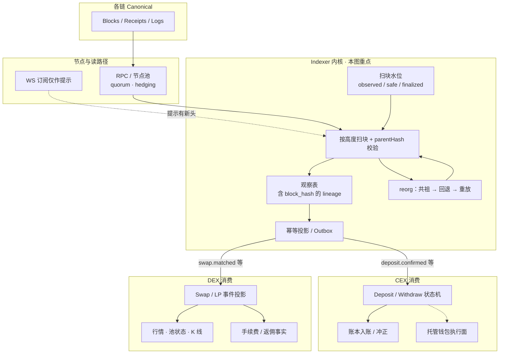
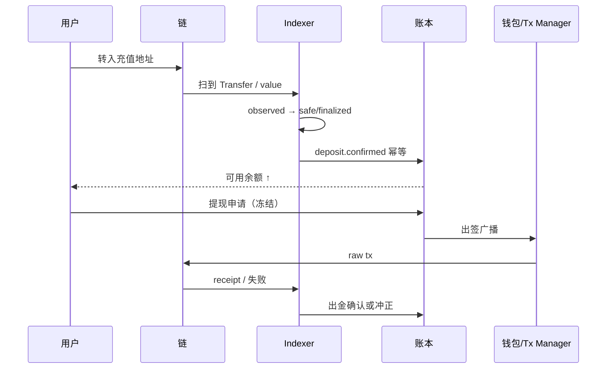
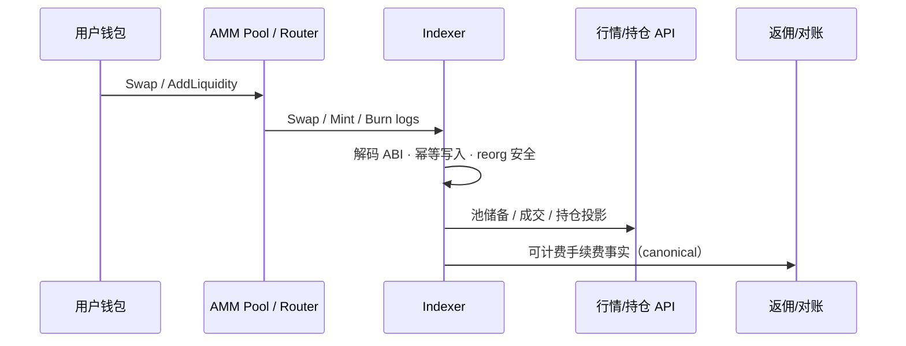
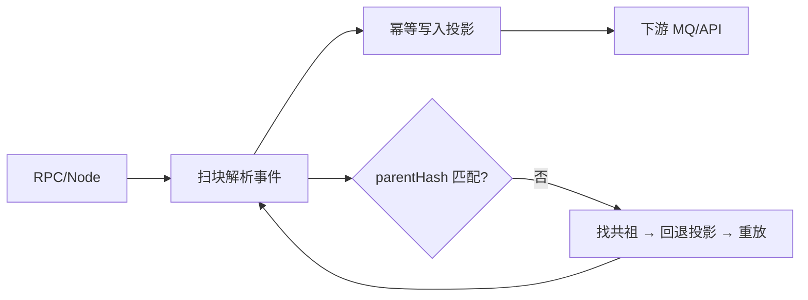

# 概念地图：Indexer / 节点数据

> 5 分钟目标：能说明 **canonical 是事实、索引库是可重建投影**，并讲清 reorg 回退与幂等键各自解决什么。  
> 返回：[概念地图总览](./index.md)

## 0. 这是 CEX，还是 DEX？

**本图是两边共用的链上观察基建**，不是某一种交易所产品专属。  
Indexer / 节点数据回答：「链上正规链发生了什么、我扫到哪、重组怎么回退」；  
**CEX 还是 DEX，取决于谁消费这些事件、投影成什么业务表。**

| | CEX 托管场景 | DEX 协议场景 |
|--|--------------|--------------|
| 主要看什么 | 充值地址 `Transfer` / 原生转入、提现 tx receipt | Pool/Router 的 Swap、Mint、Burn、Collect 等 |
| 投影去哪 | 充提状态机 → **账本 credit/debit** | 成交/持仓/TVL/K 线、报价辅助、返佣事实 |
| 确认水位 | 金额分层：`observed` 展示，`safe`/`finalized` 后可提现入账 | UI 可早展示；清算/返佣/做市对账跟 finality 与规则版本 |
| 和本仓库其他图 | 下游接 [钱包与托管](./wallet-custody.md)（CEX） | 下游接 [14 DEX/CEX](../topics/14-dex-cex-engineering/index.md) 协议与资金投影 |
| 共同点 | 扫块水位、`parentHash`、reorg 共祖回退、观察键 vs 业务幂等键、RPC HA | 机制相同；**业务表与入账语义不同** |

Hybrid（CEX 带链上 Swap 展示、DEX 前端 + 托管出金）可以**共用一套 Indexer 内核**，用不同 decoder / topic / 消费者拆开，不要做成「一个大表既当账本又当行情」。

## 1. 总架构图（共用内核 → 分叉消费）

**读图顺序**

先分清图上四层，再跟「内核主循环 → CEX 岔路 → DEX 岔路」走：

| 层 | 图中框 | 只回答什么 |
|----|--------|------------|
| 链与读路径 | Blocks / RPC / WS | **数据从哪读、能不能信单一节点** |
| Indexer 内核 | 水位 · Scan · 观察 · 投影 · reorg | **扫到哪、正规链是谁、投影如何回退** |
| CEX 消费 | Deposit/Withdraw · 账本 · 钱包 | **充提确认如何变成账本分录** |
| DEX 消费 | Swap/LP · 行情 · 返佣事实 | **协议事件如何变成只读视图/计费事实** |

#### 1. 内核主循环（图中 `indexer` 框，两边共用）

1. **扫块水位 `WM`** 记住本链 `last_observed`（以及 safe/finalized 推进进度）：下一高度 = 水位 + 1。  
2. 经 **RPC 节点池** 拉该高度的 block/receipt/logs；生产上用 quorum/hedging，避免单点撒谎。  
3. **`Scan` 校验 `parentHash`**：必须等于本地上一 canonical 块的 hash；对不上就进入 reorg，而不是继续往前写。  
4. 校验通过：写入 **观察表 `Obs`**（唯一键含 `block_hash`，保留 lineage）→ **投影/Outbox `Proj`**（业务幂等键推进，供下游消费）。  
5. **reorg**：找共同祖先 → 回退祖先之后的投影与水位 → 从共祖之后重放；穿过 safe 或超风控深度要告警停自动入账。  
6. **`WS` 虚线**：只提示「可能有新头」，**不能**代替持久水位；断线后仍靠水位 + HTTP/回补追平。  

对应图中：`Blocks → RPC → Scan`，`WM → Scan`，`Scan → Obs → Proj`，`Scan → Reorg → Scan`，`WS -.-> Scan`。

#### 2. CEX 岔路（图中 `cex` 框）

1. 投影发出 `deposit.confirmed` / 出金结果类事件（已按 finality 策略过滤，不是第一次扫到就入账）。  
2. **Deposit/Withdraw 状态机** 认地址、资产、金额，驱动充提生命周期。  
3. **账本** 做 credit / 出金扣减或冲正；用户余额只认账本。  
4. 提现出金还需 **钱包执行面**（出签广播）；Indexer 负责事后确认，不替代审批与 MPC。  

对应图中：`Proj → Dep → Led`，`Dep -.-> Wallet`。  
细节时序见下文「CEX 使用场景」。

#### 3. DEX 岔路（图中 `dex` 框）

1. 同一套内核，decoder 换成 Pool/Router 的 Swap、Mint、Burn 等。  
2. **Swap/LP 投影** → **行情/池状态/K 线**（可重建的读模型）。  
3. 需要计佣时，把 **canonical 手续费事实** 交给返佣/对账；不要在索引表里直接改「可提佣金余额」。  
4. 假池要靠 Factory/allowlist 校验，不能盲信「名叫 Uniswap 的 pair」。  

对应图中：`Proj → Swap → Mkt`，`Swap → Fee`。  
细节时序见下文「DEX 使用场景」。

#### 4. 读图时容易混的三点

- **观察键 ≠ 业务幂等键**：前者含 `block_hash` 留审计；后者防重复入账/重复计佣。  
- **投影 ≠ 账本**：Indexer 可丢可重建；用户债权与可提余额在账本（或链上合约），不在索引表。  
- **CEX/DEX 不要共用一张「真理大表」**：共用内核，分 decoder / topic / 消费者。  

读完全图后自检：能否指着内核说出「水位 + parentHash + reorg」；再分别指出充值入账与 Swap 行情各走哪条岔路。

## 2. CEX 使用场景（充提确认）

| 场景 | Indexer 职责 | 不要让 Indexer 做的事 |
|------|--------------|----------------------|
| 充值 | 认地址/memo、认资产、按 finality 发确认事件 | 直接改用户余额（应走账本分录） |
| 提现 | 跟踪出金 tx 是否在正规链成功 | 代替风控审批或 MPC 出签 |
| reorg | 回退投影并通知冲正 | 原地改历史流水数字 |

深读：[S-BC-05](../topics/12-blockchain-web3/S-BC-05-indexer-reorg.md) · [钱包地图](./wallet-custody.md) · [S-EXCH-02](../topics/14-dex-cex-engineering/S-EXCH-02-deposit-withdraw-wallet.md)

## 3. DEX 使用场景（协议事件投影）

| 场景 | Indexer 职责 | 不要让 Indexer 做的事 |
|------|--------------|----------------------|
| Swap 成交 | 解码 pool/router 事件，保留 `block_hash` lineage | 把 pending 报价当成链上已成交 |
| LP / 仓位 | 投影份额与 fee growth 等只读视图 | 代替合约存储当最终持仓真理 |
| 返佣 / 激励 | 提供 canonical 成交与手续费事实 | 在索引库里直接改可提佣金余额 |
| 假池 / 分叉合约 | 校验 Factory / init code / allowlist | 盲信「名叫 Uniswap 的 pair」 |

深读：[S-EXCH-06](../topics/14-dex-cex-engineering/S-EXCH-06-dex-amm-liquidity.md) · [S-EXCH-30](../topics/14-dex-cex-engineering/S-EXCH-30-uniswap-v2-v3-protocol.md) · [S-BC-04](../topics/12-blockchain-web3/S-BC-04-contract-abi-events.md)

## 4. 核心对象

| 对象 | 含义 |
|------|------|
| 扫块水位（游标） | 每条链独立的扫块进度与确认策略；不是 IDE 产品名 |
| Block lineage | block hash + parent hash，用于发现分叉 |
| 投影表 | 从事件派生的持仓、成交、余额视图等 |
| 幂等键 | 如 `tx_hash + log_index` / 稳定 `event_id`，防重复写入 |
| RPC / 节点池 | 读路径；需 HA、对账、避免单点撒谎 |
| Relayer / Tx Manager | 写出路径（广播与替换），常与索引确认闭环 |

## 5. 权威事实源

| 问题 | 事实源 |
|------|--------|
| 链上发生了什么 | **Canonical chain**（`safe`/`finalized` 或链特定确认） |
| API 返回的持仓/成交 | **索引投影**（可丢可重建，不能自称最终真理） |
| 合约当前状态 | 合约存储 / eth_call 等链上读；投影只是缓存视图 |
| 消息是否该生效一次 | DB 唯一约束 + 状态机；不是 MQ「恰好一次」保证 |

## 6. 主状态机（可手画）

## 7. 典型失败模式

| 失败 | 正确处理 | 反模式 |
|------|----------|--------|
| reorg | 共祖回退 + 重放 | 只靠唯一键「当没事」 |
| 重复事件 | 业务幂等键 + 同事务更新 | 假设 MQ exactly-once |
| RPC 超时/分叉视图 | 多节点核对、确认水位 | 盲信单一 latest |
| 回补打爆节点 | 限速、批处理、隔离扫块水位 | 无背压全并发扫历史 |
| CEX/DEX 投影混库 | 分 decoder / topic / 消费者 | 一张表既当账本又当行情真理 |

## 8. 易混点（本域）

先读 [投影 ≠ 链上事实](./confusion-cards.md#indexer-vs-canonical) 与
[MQ ≠ 业务 exactly-once](./confusion-cards.md#mq-vs-idempotency)。

## 9. 推荐阅读

| 顺序 | 文章 | 证据边界 |
|-----:|------|----------|
| 1 | [链上索引器：扫块、重组与幂等](../topics/12-blockchain-web3/S-BC-05-indexer-reorg.md) | explanation |
| 2 | [智能合约交互：ABI 与事件监听](../topics/12-blockchain-web3/S-BC-04-contract-abi-events.md) | explanation |
| 3 | [Go 连接节点：JSON-RPC](../topics/12-blockchain-web3/S-BC-02-go-ethereum-rpc.md) | deterministic_test（ethrpc 示例） |
| 4 | [RPC HA / quorum / hedging](../topics/19-node-rpc-staking/S-NODE-02-rpc-ha-quorum-hedging-cache.md) | explanation |
| 5 | [Relayer 与交易管理器](../topics/19-node-rpc-staking/S-NODE-05-relayer-transaction-manager.md) | explanation |
| 6 | [消息队列语义](../topics/03-system-design/S-ARCH-10-mq-semantics.md) · [幂等](../topics/03-system-design/S-ARCH-04-idempotency.md) | explanation |
| 7 | [链数据 ClickHouse / lakehouse](../topics/19-node-rpc-staking/S-NODE-10-chain-data-clickhouse-lakehouse.md) | explanation |

专题目录：[12 区块链](../topics/12-blockchain-web3/index.md) · [19 节点/RPC](../topics/19-node-rpc-staking/index.md)

## 10. 与相邻域

- **CEX** 钱包入账/确认消费本域事件 → [钱包与托管](./wallet-custody.md)
- **CEX/DEX** 资金与返佣消费 canonical 事件 → [交易所资金](./exchange-funds.md)
- **DEX** 协议机制 → [14 DEX/CEX](../topics/14-dex-cex-engineering/index.md)
- Agent 若依赖链上状态，只读投影时必须标明可重建 → [Agent 控制面](./agent-control-plane.md)
