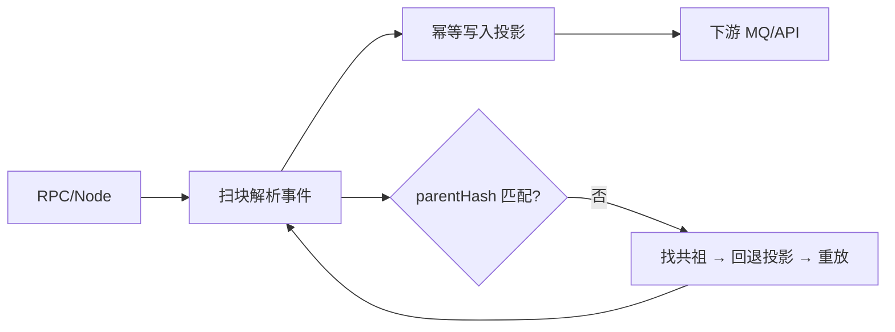

# 概念地图：Indexer / 节点数据

> 5 分钟目标：能说明 **canonical 是事实、索引库是可重建投影**，并讲清 reorg 回退与幂等键各自解决什么。  
> 返回：[概念地图总览](./index.md)

## 1. 核心对象

| 对象 | 含义 |
|------|------|
| 扫块水位（游标） | 每条链独立的扫块进度与确认策略；不是 IDE 产品名 |
| Block lineage | block hash + parent hash，用于发现分叉 |
| 投影表 | 从事件派生的持仓、成交、余额视图等 |
| 幂等键 | 如 `tx_hash + log_index` / 稳定 `event_id`，防重复写入 |
| RPC / 节点池 | 读路径；需 HA、对账、避免单点撒谎 |
| Relayer / Tx Manager | 写出路径（广播与替换），常与索引确认闭环 |

## 2. 权威事实源

| 问题 | 事实源 |
|------|--------|
| 链上发生了什么 | **Canonical chain**（`safe`/`finalized` 或链特定确认） |
| API 返回的持仓/成交 | **索引投影**（可丢可重建，不能自称最终真理） |
| 合约当前状态 | 合约存储 / eth_call 等链上读；投影只是缓存视图 |
| 消息是否该生效一次 | DB 唯一约束 + 状态机；不是 MQ「恰好一次」保证 |

## 3. 主状态机（可手画）

## 4. 典型失败模式

| 失败 | 正确处理 | 反模式 |
|------|----------|--------|
| reorg | 共祖回退 + 重放 | 只靠唯一键「当没事」 |
| 重复事件 | 业务幂等键 + 同事务更新 | 假设 MQ exactly-once |
| RPC 超时/分叉视图 | 多节点核对、确认水位 | 盲信单一 latest |
| 回补打爆节点 | 限速、批处理、隔离游标 | 无背压全并发扫历史 |

## 5. 易混点（本域）

先读 [投影 ≠ 链上事实](./confusion-cards.md#indexer-vs-canonical) 与
[MQ ≠ 业务 exactly-once](./confusion-cards.md#mq-vs-idempotency)。

## 6. 推荐阅读

| 顺序 | 文章 | 证据边界 |
|-----:|------|----------|
| 1 | [链上索引器：扫块、重组与幂等](../topics/12-blockchain-web3/S-BC-05-indexer-reorg.md) | explanation |
| 2 | [智能合约交互：ABI 与事件监听](../topics/12-blockchain-web3/S-BC-04-contract-abi-events.md) | explanation |
| 3 | [Go 连接节点：JSON-RPC](../topics/12-blockchain-web3/S-BC-02-go-ethereum-rpc.md) | deterministic_test（ethrpc 示例） |
| 4 | [RPC HA / quorum / hedging](../topics/19-node-rpc-staking/S-NODE-02-rpc-ha-quorum-hedging-cache.md) | explanation |
| 5 | [Relayer 与交易管理器](../topics/19-node-rpc-staking/S-NODE-05-relayer-transaction-manager.md) | explanation |
| 6 | [消息队列语义](../topics/03-system-design/S-ARCH-10-mq-semantics.md) · [幂等](../topics/03-system-design/S-ARCH-04-idempotency.md) | explanation |
| 7 | [链数据 ClickHouse / lakehouse](../topics/19-node-rpc-staking/S-NODE-10-chain-data-clickhouse-lakehouse.md) | explanation |

专题目录：[12 区块链](../topics/12-blockchain-web3/index.md) · [19 节点/RPC](../topics/19-node-rpc-staking/index.md)

## 7. 与相邻域

- 钱包入账/确认消费本域事件 → [钱包与托管](./wallet-custody.md)
- 行情/返佣消费 canonical 事件 → [交易所资金](./exchange-funds.md)
- Agent 若依赖链上状态，只读投影时必须标明可重建 → [Agent 控制面](./agent-control-plane.md)
