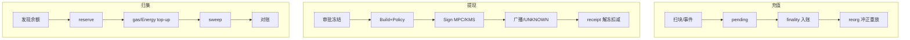

# 概念地图：多链钱包与托管签名

> 5 分钟目标：能画出充提/归集状态机，说清 **谁是事实源**，并区分 **托管信任模型** 与 **MPC 签名实现**。  
> 返回：[概念地图总览](./index.md)

## 1. 核心对象

| 对象 | 含义 |
|------|------|
| 充值地址 / 热冷钱包 | 观察入账与出金地址池；热路径高频，冷路径高审批 |
| Intent / Policy | 业务授权：chain、to、asset、amount、calldata、fee ceiling、version |
| Signer（MPC / KMS / HSM） | 只对已校验 intent 出签；不替代审批 |
| Reservation | nonce / UTXO / object 预占，防并发双花与崩溃双发 |
| Tx Manager | 广播、UNKNOWN、同 intent replacement / fee bump |
| Chain Adapter | 按链能力矩阵构造交易，禁止统一 `SendTransaction` 幻想 |

## 2. 权威事实源

| 问题 | 事实源 |
|------|--------|
| 链上是否到账 / 是否确认 | **Canonical chain / receipt**（按链 finality 策略） |
| 用户可用余额 | **不可变账本**（只追加冲正，不改历史流水） |
| 该不该转 | **审批 + Policy/Intent**，不是签名集群自己决定 |
| 交易是否已生效 | 多节点核对 txid/nonce/UTXO/receipt；超时先 **UNKNOWN** |

## 3. 主状态机（可手画）

## 4. 典型失败模式

| 失败 | 正确处理 | 反模式 |
|------|----------|--------|
| 入账后 reorg | 冲正分录 + 回退投影 + 按新 canonical 重放 | 改历史流水 |
| 广播超时 | 保留 raw tx/intent，核对后再同 intent 替换 | 盲目换 nonce 再发无关新单 |
| 有 token 无 gas | 归集队列 top-up + reservation | 当普通提现硬发 |
| 签名方故障 | 会话重开同 intent；已广播走链上核对 | 当作没发生再造一笔 |

## 5. 易混点（本域）

先读 [托管 ≠ MPC](./confusion-cards.md#custody-vs-mpc)。  
一句话：**用户托管账户** 描述信任模型；**MPC** 描述平台热签怎么出签。

## 6. 推荐阅读（先这几篇）

| 顺序 | 文章 | 证据边界 |
|-----:|------|----------|
| 1 | [充值、提现与链上钱包体系](../topics/14-dex-cex-engineering/S-EXCH-02-deposit-withdraw-wallet.md) | explanation |
| 2 | [充值地址、归集、Nonce/UTXO 预占与恢复](../topics/17-multichain-wallet/S-WALLET-06-deposit-sweep-reservation-recovery.md) | explanation |
| 3 | [MPC/TSS 与 CEX 托管签名架构](../topics/12-blockchain-web3/S-BC-10-mpc-tss-custody.md) | explanation |
| 4 | [MPC DKG、Reshare 与故障恢复](../topics/17-multichain-wallet/S-WALLET-07-mpc-dkg-reshare-recovery.md) | explanation |
| 5 | [Key Ceremony、Signer Fencing 与恢复](../topics/21-security-engineering/S-SEC-02-key-ceremony-signer-fencing-recovery.md) | integration_harness（示例，≠真实 HSM 验收） |
| 6 | [Relayer / Tx Manager](../topics/19-node-rpc-staking/S-NODE-05-relayer-transaction-manager.md) | explanation |
| 7 | [多链 Chain Adapter 能力矩阵](../topics/17-multichain-wallet/S-WALLET-01-chain-adapter-capability-matrix.md) | explanation |
| 8 | [Gas/Fee 多链差异](../topics/12-blockchain-web3/S-BC-13-gas-fee-multichain.md) · [TRON/TRC20](../topics/17-multichain-wallet/S-WALLET-12-tron-trc20-resource-transaction.md) | explanation |

专题目录：[17 多链钱包](../topics/17-multichain-wallet/index.md)

## 7. 与相邻域

- 入账观察依赖 [Indexer / 节点数据](./indexer-node-data.md)
- 余额与冲正进入 [交易所资金与对账](./exchange-funds.md)
- Agent 若要动钱，必须经本域的 Policy/Signer，见 [Agent 控制面](./agent-control-plane.md)
