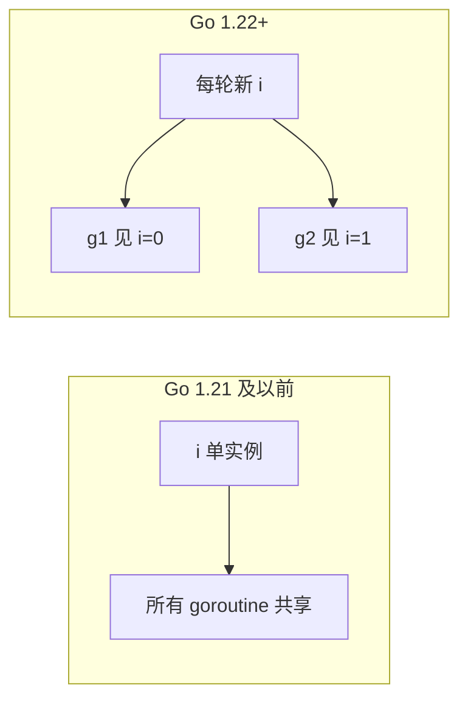

# Go 1.22 循环变量与 Go 1.26 泛型演进

## 30 秒版（开场）

> Go 1.22 的 loop variable 新语义按 **package 的 Go language version** 生效：模块 `go` 行为 1.22+ 时，每轮循环变量独立。仅升级编译器、不修改旧模块的 `go` 版本，不会自动改变旧 package 语义。泛型能提高并发容器类型安全，但不消除数据竞态；Go 1.26 允许泛型类型在自身类型参数列表中自引用，增强的是约束表达能力，同样不提供并发安全。

## 3 分钟版（精讲深度）

1. **是什么**：`for i := range n` 的 `i` 每迭代独立；泛型函数/类型可参数化 channel、Pool、map。
2. **为什么**：旧语义共享循环变量，异步闭包易捕错；泛型减少 `interface{}` 断言竞态面。
3. **怎么做**：确认 `go.mod` 的 `go` 版本。历史迁移时可用 Go 1.21 的
   `GOEXPERIMENT=loopvar` 预演；`-gcflags=all=-d=loopvar=2` 属于编译器诊断细节，使用前
   应按目标 toolchain 验证，不能当稳定 API。不存在可在当前程序运行时用
   `GODEBUG=loopvar=1` 回退新语义的通用开关。

## 10 分钟版（原理 + 图示）

**循环变量（1.22 变更）**



| 版本 | `for i := 0; i < 3; i++ { go func(){ print(i) }() }` 可能输出 |
|------|----------------------------------------------------------------|
| package language version ≤1.21 | 可能都观察到最终值，也存在数据竞态 |
| package language version ≥1.22 | 每轮变量独立，输出 0/1/2，顺序不定 |

**注意**：`range` slice 的元素变量、三层循环仍建议 benchmark；与 race detector 仍要配合。

**泛型与并发**

- **类型安全 channel**：`chan T` 泛型封装 `Send(ctx, T)`。
- **并发 map**：`Map[K,V]` 避免 `sync.Map` 的 any 断言。
- **worker pool**：`Pool[T]` 任务类型明确。
- **限制**：泛型不消除共享状态竞态，仍需 mutex/chan。

**1.22 其他**：`for range` 整数 `for i := range n`；与并发结合更常见。

**Go 1.26 泛型自引用约束**

```go
type Adder[A Adder[A]] interface {
    Add(A) A
}

func Sum[A Adder[A]](x, y A) A {
    return x.Add(y)
}
```

Go 1.25 及以前不允许第一行在 `Adder` 的类型参数列表中引用 `Adder[A]`；1.26 放宽了该限制。它适合 F-bounded 风格的递归能力约束，但不代表 Go 支持任意高阶类型，也不改变 mutex、channel 与 happens-before 规则。

## 生产场景

- **升级 1.22**：旧代码依赖「闭包捕末值」的隐藏逻辑偶发行为变化（少见）。
- **模块迁到 `go 1.22+`**：测试通过后可用现代化工具移除冗余 `v := v`；不要只看本机 toolchain 版本。
- **泛型库**：团队内部 `xsync.MapOf[K,V]` 统一缓存层。

## 排查与 tools

- 升级测试：`-race` 全量
- 在支持该诊断参数的目标 toolchain 上，可用
  `go build -gcflags=all=-d=loopvar=2` 辅助定位；参数属于编译器实现细节
- 代码搜索 `go func` + `range` 审计

## 架构取舍

| 选择 | 说明 |
|------|------|
| 最低版本 1.22 | 简化闭包、range int |
| 泛型并发工具 | 中大型团队共享库 |
| 仍写 `i:=i` | 无害，兼容老读者 |
| 第三方泛型池 | 评估维护成本 |

## 深挖问答

1. **1.22 还要 i:=i 吗？** → 非必须，但显式参数仍推荐 `go func(i int){}(i)`。
2. **泛型会影响性能吗？** → Go 编译器会按类型形状共享代码并传递字典等信息，并非简单“所有实例完全单态化”；多数场景接近手写类型代码，但接口调用、逃逸与内联仍要 benchmark。
3. **interface{} 池改泛型？** → 减断言 panic，非减锁。
4. **loopvar 与内存模型？** → 新变量仍有 hb 规则，不自动防其他竞态。
5. **for range go 1.22 int？** → `for i := range 10` 合法，注意与并发配合测试。
6. **Go 1.26 泛型自引用能解决竞态吗？** → 不能；它只增强编译期约束表达，运行时同步仍由锁、channel、原子操作和所有权设计保证。

## 反模式与事故

- 以为 1.22 修复了所有闭包 bug，共享 slice 元素仍可能竞态。
- 泛型 map 内部忘记 mutex。
- 只升级本机 toolchain、没核对各 module/package 的语言版本，就断言整个构建都采用新语义。

## 代码示例

```go
// Go 1.22+：每轮独立 i
for i := range 10 {
    go func() {
        fmt.Println(i) // 安全：各自捕获当轮 i
    }()
}

// 泛型 worker 任务类型
type Job[T any] struct {
    Ctx context.Context
    Val T
}
jobs := make(chan Job[Order], 128)
```

见 [`basis/goroutine/main.go`](https://github.com/twodog-tt/Golang-development-manual/blob/master/basis/goroutine/main.go) 中闭包与 WaitGroup 模式。

## 延伸阅读

- [Go 1.22 Release Notes](https://go.dev/doc/go1.22)
- [Loopvar preview](https://go.dev/blog/loopvar-preview)
- [Go 1.18 Generics](https://go.dev/blog/go1.18)
- [Go 1.26 Release Notes - Generic self-reference](https://go.dev/doc/go1.26)
