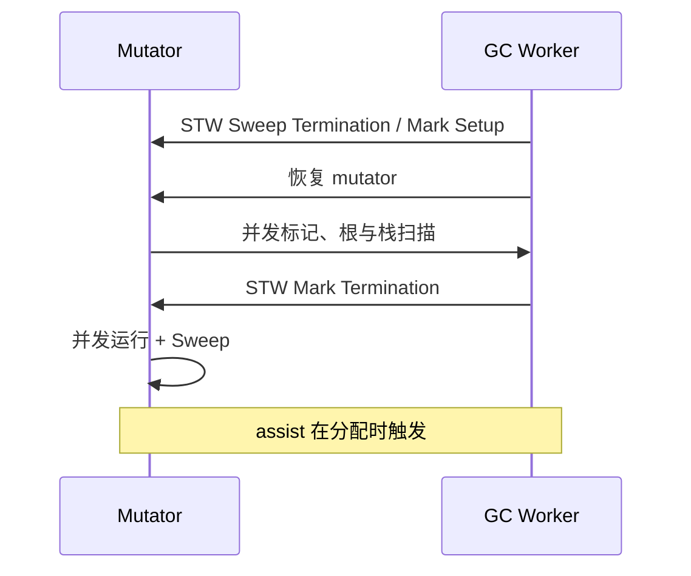

# STW 阶段与 Go 1.5+ GC 演进

## 30 秒版（开场）

> **STW（Stop The World）** 是 runtime 暂停所有用户 goroutine 以切换 GC 全局阶段的窗口；Go 自 1.5 起以**并发标记**为主，STW 已大幅缩短，但**从未归零**。goroutine 栈主要在并发标记期逐个暂停并扫描，不等于“STW 一次扫完所有栈”。生产关键词：**sweep termination、mark termination、P99 毛刺**。

## 3 分钟版（精讲深度）

1. **是什么**：STW 期间 mutator 不运行，runtime 用它完成 sweep termination、开启/关闭写屏障和切换标记阶段等全局操作。
2. **为什么**：完全无 STW 的并发 GC 极难；Go 选择「短 STW + 长并发」平衡吞吐与延迟。
3. **怎么做**：1.5 三色并发标记；1.8 混合写屏障去掉 mark termination 的 stack rescan；1.12 优化 mark termination；1.14 引入异步抢占，降低 goroutine 长时间不到安全点的风险；1.26 默认启用 Green Tea，主要优化标记/扫描 CPU 与局部性，而不是消灭 STW。

## 10 分钟版（原理 + 图示）

**典型 GC 周期 STW 点（简化）**

| 阶段 | STW? | 说明 |
|------|------|------|
| Sweep Termination / Mark Setup | 是（极短） | 完成上一轮 sweep、开启写屏障并切入 mark |
| Concurrent Mark + Scan | 否（整体） | mutator 与 GC worker 并行；扫描某个 G 的栈时会暂停该 G |
| Mark Termination | 是（短） | 完成标记，关闭写屏障 |
| Concurrent Sweep | 否 | 后台清扫 span |



**版本演进时间线**

- **≤1.4**：标记-清除，STW 长，吞吐差。
- **1.5**：并发三色标记，STW 主要剩 setup/term。
- **1.8**：混合写屏障，去掉 stack rescan STW。
- **1.12**：mark assist 调度优化，降低 term STW。
- **1.19+**：软内存限制 `GOMEMLIMIT` 与 GC 协同，减少 OOM 前剧烈 GC。
- **1.26**：Green Tea GC 默认启用，按 page/span 聚合小对象的标记与扫描工作，改善局部性和多核扩展；setup、mark termination 等短 STW 仍然存在。

## 生产场景

- **低延迟 API**：P99 偶发 1–3ms 毛刺，trace 显示 `STW` 与 `network` 无关 → GC pause。
- **发布升级**：Go 版本升级后 GC CPU、assist 与 pause 分布都可能变化；升级到 1.26 应对比业务压测，不能把官方基准收益直接当成本服务结论。
- **可观测**：Prometheus `go_gc_duration_seconds`、OpenTelemetry runtime metrics。

## 排查与工具

| 工具 | 用途 |
|------|------|
| `go tool trace` | 精确 STW 区间与长度 |
| `GODEBUG=gctrace=1` | 每轮 pause 时间 |
| `runtime/metrics` | `/gc/pauses:seconds` 直方图 |

路径：P99 毛刺 → trace 过滤 STW → 对齐 gctrace 周期 → 查分配率/GOGC/GOMEMLIMIT。

## 架构取舍

| 方案 | 适用 | 不适用 |
|------|------|--------|
| 接受亚毫秒 STW | 大多数 HTTP/gRPC | 微秒级硬实时 |
| 升级 Go 版本获 GC 改进 | 长期维护服务 | 无回归测试的一次升级 |
| 换语言/进程隔离 GC 敏感路径 | 极端延迟 | 小团队过早优化 |

## 深挖问答

1. **STW 时 goroutine 状态？** → runtime 将 goroutine 带到可停止点，暂停 mutator 并协调各 P 完成阶段切换。
2. **并发标记时 mutator 能分配吗？** → 能，触发 assist 并受写屏障保护。
3. **1.5 前后对比一句话？** → 从「大部分时间 STW 标记」到「大部分时间并发」。
4. **sweep 为何能并发？** → span 清扫状态与分配路径协同；分配路径也可能同步 sweep 某个 span，但这不是一次全局 STW。
5. **如何读 gctrace pause？** → 重点区分开头的 STW sweep termination、并发 mark/scan，以及结尾的 STW mark termination。

## 反模式与事故

- 用「Go 无 STW」作答——会被追问 sweep term 打脸。
- 仅看 `GOGC=100` 默认值，不随容器 memory limit 设 `GOMEMLIMIT`。
- 压测只看 QPS 不看 GC pause 分位，上线后 P99 暴雷。

## 代码示例

```go
// 读取 GC pause 直方图（Go 1.16+ runtime/metrics）。
// runtime/metrics 没有 Percentile 方法；分位数需按 Buckets/Counts 自行计算，
// 或把直方图交给监控系统聚合。
import "runtime/metrics"

func gcPauseHistogram() *metrics.Float64Histogram {
    samples := []metrics.Sample{{Name: "/gc/pauses:seconds"}}
    metrics.Read(samples)
    return samples[0].Value.Float64Histogram()
}
```

## 延伸阅读

- [Go 1.5 Release Notes - GC](https://go.dev/doc/go1.5)
- [Go 1.8 Release Notes - Hybrid Barrier](https://go.dev/doc/go1.8)
- [Go 1.26 Release Notes - Green Tea GC](https://go.dev/doc/go1.26)
- [Go GC Guide](https://go.dev/doc/gc-guide)
- [GopherCon 2018: GC 演进](https://www.youtube.com/watch?v=0izBiElKNl4)
