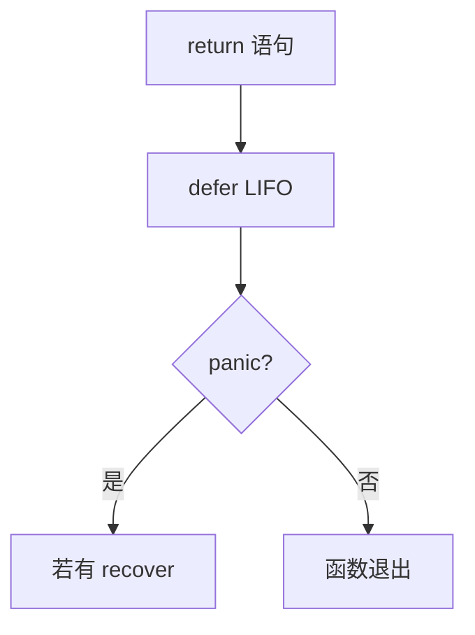

# defer 链、开销与错误处理

## 30 秒版（开场）

> **defer** 注册调用，在函数返回或 panic 展开时按 LIFO 执行。编译器/runtime 可能采用 **open-coded defer**、栈上 `_defer` 或堆上 `_defer`，不能统一描述成“一个堆链表”。Go 1.14 起多数常见 defer 已接近普通调用成本，但循环中 defer 仍会累积到外层函数退出。

## 3 分钟版（精讲深度）

1. **是什么**：推迟调用到 surrounding function 退出；参数在 defer 语句处求值（除函数字面量闭包延迟读变量）。
2. **为什么**：保证资源释放（close、Unlock、tx.Rollback）路径统一，避免漏释。
3. **怎么做**：锁/文件/连接用 defer；循环内改用显式 close 或封装函数；错误用 `defer func(){ if err!=nil { rollback() } }()`。

## 10 分钟版（原理 + 图示）

**执行顺序**

```go
defer fmt.Println(1)
defer fmt.Println(2)
// return 时打印 2 然后 1
```

**与 return 交互**

- 先算 return 右值 → 赋给 named return → 跑 defer 链 → 再真正 ret。
- defer 可修改 **named result** 影响最终返回值。



**开销（表述要点）**

- Go 1.14 起，编译器可对满足条件的场景使用 **open-coded defer**；其他场景可能使用栈上或堆上的 `_defer` 记录。
- 极热微函数：百万次 defer 可测到 ns 级差异，通常不是首要瓶颈。
- **循环中 defer**：defer 累积到函数结束才执行，可能耗尽 fd/连接。

**panic/recover**

- `recover` 只有在 panic 展开期间，由**被 defer 的函数直接调用**时才会停止 panic；再套一层普通 helper 调用通常拿不到该 panic。
- 业务错误用 `error` 返回，非 panic。

## 生产场景

- **DB 事务**：`defer tx.Rollback()` + 成功 `Commit` 覆盖；注意 Rollback 忽略 ErrTxDone。
- **HTTP client**：循环里 `defer resp.Body.Close()` 会把释放推迟到外层函数结束；如需复用 HTTP/1.x 连接，还应在合适场景读到 EOF 或显式 drain 后关闭。
- **可观测**：fd 泄漏、too many open files；pprof 见 defer 相关分配（通常次要）。

## 排查与工具

| 工具 | 用途 |
|------|------|
| 代码审查 | 循环 defer |
| pprof allocs | 极端 defer 热点 |
| vet/staticcheck | 常见资源泄漏 |

路径：连接/fd 涨 → 搜 defer Close → 改子函数或显式 close → 压测连接数稳定。

## 架构取舍

| 方案 | 适用 | 不适用 |
|------|------|--------|
| defer Close/Unlock | 绝大多数 IO/锁 | 纳秒级循环内核 |
| 子函数 + defer | 循环体资源 | 过度嵌套 |
| 显式 close | 热循环 | 多 return 易漏 |
| errgroup + context | 并发生命周期 | 单函数资源 |

## 深挖问答

1. **defer 参数何时求值？** → 注册时，除闭包读外部变量在执行时。
2. **defer 修改返回值？** → 仅 named return 可被 defer 内赋值影响。
3. **recover 能跨 goroutine 吗？** → 不能，只在同一 G 的 defer 栈。
4. **defer 与 os.Exit？** → Exit 跳过 defer。
5. **1.14+ defer 性能？** → open defer 减开销，实现细节讲解「持续优化」即可。

## 反模式与事故

- `for { f, _ := os.Open(); defer f.Close() }` —— 经典 fd 泄漏题。
- 用 panic/recover 做正常流程控制。
- 用 named result + defer 隐式覆盖原错误，却没有明确记录 close/rollback 错误优先级。

## 代码示例

```go
func writeFile(path string, data []byte) (err error) {
    f, err := os.Create(path)
    if err != nil {
        return err
    }
    defer func() {
        cerr := f.Close()
        if err == nil {
            err = cerr
        }
    }()
    _, err = f.Write(data)
    return err
}

// 循环：用子函数确保 defer 在每次迭代结束执行
func processFiles(paths []string) error {
    for _, p := range paths {
        if err := func() error {
            f, err := os.Open(p)
            if err != nil {
                return err
            }
            defer f.Close()
            return consume(f)
        }(); err != nil {
            return err
        }
    }
    return nil
}
```

## 延伸阅读

- [Defer, Panic, and Recover](https://go.dev/blog/defer-panic-and-recover)
- [Go spec: Defer statements](https://go.dev/ref/spec#Defer_statements)
- [Open defer 实现（Go 1.14）](https://go.dev/doc/go1.14)
