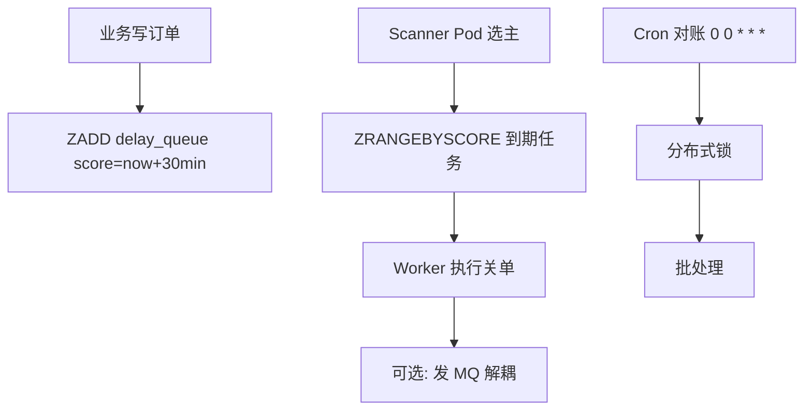

# 延迟任务与定时任务架构

## 30 秒版（开场）

> 延迟任务 = **不早于 T 时刻触发一次或多次尝试**（订单超时关单）；定时任务 = **周期执行**（对账）。常见实现有 **Redis ZSET 轮询、支持定时投递的 MQ、DB 扫描、durable workflow**。分布式调度通常只能承诺至少一次尝试，业务 handler 必须幂等。

## 3 分钟版（精讲深度）

1. **是什么**：延迟队列在指定时间触发回调；Cron 按 cron 表达式周期跑批。
2. **为什么**：支付 30 分钟超时、优惠券到期提醒、日终对账——不能靠 `time.Sleep` 挂进程。
3. **怎么做**：简单可控规模可用 Redis ZSET/DB；RocketMQ 5.x 可按时间戳定时投递（4.x 常见固定 delay level）；复杂长流程用 Temporal 等 durable workflow。`robfig/cron` 是第三方进程内调度库，多实例需选主、分片或让任务本身幂等。

## 10 分钟版（原理 + 图示）



**方案对比**

| 方案 | 精度 | 规模 | 持久化 |
|------|------|------|--------|
| Redis ZSET | ms~s | 百万级 | RDB/AOF |
| RocketMQ 延迟 | 版本相关；5.x 支持定时时间戳 | 高吞吐 | broker 持久化 |
| DB 轮询 | s~min | 简单 | 强 |
| Kafka + 应用调度 | 取决于实现 | 中高 | Kafka 本身无通用原生延时队列 |
| Temporal | durable timer，实际执行仍受 worker 调度影响 | 工作流级 | 服务端持久化 |

**容量估算**

- 日订单 100 万，30min 超时 → 同时 pending 约 100万/48 ≈ **2 万** 延迟任务在队列。
- Scanner 1s 扫一次，每次取 1000 条 → 峰值取消 1000/s，足够。
- ZSET 100 万元素内存 ~100MB 量级。

**分布式 Cron 要点**

- 多 Pod 可采用 K8s Lease/DB 租约选主，也可按分片并行；即便选主，任务仍需幂等以覆盖 lease 切换和超时重试。
- 任务必须 **幂等**（关单 `UPDATE WHERE status=PENDING`）。
- 时钟漂移：用 NTP；score 用 UTC 毫秒。

## 生产场景

- **订单 30 分钟未支付自动关闭**：延迟 MQ 或 ZSET。
- **会员到期前 3 天提醒**：Cron 日批 + 用户分片并行。
- **Retry 退避**：1m、5m、30m 延迟重试链。

## 排查与工具

| 现象 | 排查 |
|------|------|
| 任务未执行 | Scanner 选主失败、ZSET score 错误 |
| 重复执行 | 未幂等、多 Scanner 无锁 |
| 堆积 | Worker 慢、Consumer lag |
| 时间不准 | 时区、cron 表达式错误 |

## 架构取舍

| 方案 | 适用 | 不适用 |
|------|------|--------|
| Redis ZSET | 灵活延迟、Go 生态 | Redis 持久化要求极高 |
| MQ 延迟 | 已有 MQ、固定档位 | 任意延迟时间 |
| XXL-JOB/Temporal | 复杂编排、可视化 | 简单超时关单 |
| time.AfterFunc | 单进程 demo | 生产分布式 |

## 深挖问答

1. **Redis ZSET 扫描会阻塞吗？** → 分批 ZRANGEBYSCORE + LIMIT；避免 ZRANGE 全量。
2. **任务执行失败？** → 重入队列 + 退避 + DLQ + 告警。
3. **Go cron 多实例？** → 必须分布式锁，否则重复跑批。
4. **和 MQ 延迟消息区别？** → ZSET 便于查询、取消和改期，但 claim/recovery 要自己实现；MQ 由 broker 管投递与重试。RocketMQ 4.x 常用固定级别，5.x 已支持定时时间戳，回答时要说明版本。
5. **百万延迟任务如何删除？** → 执行后 ZREM；定期 ZREMRANGEBYSCORE 清理过期。

## 反模式与事故

- 单 Pod `time.Sleep`，发布滚动丢任务。
- Cron 无锁，对账跑 3 遍写 3 份报表。
- ZSET 无上限，历史任务未删内存爆。
- 用本地时区算延迟，夏令时出错。

## 代码示例

```go
// 原子地把到期任务从 pending 移到 processing，并写入 lease deadline。
// 生产代码应批量 claim，并由 reaper 把过期 processing 任务重新入队。
const claimDueLua = `
local ids = redis.call('ZRANGEBYSCORE', KEYS[1], '-inf', ARGV[1],
  'LIMIT', 0, 1)
if #ids == 0 then return nil end
local id = ids[1]
if redis.call('ZREM', KEYS[1], id) == 1 then
  redis.call('ZADD', KEYS[2], ARGV[2], id)
  return id
end
return nil
`

func (s *DelayQueue) Claim(ctx context.Context, lease time.Duration) (string, error) {
    now := time.Now()
    return s.rdb.Eval(ctx, claimDueLua,
        []string{"delay:pending", "delay:processing"},
        now.UnixMilli(), now.Add(lease).UnixMilli(),
    ).Text()
}

func (s *DelayQueue) Ack(ctx context.Context, id string) error {
    return s.rdb.ZRem(ctx, "delay:processing", id).Err()
}

func (s *DelayQueue) Schedule(ctx context.Context, id string, at time.Time) error {
    return s.rdb.ZAdd(ctx, "delay:pending", redis.Z{
        Score:  float64(at.UnixMilli()),
        Member: id,
    }).Err()
}
```

worker 成功后 `Ack`；失败则按退避重新 `ZADD pending`。如果 worker 在处理期间崩溃，reaper 根据 processing 的 lease deadline 重投。lease 过期仍可能造成并发重复执行，因此关单等业务还要用 `UPDATE ... WHERE status='PENDING'` 保证幂等。

## 延伸阅读

- [Redis Sorted Set 延迟队列](https://redis.io/docs/latest/commands/zadd/)
- [Temporal - Durable Timers](https://docs.temporal.io/workflows#timers)
- [robfig/cron v3](https://github.com/robfig/cron)
