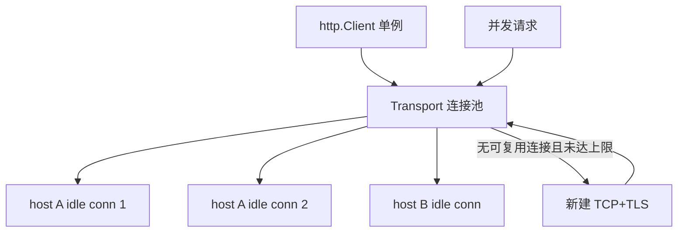

# HTTP 连接池与 Keep-Alive

## 30 秒版（开场）

> Go `http.Transport` 默认会缓存连接；对 HTTP/1.x，`DefaultMaxIdleConnsPerHost` 为 2，固定高并发下游可能需要调大。**Keep-Alive** 复用 TCP/TLS 握手。生产应复用 `Client/Transport`，并按容量设置 `MaxIdleConnsPerHost`、`MaxConnsPerHost`、`IdleConnTimeout` 和各阶段超时。关键词：**TIME_WAIT、FD 耗尽、HTTP/2 多路复用**。

## 3 分钟版（精讲深度）

1. **是什么**：`http.Transport` 维护 idle 连接缓存；请求完连接放回池供复用；Keep-Alive 是 HTTP/1.1 默认持久连接。
2. **为什么**：每次新建 TCP+TLS 握手有额外延迟与 CPU 成本；HTTP/1.x 高并发出站调用若每 host 只保留 2 条空闲连接，波峰时会频繁重建连接。
3. **怎么做**：按相同 TLS、代理和超时策略复用 `http.Client`/`Transport`；容量值由下游实例数、并发和 HTTP 版本压测确定；同时设置请求总 deadline 与连接、TLS、响应头等阶段超时。

## 10 分钟版（原理 + 图示）

**Transport 关键字段**

| 字段 | 默认 | 建议 |
|------|------|------|
| MaxIdleConns | 100 | 按总 outbound 调 |
| MaxIdleConnsPerHost | **2** | 20~100 |
| MaxConnsPerHost | 0（不限） | 需要保护下游时设置 |
| IdleConnTimeout | 90s | 对齐 LB idle |
| TLSHandshakeTimeout | 10s | 防挂死 |
| ExpectContinueTimeout | 1s | 大 body 上传 |



**HTTP/1.1 vs HTTP/2**：HTTP/2 在一条连接上并发多个 stream，达到服务端 `MAX_CONCURRENT_STREAMS` 或连接异常时也可能建立更多连接；HTTP/1.1 并行请求通常需要多条连接。`DefaultTransport` 会尝试 HTTP/2；若自定义 `DialContext`、`DialTLS` 或 `TLSClientConfig`，应显式设置 `ForceAttemptHTTP2: true`，否则可能保守地关闭自动 HTTP/2。

**陷阱**：`http.Get` 使用 `DefaultClient`，没有应用级总超时；多个零值 `http.Client{}` 仍会共享 `DefaultTransport`，真正破坏复用的是每次新建自定义 `Transport`。响应体必须 `Close`；对 HTTP/1.x，通常还应读到 EOF 才能稳定复用该连接。

## 生产场景

- **调用支付网关高 QPS**：先按协议版本、并发度和下游承载能力压测，再调 `MaxIdleConnsPerHost`/`MaxConnsPerHost`；不要背固定参数或固定收益。
- **K8s 滚动发布**：旧 Pod 连接仍被 client 池持有 → 502；缩短 `IdleConnTimeout` + 优雅 drain。
- **Sidecar Envoy**：客户端 HTTP/2 单连接，注意 max concurrent streams。

## 排查与工具

| 工具 | 用途 |
|------|------|
| `ss -s` / `lsof -p` | FD 与连接状态 |
| pprof goroutine | 阻塞在 dial |
| APM outbound span | 连接 vs TTFB |
| `GODEBUG=http2debug=2` | HTTP/2 帧调试 |

路径：出站 RT 周期性尖刺 → 是否每请求 NewClient → TIME_WAIT 堆积 → 调池参数与 LB idle 对齐。

## 架构取舍

| 方案 | 适用 | 不适用 |
|------|------|--------|
| 共享 Transport | 所有出站 HTTP | 完全不同 TLS 需求 |
| 连接池调优 | 高 QPS 固定下游 | 单次调用 |
| HTTP/2 | 同 host 高并发 | 老中间盒不兼容 |
| 短连接 | 极低频 | 性能敏感 |
| 专用 proxy | 统一 mTLS/限流 | 简单两服务 |

## 深挖问答

1. **为什么要读完并关闭 Body？** → HTTP/1.x Transport 只有在响应体读到 EOF 后，才通常能把连接放回复用池；无论是否读完都必须 `Close`。请求取消用 context，不再推荐 `CancelRequest`。
2. **Client.Timeout 包含什么？** → 从 Dial 到读完 body 的总时间。
3. **MaxConnsPerHost？** → Go 1.11+ 限制总连接，防打爆下游。
4. **Keep-Alive 谁关？** → 空闲超时任一侧可关；下次请求重建。
5. **和数据库连接池区别？** → 语义类似；HTTP 还有 TLS 会话复用。

## 反模式与事故

- 每个请求新建一个自定义 `http.Transport`——连接池彼此隔离，TLS/TCP 频繁重建。
- 忽略 `resp.Body.Close()`——泄漏 FD。
- 只调大空闲池却不设 `MaxConnsPerHost`——突发流量仍可建立大量连接打爆下游。
- 客户端 idle timeout 明显长于 LB——增加陈旧连接、重连和偶发网络错误风险；是否自动重试还取决于请求是否幂等、body 是否可重放等条件。

## 代码示例

```go
var defaultHTTPClient = &http.Client{
    Timeout: 10 * time.Second,
    Transport: &http.Transport{
        MaxIdleConns:          200,
        MaxIdleConnsPerHost:   50,
        MaxConnsPerHost:       100,
        IdleConnTimeout:       60 * time.Second,
        TLSHandshakeTimeout:   5 * time.Second,
        ResponseHeaderTimeout: 5 * time.Second,
        ForceAttemptHTTP2:     true,
    },
}

func callAPI(ctx context.Context, url string) error {
    req, err := http.NewRequestWithContext(ctx, http.MethodGet, url, nil)
    if err != nil {
        return err
    }
    resp, err := defaultHTTPClient.Do(req)
    if err != nil {
        return err
    }
    defer resp.Body.Close()
    _, err = io.Copy(io.Discard, resp.Body) // HTTP/1.x 尽量读到 EOF
    return err
}
```

## 延伸阅读

- [net/http Transport](https://pkg.go.dev/net/http#Transport)
- [Go HTTP Client 最佳实践](https://blog.cloudflare.com/the-complete-guide-to-golang-net-http-timeouts/)
- [Effective Go](https://go.dev/doc/effective_go)
