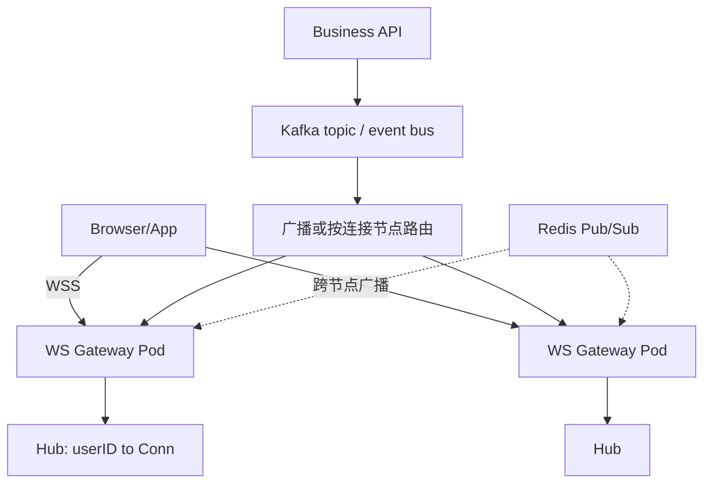

# WebSocket 网关设计

## 30 秒版（开场）

> **WebSocket** 在单连接上提供全双工通信，适合 **实时推送、IM、行情**。网关职责：**连接管理、鉴权、心跳、广播/房间、与 MQ 桥接**。Go 常用 **gorilla/websocket** 或 **github.com/coder/websocket**（原 nhooyr 项目现由 Coder 维护）。生产关键词：**连接上限、水平扩展、跨节点路由、背压、优雅下线**。

## 3 分钟版（精讲深度）

1. **是什么**：HTTP Upgrade 握手后切换 WS 协议；服务端可主动 push；帧类型 Text/Binary/Ping/Pong/Close。
2. **为什么**：轮询浪费；SSE 仅服务端推且 HTTP/1.1 连接数受限；gRPC stream 浏览器不原生支持。
3. **怎么做**：独立 **WS Gateway** 集群；握手或首帧阶段鉴权；`Ping/Pong` + 读超时识别失活连接；**Hub** 管理本机连接；业务事件通过可明确 fan-out 语义的 Pub/Sub、独立消费组或“用户到节点”路由送达；客户端实现退避重连。

## 10 分钟版（原理 + 图示）

**架构**



**连接管理**：每连接 **读 goroutine + 写 goroutine**（或 send channel）；写集中避免 concurrent Write；`SetReadLimit` 防大包；`SetPongHandler` 续读 deadline。

**扩展**：连接状态通常在 **本地内存**；跨 Pod 推送可广播后本地过滤，也可维护 `user_id -> gateway` 路由。Kafka 节点若使用同一个 consumer group，消息会在组内分摊，**不会自动广播到每个网关**。Go 的 goroutine 已由 runtime netpoll 支撑，常见的一读一写 goroutine 模型本身可扩展；是否改事件驱动库应由内存、调度和压测数据决定。

**负载均衡**：sticky session 只影响初次握手或重连落点，已建立连接不会在请求间重新负载。若连接状态只在本机，重连到其他节点时应重新注册订阅；粘性不是正确跨节点消息路由的替代品。

**优雅下线**：SIGTERM → 停 accept → 广播 close frame → 等待 drain 或超时强关 → 客户端指数退避重连。

## 生产场景

- **订单状态推送**：支付成功 → MQ → 网关查 user 是否在线 → WS push JSON。
- **在线客服 IM**：房间 `room_id` Hub；消息持久化仍走 HTTP/DB，WS 仅实时层。
- **大屏行情**：广播多；可 **合并 tick** 降频，二进制 Protobuf 减带宽。

## 排查与工具

| 工具 | 用途 |
|------|------|
| `netstat` / conntrack | 连接数 |
| pprof goroutine | 泄漏连接 |
| Prometheus | 在线数、推送延迟 |
| wscat | 手工测握手 |

路径：大量断连 → LB idle 超时 vs 心跳间隔 → 是否 concurrent Write → OOM 看连接是否泄漏未 Unregister。

## 架构取舍

| 方案 | 适用 | 不适用 |
|------|------|--------|
| 独立 WS 网关 | 连接与 HTTP API 解耦 | 极小流量 |
| Redis Pub/Sub | 跨节点 push | 强可靠（用 Kafka） |
| SSE | 单向通知、简单 | 双向 IM |
| 第三方（Pusher/Ably） | 快速上线 | 成本/定制 |
| gRPC stream 内网 | 非浏览器 | 公网 |

## 深挖问答

1. **握手过程？** → Upgrade 101，Sec-WebSocket-Accept 校验。
2. **如何鉴权？** → 原生客户端可用 `Authorization`；浏览器 WebSocket API 不能自定义该 header，常用受保护 Cookie、受限 subprotocol 或连接后首帧认证。Query token 容易进入 access log、监控和 URL 记录，应尽量避免或使用一次性短 token。
3. **心跳怎么做？** → Ping/Pong 或应用层 ping；必须持续运行 read pump 才能处理控制帧并触发 Pong handler。
4. **多机如何推指定用户？** → 本地有则写；无则 Pub/Sub 到持有连接节点。
5. **和 HTTP/2 server push 区别？** → WS 全双工独立协议；H2 push 已弱化。

## 反模式与事故

- gorilla/websocket 违反“一名并发 reader、一名并发 writer”约束——产生数据竞争、协议错误或写失败。
- 无读超时——半开连接占满 FD。
- 广播单线程写万连接——阻塞；应 per-conn buffer + drop 慢客户端。
- 网关当 DB——消息未落库即 push，断线丢失。

## 代码示例

```go
var upgrader = websocket.Upgrader{
    CheckOrigin: func(r *http.Request) bool {
        return r.Header.Get("Origin") == "https://app.example.com"
    },
    ReadBufferSize: 1024, WriteBufferSize: 1024,
}

type Client struct {
    conn *websocket.Conn
    send chan []byte
}

func (c *Client) writePump() {
    ticker := time.NewTicker(30 * time.Second)
    defer ticker.Stop()
    defer c.conn.Close()
    for {
        select {
        case msg, ok := <-c.send:
            _ = c.conn.SetWriteDeadline(time.Now().Add(10 * time.Second))
            if !ok {
                _ = c.conn.WriteMessage(websocket.CloseMessage, []byte{})
                return
            }
            if err := c.conn.WriteMessage(websocket.TextMessage, msg); err != nil {
                return
            }
        case <-ticker.C:
            _ = c.conn.SetWriteDeadline(time.Now().Add(10 * time.Second))
            if err := c.conn.WriteMessage(websocket.PingMessage, nil); err != nil {
                return
            }
        }
    }
}
```

Hub 维护 `register/unregister/broadcast` channel；`send` 必须有界，并明确慢客户端策略（丢旧消息、断开或降级）。另需 read pump 设置 read limit、deadline 和 Pong handler。

## 延伸阅读

- [RFC 6455 WebSocket](https://datatracker.ietf.org/doc/html/rfc6455)
- [gorilla/websocket](https://github.com/gorilla/websocket)
- [gorilla/websocket 文档](https://pkg.go.dev/github.com/gorilla/websocket)
