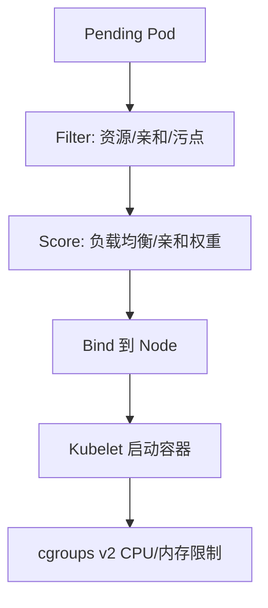

# Kubernetes 调度与 Go 服务资源 limit

## 30 秒版（开场）

> K8s **Scheduler 主要按 resource requests**、亲和性、污点容忍等选择 Node；CPU/memory limits 主要由 kubelet/container runtime 通过 cgroup 执行。Go 服务应验证 **GOMAXPROCS 与有效 CPU 配额**，避免严重不匹配造成 throttling 与尾延迟。Go 1.25+ 在 Linux 容器中默认感知 cgroup CPU limit。

## 3 分钟版（精讲深度）

1. **是什么**：Scheduler 过滤（Filter）+ 打分（Score）选 Pod 所在 Node；资源可调度性看 requests，limits 决定运行时上限和 QoS 等行为。
2. **为什么**：5 年+ 后端多数跑 K8s；不懂 limit 会导致 **CPU 节流、OOMKilled、GOMAXPROCS 过大**。
3. **怎么做**：requests/limits 根据压测和生产分位数设定；内存预算除 Go heap/stack 外还要覆盖 runtime、mmap、CGO、内核记账等。Go 1.24 及更早可用 **automaxprocs**，Go 1.25+ 默认自动感知 CPU limit，但显式设置 `GOMAXPROCS` 会关闭该默认行为。readiness 只判断实例当前是否有能力接流量，外部依赖检查要避免“一处依赖故障使所有副本同时摘流量”。

## 10 分钟版（原理 + 图示）

**调度简要流程**



**Go 与 CPU limit**

| 现象 | 原因 |
|------|------|
| CPU limit=2 但 GOMAXPROCS=48 | 过多 P 争用 2 核，调度开销大 |
| P99 尖刺 | CFS throttling |
| OOMKilled | limit 低于 Go heap 峰值 |

**推荐实践**

```yaml
resources:
  requests:
    cpu: "500m"
    memory: "512Mi"
  limits:
    cpu: "2"
    memory: "1Gi"
```

```go
import _ "go.uber.org/automaxprocs" // 或监控 GOMAXPROCS 与 cgroup
```

## 生产场景

- 网关类 Go 服务：CPU 密集 + 高并发，limit 过低 → 全链路超时
- 有状态服务：避免频繁 reschedule；用 PDB + 反亲和 spread
- 大促：HPA 基于 CPU 或自定义 QPS；提前压测 **limit 下** 表现

## 排查与工具

- `kubectl describe pod` → Events、OOM、FailedScheduling
- `kubectl top pod`、metrics-server
- 节点：`/sys/fs/cgroup` CPU throttling 指标
- Go：pprof + 容器 limit 对照

## 架构取舍

| QoS 类 | 说明 |
|--------|------|
| Guaranteed | 每个容器都为 CPU 与 memory 设置 request=limit；是否适合仍看容量与运维策略 |
| Burstable | 常见 Go 微服务 |
| BestEffort | 未设置 CPU/memory request 与 limit，节点压力下驱逐优先级通常更差 |

**何时不用 K8s**：极简边缘、强实时单机、团队无 SRE 能力 → 评估 VM/裸机。

## 深挖问答

1. **request 和 limit 怎么定？** → request 影响调度和 CPU HPA 利用率基线；limit 约束运行时资源。使用历史分布、压测、SLO 和节点超卖策略共同决定，不背固定倍数。
2. **liveness 和 readiness 区别？** → liveness 失败重启；readiness 失败摘流量。
3. **Pod 被驱逐？** → 节点压力、优先级、是否 BestEffort。
4. **不同 Go 版本在容器里 GOMAXPROCS？** → Go 1.24 及更早默认看主机逻辑 CPU；Go 1.25+ 在 Linux 默认取逻辑 CPU、affinity 与 cgroup CPU limit 的约束值并周期更新，但 CPU request 不参与。

## 反模式与事故

- **未设 memory limit** → 拖垮节点
- readiness 永远 200，实例已无法完成核心请求仍接流量；反过来深度检查共享依赖也可能造成全体摘流量，需按降级能力设计
- **HPA 仅 CPU** 忽略 goroutine 泄漏型内存涨

## 代码示例

```go
http.HandleFunc("/healthz", func(w http.ResponseWriter, r *http.Request) {
    if err := db.PingContext(r.Context()); err != nil {
        http.Error(w, "db down", http.StatusServiceUnavailable)
        return
    }
    w.WriteHeader(http.StatusOK)
})
```

## 延伸阅读

- [Kubernetes Scheduling](https://kubernetes.io/docs/concepts/scheduling-eviction/)
- [uber-go/automaxprocs](https://github.com/uber-go/automaxprocs)
- [S-CLOUD-04 滚动发布与探针](./S-CLOUD-04-rolling-update-probes-pdb.md)
- [S-CLOUD-07 K8s 故障排查](./S-CLOUD-07-k8s-troubleshooting.md)
