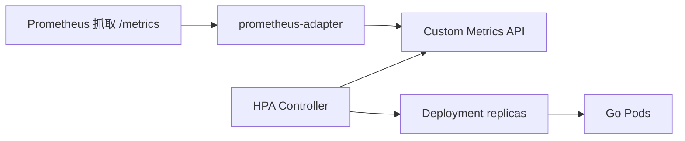

# HPA 与 Go 服务自定义指标扩缩容

## 30 秒版（开场）

> **HPA** 根据 CPU、内存或自定义/外部指标自动修改 workload 副本数。CPU `Utilization` 是 **实际 CPU usage / CPU request**，不是除以 limit；未设置 request 时该指标无法正常计算。I/O 型服务通常更适合按 RPS、inflight、队列 lag 等“增加副本后会下降”的指标扩容，延迟可作为保护信号但不宜单独盲目驱动。

## 3 分钟版（精讲深度）

1. **是什么**：HorizontalPodAutoscaler 周期性读 metrics-server 或 custom metrics API，计算目标副本数。
2. **为什么**：大促/开盘流量波动；手动扩缩滞后；常见深挖「为什么 CPU 不高却不扩容」。
3. **怎么做**：CPU target 只是起点；Go 网关结合 RPS/inflight 与 CPU，多指标时 HPA 取各建议副本数的最大值；用 `behavior` 的 stabilization window 与 scaling policies 防抖；在真实 requests/limits 下压测。

## 10 分钟版（原理 + 图示）



**副本数公式（简化）**

```
desiredReplicas = ceil(currentReplicas × (currentMetric / targetMetric))
```

**CPU 型 HPA（入门）**

```yaml
apiVersion: autoscaling/v2
kind: HorizontalPodAutoscaler
metadata:
  name: api-hpa
spec:
  scaleTargetRef:
    apiVersion: apps/v1
    kind: Deployment
    name: api
  minReplicas: 3
  maxReplicas: 50
  metrics:
    - type: Resource
      resource:
        name: cpu
        target:
          type: Utilization
          averageUtilization: 70
  behavior:
    scaleUp:
      stabilizationWindowSeconds: 60
    scaleDown:
      stabilizationWindowSeconds: 300
```

**自定义指标（QPS）**

```yaml
  metrics:
    - type: Pods
      pods:
        metric:
          name: http_requests_per_second
        target:
          type: AverageValue
          averageValue: "500"
```

Go 侧暴露：

```go
var reqTotal = prometheus.NewCounterVec(
    prometheus.CounterOpts{Name: "http_requests_total"},
    []string{"method", "path"},
)
// prometheus-adapter 规则将 rate(http_requests_total[1m]) 暴露为自定义指标
```

## 生产场景

- **Go I/O 密集**：CPU 低但 inflight/连接队列已满 → 改按 **inflight、RPS 或队列长度**；P99 可告警或参与复合策略，但它噪声大且扩容生效慢
- **Kafka consumer**：按 **consumer lag** 扩（见 [S-DIST-04](../middleware/kafka/S-DIST-04-kafka-semantics.md)）— 扩缩触发 rebalance，需 **scaleDown 慢**
- **交易所开盘**：提前 **manual scale** + HPA max 预留；与 [S-ARCH-18](../03-system-design/S-ARCH-18-capacity-planning.md) 容量规划一致
- **内存泄漏**：HPA 不是修复手段；按内存扩容可能只是复制更多泄漏实例，应告警、限制 maxReplicas 并修代码

## 排查与工具

- `kubectl get hpa` → TARGETS、REPLICAS 是否 `--`
- `kubectl describe hpa` → FailedGetResourceMetric / 指标缺失
- metrics-server：`kubectl top pod`
- Prometheus：`rate(http_requests_total[1m])` 与 adapter 规则是否一致

## 架构取舍

| 指标 | 优点 | 缺点 |
|------|------|------|
| CPU | 开箱即用 | Go throttle/IO 型失真 |
| Memory | 防 OOM 堆积 | 滞后、易受 GC 影响 |
| RPS / QPS | 贴近业务 | 需 Prometheus 栈 |
| Queue lag | 消费型准确 | 扩缩容扰动消费组 |

**何时不用 HPA**：副本强一致单主、有状态不适合水平扩、流量极平稳且成本敏感。

## 深挖问答

1. **HPA 和 VPA 区别？** → HPA 改副本数；VPA 调整/推荐单 Pod 资源。两者可以组合，但不要让 VPA 改动 HPA 正在以利用率计算的同一资源而缺少协调，否则目标基线会漂移。
2. **扩容后更卡？** → 冷启动、JVM/Go 预热、DB 连接池打满、缓存未热。
3. **Go GOMAXPROCS 与 HPA？** → 单 Pod CPU limit 固定时 GOMAXPROCS 应匹配；多 Pod 线性扩展（[S-CONC-04](../01-runtime-concurrency/S-CONC-04-gomaxprocs.md)）。
4. **自定义指标延迟？** → scrape、adapter、HPA sync、调度和应用启动都会叠加；默认/示例周期不是 SLA。尖峰场景可预扩容、保留余量或使用事件驱动 autoscaler。

## 反模式与事故

- **minReplicas=1 核心服务** → 单点 + 扩容来不及
- **scaleDown 无 stabilization** → 流量波动反复缩扩，缓存失效
- CPU request/limit 设置与 HPA target 不匹配 → 利用率基线失真，Pod 可能先被 limit throttle，或 HPA 过早/过晚扩容
- **maxReplicas 超过 DB 连接上限** → 扩容即打挂数据库

## 代码示例

```go
// 可选：暴露 inflight 供自定义 HPA
var inflight = prometheus.NewGauge(prometheus.GaugeOpts{Name: "http_inflight_requests"})

func inflightMiddleware(next http.Handler) http.Handler {
    return http.HandlerFunc(func(w http.ResponseWriter, r *http.Request) {
        inflight.Inc()
        defer inflight.Dec()
        next.ServeHTTP(w, r)
    })
}
```

## 延伸阅读

- [Horizontal Pod Autoscaling](https://kubernetes.io/docs/tasks/run-application/horizontal-pod-autoscale/)
- [S-CLOUD-01 K8s 调度与 limit](./S-CLOUD-01-k8s-scheduling.md)
- [S-ARCH-18 容量规划](../03-system-design/S-ARCH-18-capacity-planning.md)
