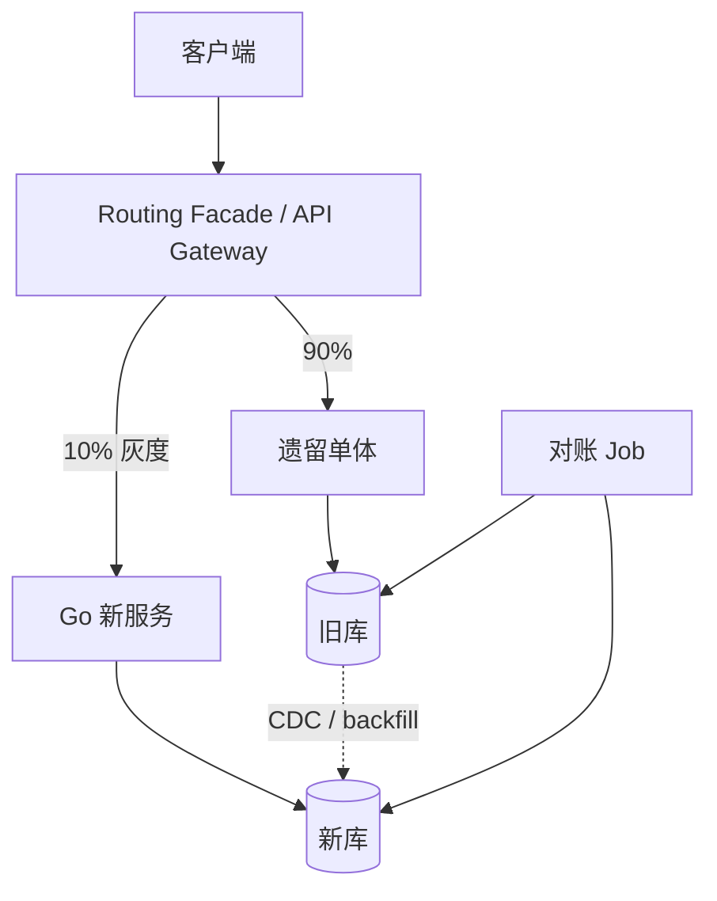

# 绞杀者模式与遗留系统迁移

## 30 秒版（开场）

> **绞杀者（Strangler Fig）**：逐路由、逐能力替换旧系统。关键不是“同时写两套库”，而是每阶段明确 **唯一 source of truth**、同步方向、数据回放/对账和回滚条件，避免把迁移做成永久双主。

## 3 分钟版（精讲深度）

1. **是什么**：在旧系统外围设 **Routing Facade**（网关/BFF），按 URL/用户/百分比把流量导向新旧实现。
2. **为什么**：架构讲解几乎必问「你怎么迁移 PHP/Java 老单体到 Go 微服务」；大爆炸风险不可接受。
3. **怎么做**：按垂直切片迁移；先做只读/影子验证，再切写 ownership。数据同步优先用同事务 outbox/CDC、可重放 backfill 与校验；若短期应用双写无法避免，也必须有幂等、失败记录和明确主写，不能忽略任一写错误。

## 10 分钟版（原理 + 图示）



**迁移阶段模板（叙事用）**

| 阶段 | 动作 | 回滚 |
|------|------|------|
| 0 | 只读 API 读新写旧 | 关开关回 100% 旧 |
| 1 | 旧库仍为主写，CDC/outbox 同步新库并影子校验 | 停同步，读写旧 |
| 2 | 短暂停写或双向兼容窗口后切换新库为唯一主写 | 只有在反向同步、schema 兼容和演练通过时才能切回 |
| 3 | 下线旧模块 | 保留只读备份 |

**Go 侧常见落地**

- 网关：Nginx/APISIX 按 path 路由；或 Go BFF 内 `if feature.NewOrder()` 转发
- 同步：业务事务写 outbox 后 relay，或 Debezium/Canal CDC 单向同步
- 对账：按主键范围比对记录版本、关键字段与金额汇总；仅比较总行数/checksum 可能漏掉相互抵消的错误

## 生产场景

- **支付链路迁移**：先迁查询，最后迁扣款；支付 never 允许 silent failure
- **Session 粘滞**：旧系统有 session，迁移期 JWT 统一或 SSO 桥接
- **与 S-ARCH-19 关系**：19 讲单体→微服务概念；本题讲 **怎么安全落地**

## 排查与工具

- 特性开关：LaunchDarkly / 自研 config center
- 指标：新旧路径 **错误率、P99、业务成功率** 对比
- 影子流量：复制真实读请求，但必须屏蔽写、副作用、外部通知和计费

## 架构取舍

| 双写 | CDC |
|------|-----|
| 实现快 | 解耦应用 |
| 应用复杂 | 延迟、顺序需处理 |

**何时不用绞杀者**：系统极小、或旧系统可整体停机窗口重写（罕见）。

## 深挖问答

1. **迁移同步不一致怎么办？** → 每阶段定义 source of truth、记录失败事件、可幂等重放并对账修复；不能默认“第二次写失败也先返回成功”。
2. **如何选第一个切片？** → 边界清晰、流量可灰度、非资金核心路径优先。
3. **组织阻力？** → 联合 KPI、小步快跑、可视化迁移看板（架构师软技能）。
4. **Go 与旧 Java 共存事务？** → 避免跨库 2PC；Saga + 幂等（见 [S-DIST-05](../middleware/distributed/S-DIST-05-distributed-transaction.md)）。

## 反模式与事故

- **Big Bang 切换** → 大促前全量切，回滚不及
- **无对账** → 双写静默丢单
- **按层迁移**（先迁所有 DAO）→ 长期两套并行，成本失控

## 代码示例

```go
func (h *OrderHandler) Create(c *gin.Context) {
    if h.flags.UseNewOrderService(c.Request.Context(), userID) {
        h.newSvc.Create(c)
        return
    }
    h.legacyProxy.Create(c)
}
```

## 延伸阅读

- [Strangler Fig - Martin Fowler](https://martinfowler.com/bliki/StranglerFigApplication.html)
- [Azure Strangler Fig pattern](https://learn.microsoft.com/en-us/azure/architecture/patterns/strangler-fig)
