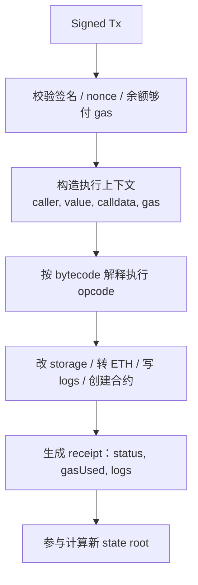
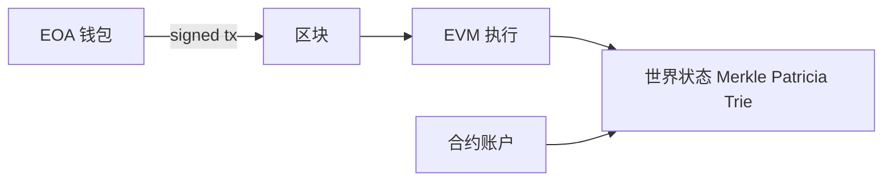

# 区块链基础与 EVM 账户模型

## 30 秒版（开场）

> **EVM（Ethereum Virtual Machine）** 是以太坊执行层的确定性虚拟机：给定同一前置世界状态与同一批交易，任何合规客户端算出来的状态转移结果必须一致。
> 它不是“另一条链”，而是 **怎么执行交易、改账户状态** 的规则引擎；共识（PoS）负责谁出块、哪条链有效，EVM 负责块内交易如何改变状态。
> 账户上传统区分 **EOA** 与 **合约账户**；EIP-7702 允许 EOA 设置持久代码委托，二分法要加版本语境。Go 后端重点是 nonce、typed transaction、fee、safe/finalized 与 chain ID。

## 3 分钟版（精讲深度）

1. **EVM 是什么**：栈式、基于 gas 计量的字节码虚拟机。Solidity/Vyper 等先编译成 **EVM bytecode**，部署后存在合约账户的 code 字段；交易触发时，EVM 按 opcode 逐步执行，读写 **stack / memory / storage**，并更新世界状态。
2. **它解决什么**：在不可信环境里让所有节点对「这笔交易执行后状态变成什么样」达成可验证一致——没有统一的中心服务器来“跑业务逻辑”。
3. **后端怎么用**：读链用 RPC（`eth_call` / receipt / logs）；写链构造并广播 signed tx；业务层必须把 **EVM 执行结果**（status、logs、state root 含义）与 **链下订单/账本状态** 拆开建模。

## 10 分钟版（原理 + 图示）

### EVM 究竟是什么

用一句话：**EVM = 以太坊的状态转移函数实现规范**。

```text
新世界状态 = EVM(旧世界状态, 区块内交易与执行上下文)
```

| 它是 | 它不是 |
|------|--------|
| 确定性字节码 VM（同输入同输出） | 共识协议本身（那是 PoS / fork choice） |
| 交易与合约逻辑的执行环境 | “钱包 App”或 RPC 网关 |
| 以 **gas** 为计量单位的资源会计器 | 无限算力的通用服务器 |
| 多条 EVM 兼容链可共享的执行模型 | 以太坊专属硬件或单一二进制 |

**执行时看到的三块工作区（讲解必分清）**

| 区域 | 生命周期 | 典型用途 | 后端直觉 |
|------|----------|----------|----------|
| **Stack** | 单次调用内 | opcode 运算操作数 | 不持久；溢出/深度限制会导致 revert |
| **Memory** | 单次调用内 | 临时字节数组、ABI 编解码缓冲 | 按字扩展计 gas；调用结束即丢 |
| **Storage** | 合约账户持久 | 状态变量、映射 | 写入昂贵；reorg/finality 前仍可能被推翻的是“整块共识”，不是单次 opcode 语义 |

**一次交易在 EVM 里大致发生什么**



要点：

- **输入**：前置状态 + 交易（及区块级上下文，如 `block.number`、`baseFee`）。
- **输出**：后置状态 + receipt（成功/失败、耗气、事件日志）；失败交易仍可能消耗 gas（已执行部分计费，防 DoS）。
- **确定性**：禁止依赖节点本地时间噪声、随机外设等；链上“随机性”必须来自协议定义的来源，否则各节点状态会分叉。
- **与共识的分工**：PoS 决定 **哪条链、哪个块** 被接受；EVM 决定 **块被接受后状态怎么变**。Go 索引器两者都要关心：先跟对 canonical head / finality，再解释 receipt 与 logs。

**和“智能合约”的关系**：合约源码不是链上直接执行物；链上存的是 bytecode。`eth_call` 是只读模拟执行（通常不改持久状态）；真正改状态的是被打包进块的交易。



**账户对比**

| 类型 | 控制 | 有代码 | 典型用途 |
|------|------|--------|----------|
| EOA | 原生 secp256k1 密钥授权；可通过 EIP-7702 委托代码执行 | 传统为空；7702 的 delegation indicator 会保留到后续授权替换或清除 | 用户钱包、热钱包 |
| Contract | 代码逻辑 | 是 | ERC20、DEX、NFT |

**交易字段（常考）**

| 字段 | 含义 |
|------|------|
| nonce | 发送账户的顺序与同链重放保护参数 |
| gasLimit / fee fields | 执行 gas 上限；legacy 与 EIP-1559 typed tx 的 fee 字段不同 |
| to | 是否可空由交易类型决定；在允许创建合约的交易类型中，空值表示创建。EIP-7702 set-code 交易要求非空目标，不能套用该简写 |
| value | 转 ETH |
| data | 调合约 calldata |

**Gas 机制（EIP-1559 后）**

- `baseFee` 销毁 + `priorityFee` 给验证者
- `SSTORE` 状态转换、首次 cold account/storage access 与后续 warm access 的计价不同；不要只背一个固定 opcode 数字。大数据通常链下存储并在链上提交必要承诺
- EIP-7702 的授权处理与后续目标调用是两个阶段；即使交易执行阶段 revert，已处理的代码委托也不会因此自动回滚。签名 UI 与后端策略必须把授权本身当作持久权限变更审查
- **计费公式、L2 L1 data fee、多链费用差异与 `estimateGas` 陷阱** 见 [S-BC-13](./S-BC-13-gas-fee-multichain.md)

**Finality**

- 以太坊 PoS 应优先区分 `latest`、`safe`、`finalized`；确认块数只是业务策略，不存在通用“12 块即最终”。托管 RPC 是否支持标签也要验证
- 与 [S-BC-05 重组](./S-BC-05-indexer-reorg.md) 联动

## 生产场景

- **充值**：用户转 ERC20 到平台地址 → 索引器按链的 safe/finalized 能力、资产价值和风控策略入账；固定 N 块只能是显式配置的替代策略
- **Gas 代付**：元交易 / Paymaster（Account Abstraction）
- **多 EVM 链**：若使用同一私钥，地址通常相同，但 chain ID、nonce、余额、合约代码和安全假设彼此独立；非 EVM 链的派生与地址格式另论
- **链族与接入差异**：独立 L1、侧链、Optimistic/ZK Rollup 的全景对照见 [S-BC-14](./S-BC-14-evm-chains-landscape-integration.md)

## 排查与工具

- Etherscan / Blockscout 看 tx、internal tx、event logs
- `eth_getTransactionReceipt` 的 `status` 0/1
- Foundry/Hardhat 本地复现

## 架构取舍

| 全链上 | 链下+链上承诺 |
|--------|---------------|
| 规则和状态更容易公开验证；仍受共识最终性、合约权限/升级和实现漏洞影响 | 便宜、可扩展 |
| 执行和数据成本高 | 需保证链下可用性；哈希只证明承诺内容未变，不自动证明内容真实 |

## 深挖问答

1. **EVM 和“以太坊节点”是一回事吗？** → 不是。节点还包含共识、网络、存储、RPC；EVM 只是执行层里负责状态转移的那一块。go-ethereum 的 `core/vm` 是实现，规范以 Yellow Paper / execution specs 为准。
2. **为什么说 EVM 必须确定性？** → 每个验证者独立重放同一批交易；若结果可因本地环境分叉，就无法就 state root 达成共识。
3. **UTXO vs Account？** → BTC UTXO；ETH 账户余额模型，便于智能合约。
4. **为什么 tx 失败仍耗 Gas？** → 已执行部分计费，防 DoS。
5. **chainId 作用？** → 进入交易签名域，降低跨链重放；应用层 EIP-712/授权消息仍要包含 domain、nonce、deadline 等自己的重放保护。
6. **和分布式系统一致性？** → 客户端先看到可能 reorg 的 tentative head，再按共识
   获得 safe/finalized 保证；不要把所有链简单归类成一个“最终一致”数据库。
   跨链桥还引入额外协议与信任假设。

## 反模式与事故

- **把 tentative 交易直接当不可逆入账** → 暴露于 reorg、双花或链异常
- 忽略/信任调用方传入的 chainId → 可能签错网络或形成跨环境事故；签名服务应按受控网络配置校验
- **把私钥放后端** → 用热钱包+HSM/KMS，最小余额

## 代码示例

只拿到 chain ID、且确实要支持当前 go-ethereum 已实现的全部交易类型时，可用
`types.LatestSignerForChainID(chainID)`；若掌握链配置与目标区块/时间，应优先用
`types.MakeSigner`（或对应 fork signer）按已激活分叉选择规则。不要把
`NewLondonSigner` 当作能验证 EIP-7702 等后续交易类型的通用 signer，并应固定
go-ethereum 版本后做兼容测试。

## 延伸阅读

- [Ethereum Virtual Machine (EVM)](https://ethereum.org/en/developers/docs/evm/)
- [Ethereum Accounts](https://ethereum.org/en/developers/docs/accounts/)
- [Gas and Fees](https://ethereum.org/en/developers/docs/gas/)
- [Smart Contracts](https://ethereum.org/en/developers/docs/smart-contracts/)
