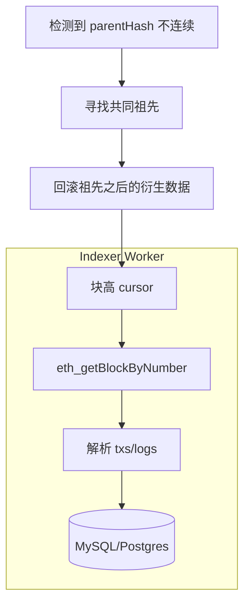

# 链上索引器：扫块、重组与幂等

!!! tip "相关主题"
    先分清 [投影 ≠ 链上事实](../../maps/confusion-cards.md#indexer-vs-canonical)；
    领域地图见 [Indexer / 节点数据](../../maps/indexer-node-data.md)。

## 30 秒版（开场）

> **索引器** = 持续同步链上 canonical 数据到 DB，供 API 查询。必须校验相邻块 `parentHash`，遇到 **reorg** 时回退到共同祖先并重放。Ethereum PoS 应优先区分 `latest`、`safe`、`finalized`；“固定 N 个确认”只是部分链或 RPC 不支持 finality tag 时的风险策略。

## 3 分钟版（精讲深度）

1. **是什么**：Worker 从 `lastBlock+1` 扫到 latest，解析 tx/logs 写业务表。
2. **为什么**：RPC 不适合直接给 C 端高并发查；且需关联链下 userId。
3. **怎么做**：保存块高、块 hash、parent hash 和处理状态；新区块的 `parentHash` 必须等于本地前一 canonical 块的 hash。发现分叉后向前寻找共同祖先，在同一事务中回滚衍生数据与 cursor，再重扫。

## 10 分钟版（原理 + 图示）



**表设计要点**

| 表 | 关键字段 |
|----|----------|
| blocks | chain_id, number, hash, parent_hash, status, processed_at |
| chain_log_observations | chain_id, block_hash, tx_hash, log_index, payload, canonical |
| deposits | business_id, chain_id, tx_hash, log_index, current_block_hash, amount, status |
| cursor | chain_id, last_observed, last_safe, last_finalized |

要区分两种 identity：

- 链上“观察记录”用 `(chain_id, block_hash, tx_hash, log_index)` 唯一，以保留同一
  transaction 在 reorg 前后不同区块中的 lineage
- 业务副作用可用 `(chain_id, tx_hash, log_index, event_semantics)` 作为幂等键，但要
  随 canonical 状态推进/冲正；同一 tx 重新上链不应重复入账

如果只保留 `(tx_hash, log_index)` 一行并覆盖 `block_hash`，会丢失审计历史；如果把
每个 `block_hash` 都当新充值，又会重复入账。该模型与
[S-ARCH-04 幂等](../03-system-design/S-ARCH-04-idempotency.md) 同构。

**三个容易混淆的水位**

| 水位 | 含义 | 典型用途 |
|------|------|----------|
| observed/latest | 当前节点看到的链头，可能 reorg | 低风险 UI 预展示 |
| safe | 在正常共识假设下不太可能被重组 | 风险可控的业务确认 |
| finalized | 除非发生严重共识故障，否则不能回滚 | 高价值入账/结算 |

业务状态不能在第一次看到日志时就直接变成“已入账”。应先落 `observed` 事件，再由链别、资产价值和风控策略决定在 `safe` 或 `finalized` 时发布入账事件。非 Ethereum 链需要按各自 finality 模型配置，不能把“12 确认”写成通用常量。

**Reorg 处理伪代码**

```go
for {
    next := repo.LastObserved(chainID) + 1
    block := client.BlockByNumber(ctx, next)
    parent := repo.CanonicalBlock(chainID, next-1)

    if parent != nil && block.ParentHash != parent.Hash {
        ancestor := findCommonAncestor(ctx, client, repo, next-1)
        repo.InTx(func(tx Tx) error {
            // 流水不可原地篡改；已产生的资金影响要用冲正流水。
            tx.RevertDerivedAfter(chainID, ancestor.Number)
            tx.MarkBlocksOrphanedAfter(chainID, ancestor.Number)
            tx.SetObservedCursor(chainID, ancestor.Number)
            return nil
        })
        continue
    }

    repo.InTx(func(tx Tx) error {
        tx.UpsertObservedBlock(block)
        tx.InsertLogObservations(block) // observation key 包含 block_hash
        tx.ProjectCanonicalEvents(block) // 业务幂等键推进 canonical 状态
        tx.SetObservedCursor(chainID, block.Number)
        return nil
    })

    // 支持相应 JSON-RPC block tag 的节点可查询 "safe" / "finalized"；
    // 其他链按其共识模型使用确认数等替代策略。
    safeHead, finalizedHead := client.FinalityHeads(ctx)
    repo.PromoteStatus(chainID, safeHead, finalizedHead)
}
```

`findCommonAncestor` 的核心是从本地断点向前走，用“同高度的远端 canonical hash”与本地 hash 比较，直到相等；不能只删除当前一个高度。若 reorg 穿过本地 `safe` 水位或超过配置上限，应停止自动入账并升级告警。

## 生产场景

- **交易所充值**：先展示 pending，再按链别和金额在 safe/finalized 后 credit；深度 reorg 用冲正流水处理
- **NFT 铸造索引**：metadata 链下 IPFS + 链上 tokenId
- **多链**：每链独立 cursor、finality 策略和 worker 池

## 排查与工具

- 指标：`indexer_lag_blocks`、`reorg_count`、`rpc_errors`
- 告警：lag > 50 或 10min 不前进
- 对账：链上 balance vs 库内汇总抽样

## 架构取舍

| 策略 | 延迟 | 风险 |
|------|------|------|
| observed 即展示 | 最低 | 只能作为 pending，不可直接用于高价值结算 |
| safe 后确认 | 中 | 适合多数正常风险业务 |
| finalized 后确认 | 最高 | 适合高价值、不可逆结算 |

## 深挖问答

1. **重组回滚多深？** → 不猜固定深度；一直回退到共同祖先。穿过 safe/finalized 或超过风控上限时升级告警。
2. **eth_getLogs 范围限制？** → 按 provider 限额分片、重试并校验连续性。历史日志依赖节点保留对应区块体/receipt 与 provider 的历史窗口，不等同于“必须有 archive state”；启用 history pruning 的节点也可能已经删除旧 receipt。
3. **和 MQ？** → 索引后发 `DepositConfirmed` 事件驱动下游（[S-SOL-03](../11-solution-architecture/S-SOL-03-event-driven-cqrs.md)）。
4. **并发扫块？** → 单链单 cursor 串行；按段并行需严格顺序合并。

## 反模式与事故

- **只存 blockNumber 不存 hash** → reorg 无法检测
- **只比较“同高度旧 hash”而不校验 parentHash** → 正常前向同步无法及时识别分叉
- **无 UNIQUE 约束** → 重复入账
- **catch-up 无并发上限、退避和 provider 限流** → RPC 被限流或封禁

## 代码示例

Worker 用 `context` + graceful shutdown；见 [S-CODE-03 优雅退出](../08-coding-senior/S-CODE-03-graceful-shutdown.md)。

## 延伸阅读

- [PoS 与 finality](https://ethereum.org/en/developers/docs/consensus-mechanisms/pos/)
- [Ethereum PoS 重组与防御](https://ethereum.org/developers/docs/consensus-mechanisms/pos/attack-and-defense/#reorgs)
- [Ethereum JSON-RPC block tags](https://ethereum.org/en/developers/docs/apis/json-rpc/)

## 相关链接

- [Indexer 概念地图](../../maps/indexer-node-data.md)
- [投影 ≠ 事实](../../maps/confusion-cards.md#indexer-vs-canonical)
- [充提入账](../14-dex-cex-engineering/S-EXCH-02-deposit-withdraw-wallet.md)
- [MQ 语义](../03-system-design/S-ARCH-10-mq-semantics.md)
