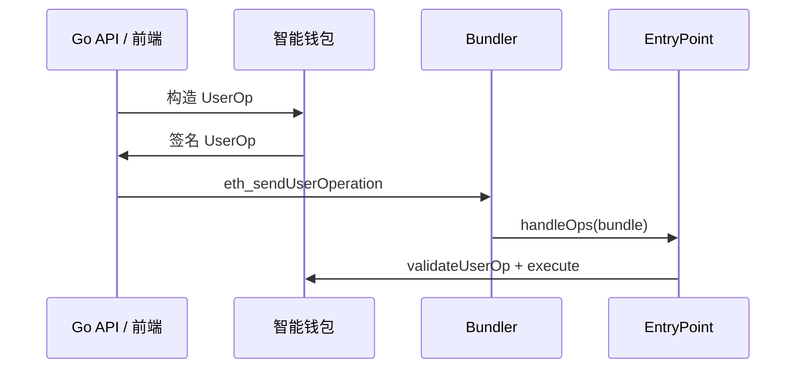

# Account Abstraction ERC-4337 与 Go 后端

## 30 秒版（开场）

> **ERC-4337** 在不改共识的前提下实现 **智能合约账户**：用户提交 **UserOperation**，**Bundler** 打包为交易调用某个版本的 **EntryPoint**，**Paymaster** 可按策略代付 Gas。Go 后端关键词：**按 EntryPoint 版本构造 UserOp、Bundler RPC、会话密钥、Gas 赞助策略**。

## 3 分钟版（精讲深度）

1. **是什么**：AA = 验证与执行逻辑在智能账户里；可实现批量交易、社交恢复、ECDSA/Passkey/多签/会话密钥等验证方式。它不等于“不再使用私钥”，很多账户仍以 ECDSA 私钥为根权限。
2. **为什么**：Web3 用户体验（Gasless、一键登录）依赖后端与 Bundler 协作；4337 是账户抽象的主流工程入口。
3. **怎么做**：后端不替用户持主私钥；构建 UserOp → 用户/Session 签 → 调 Bundler `eth_sendUserOperation` → 监听 `UserOperationEvent`。

## 10 分钟版（原理 + 图示）



**核心组件**

| 组件 | 职责 |
|------|------|
| Smart Account | 验证签名、执行 callData |
| EntryPoint | 规范化入口，负责验证、执行和计费；不同版本及不同链的部署地址必须配置和校验 |
| Bundler | 收集 UserOp、模拟、提交 tx |
| Paymaster | 赞助 Gas，可设 allowlist/规则 |
| Aggregator | 可选，聚合签名验证 |

**UserOperation 字段要按版本区分**

当前 EIP 的逻辑（unpacked）表示包括：

| 字段组 | 含义 |
|--------|------|
| `sender`、`nonce` | 智能账户与半抽象 nonce |
| `factory`、`factoryData` | 尚未部署账户的创建信息；已部署账户为空 |
| `callData` | 账户要执行的操作 |
| `callGasLimit`、`verificationGasLimit`、`preVerificationGas` | 执行、验证与预验证 Gas |
| `maxFeePerGas`、`maxPriorityFeePerGas` | EIP-1559 费用参数 |
| `paymaster`、Paymaster Gas 上限、`paymasterData` | 可选的赞助信息 |
| `signature` | 由智能账户验证逻辑解释的签名/证明 |

进入合约 ABI 时，`PackedUserOperation` 会把部分字段压成
`initCode`、`accountGasLimits`、`gasFees`、`paymasterAndData`。不同
EntryPoint 版本、Bundler RPC schema 和 SDK 类型不能混用，后端应以
`chainId + entryPointAddress + entryPointVersion` 选择 ABI 与序列化器。

当前规范还包含 EIP-712 风格的 UserOp 哈希规则，并支持在适用请求中携带
EIP-7702 authorization。它们不是可以随意忽略的“SDK 附加字段”：必须固定
EntryPoint、ERC-4337/ERC-7769 版本及链能力，按该版本的哈希域和 RPC schema
生成、模拟与验签。UserOp 主签名由账户逻辑解释，协议哈希不包含该签名本身；
Paymaster 若使用自己的签名，也必须在其验证逻辑中绑定全部关键意图和有效期。

**与 EOA 交易区别**

| EOA tx | UserOp |
|--------|--------|
| 直接 `sendRawTransaction` | 经 Bundler 打包 |
| 发送者 EOA nonce 在协议层 | 智能账户 nonce 由账户/EntryPoint 的 NonceManager 协作管理；规范 nonce 可拆为 192-bit key 与 64-bit sequence 以支持多条有序序列，但账户仍要定义权限和并发语义 |
| 交易签名规则固定为协议支持的签名方案 | `signature` 由账户验证逻辑解释，可支持 ECDSA、Session key、多签等 |

## 生产场景

- **Gasless mint**：Paymaster 赞助，后端校验白名单 Merkle proof
- **Session key**：游戏内小额度操作，主密钥离线
- **批量操作**：一次 UserOp 多 call（approve+swap）

## 排查与工具

- ERC-7769 规定的 Bundler RPC 包括 `eth_estimateUserOperationGas`、`eth_sendUserOperation`、`eth_getUserOperationReceipt` 等；供应商扩展方法不能当作跨实现标准
- `debug_bundler_dumpMempool` 属于可选调试接口，不应当作跨供应商标准能力
- Stackup / Alchemy / Pimlico 等 Bundler SaaS
- 失败：`AA21`、`AA23` 等 EntryPoint 错误码

## 架构取舍

| 自建 Bundler | SaaS Bundler |
|--------------|--------------|
| 可控 | 快 |
| 维护独立 mempool、模拟、reputation 与链上提交基础设施；是否需要质押取决于角色、实现和生态策略 | 依赖第三方的限流、审查、版本与可用性 |

**何时不用 4337**：EOA 已满足产品需求，或目标链缺少兼容的 EntryPoint、Bundler 和监控生态；不要只因为“链支持 EVM”就假设 4337 可直接投产。

## 深挖问答

1. **Paymaster 如何防滥用？** → 在对应 EntryPoint 版本的数据结构中绑定用户、目标调用、额度、有效期、chainId、nonce/唯一请求，并在链上验证；同时做预算、速率、信誉和 `postOp` 风险控制。
2. **和 [S-BC-03 签名](./S-BC-03-tx-signing-key-mgmt.md)？** → UserOpHash 会绑定 chainId 与 EntryPoint，账户签名格式又由实现定义；仍要防 session key 泄漏、跨链/跨账户重放。
3. **L2 上 4337？** → 同框架，Bundler 跑在 L2（[S-BC-07](./S-BC-07-l2-cross-chain-bridge.md)）。
4. **Go 如何集成？** → HTTP 调 Bundler JSON-RPC；或用 go 社区 bundler client（生产以官方 spec 为准）。

## 反模式与事故

- **Paymaster 无额度上限** → 被刷 Gas
- **不模拟 UserOp** → Bundler 很可能拒绝或上链失败；但模拟成功也不保证最终执行成功，因为链上状态、费用和 bundle 内容会变化
- **Session key 权限过大** → 等同热私钥
- **混用 EntryPoint/SDK/RPC 版本，或漏处理 EIP-7702 authorization** → 哈希、Gas 字段或验证语义不一致，可能导致拒绝、重放边界错误或错误授权

## 代码示例

```go
// 伪代码：提交 UserOp 到 Bundler
req := map[string]any{
    "jsonrpc": "2.0",
    "method":  "eth_sendUserOperation",
    "params":  []any{userOp, entryPointAddr},
    "id":      1,
}
```

## 延伸阅读

- [EIP-4337](https://eips.ethereum.org/EIPS/eip-4337)
- [ERC-7769 Bundler RPC](https://eips.ethereum.org/EIPS/eip-7769)
- [erc4337.io](https://www.erc4337.io/)
