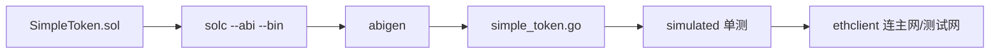

# go-ethereum abigen 完整合约调用实战

## 30 秒版（开场）

> 生产路径：**Solidity → solc 出 ABI/BIN → abigen 生成 Go → Deploy/Call/FilterLogs**。单测用 **simulated.Backend** 不上测试网。与 [S-BC-04 ABI 理论](./S-BC-04-contract-abi-events.md) 配套，本题是 **可运行闭环**。

## 3 分钟版（精讲深度）

1. **是什么**：`abigen` 根据 ABI 生成类型安全的 `SimpleToken` Go 结构体，封装 `transfer`、`FilterTransfer` 等。
2. **为什么**：手写 RLP/ABI 易错；能说「我们 abigen + simulated 单测覆盖」体现工程化。
3. **怎么做**：见本仓库 `examples/senior/erc20bind/`。

> go-ethereum 同时存在 legacy binding 与新一代 v2 binding 路径，v2 生成命令使用
> `abigen --v2`，生成 API 与本文仓库当前示例并不互换。项目必须同时固定
> go-ethereum 依赖版本、`abigen` 二进制版本和生成模式；本文以下代码按仓库现有
> legacy API 讲解，不能只升级生成器后沿用旧调用代码。

## 10 分钟版（流程 + 代码）



**生成命令（本仓库）**

```bash
cd examples/senior/erc20bind/contract
solc --evm-version paris --overwrite --abi --bin -o build SimpleToken.sol
abigen --abi build/SimpleToken.abi --bin build/SimpleToken.bin \
  --pkg erc20bind --type SimpleToken --out ../simple_token.go
```

> 本仓库固定 `paris` 是为了生成结果可复现并兼容更广的执行环境，不是因为新版
> go-ethereum 的 simulated backend 永远不支持 `PUSH0`。生产应按目标链已激活的
> fork、节点版本和部署编译参数选择 `--evm-version`，不能盲目使用编译器默认值。

**部署与转账（测试核心逻辑）**

```go
auth, err := bind.NewKeyedTransactorWithChainID(key, big.NewInt(1337))
if err != nil {
    return err
}
backend := simulated.NewBackend(types.GenesisAlloc{
    auth.From: {Balance: big.NewInt(1e18)},
})
defer backend.Close()

client := backend.Client()
_, deployTx, token, err := erc20bind.DeploySimpleToken(auth, client, big.NewInt(1_000_000))
if err != nil {
    return err
}
backend.Commit()
deployReceipt, err := bind.WaitMined(ctx, client, deployTx)
if err != nil {
    return err
}
if deployReceipt.Status != types.ReceiptStatusSuccessful {
    return fmt.Errorf("deployment reverted: tx=%s", deployTx.Hash())
}

transferTx, err := token.Transfer(auth, recipient, big.NewInt(100))
if err != nil {
    return err
}
backend.Commit()
transferReceipt, err := bind.WaitMined(ctx, client, transferTx)
if err != nil {
    return err
}
if transferReceipt.Status != types.ReceiptStatusSuccessful {
    return fmt.Errorf("transfer reverted: tx=%s", transferTx.Hash())
}

bal, err := token.BalanceOf(&bind.CallOpts{Context: ctx}, recipient)
if err != nil {
    return err
}
```

**监听事件**

```go
iter, err := token.FilterTransfer(&bind.FilterOpts{Context: ctx},
    []common.Address{from}, []common.Address{to})
if err != nil {
    return err
}
defer iter.Close()
for iter.Next() {
    ev := iter.Event
    _ = ev.Value
}
if err := iter.Error(); err != nil {
    return err
}
```

**接真实 RPC**

```go
client, err := ethclient.DialContext(ctx, os.Getenv("SEPOLIA_RPC"))
if err != nil {
    return err
}
defer client.Close()
token, err := erc20bind.NewSimpleToken(tokenAddr, client)
if err != nil {
    return err
}
bal, err := token.BalanceOf(&bind.CallOpts{Context: ctx}, userAddr)
if err != nil {
    return err
}
```

## 生产场景

- CI：`go test ./examples/senior/erc20bind/...` 无外部依赖
- 升级合约：重新 abigen，**版本化** package 或文件名 `token_v2.go`
- 只读调用：`CallOpts` + `context` 超时

## 排查与工具

- `bind.WaitMined` 只等待 receipt 出现，不会替你检查 `receipt.Status`，也不代表区块已经 safe/finalized；业务状态仍需显式执行成功检查和 finality 推进
- `receipt.Status == 0` → 交易已包含但执行 revert。优先用节点 trace/Tenderly 等按原交易和区块内顺序回放；简单地在“同一块”做 `eth_call` 通常读到块后状态，并不等价于原交易执行前的精确上下文。发送前 call/estimate 也只能降低失败率
- abigen 失败：检查 ABI JSON 是否合法数组

## 架构取舍

| abigen | 手写 ABI pack |
|--------|----------------|
| 类型安全 | 灵活 |
| 合约变更需 regen | 适合一次性脚本 |

## 深挖问答

1. **如何测主网 fork？** → anvil/hardhat fork + go ethclient 指本地。
2. **MetaData.Bin 用途？** → `DeploySimpleToken` 链上创建合约。
3. **与 [S-BC-02 ethrpc](./S-BC-02-go-ethereum-rpc.md)？** → ethrpc 教 JSON-RPC；abigen 教合约层。
4. **WatchTransfer vs Filter？** → Watch 订阅；Filter 历史块范围。

## 反模式与事故

- **手改 simple_token.go** → 下次 abigen 覆盖；改 .sol 再生成
- **编译 fork 高于目标链/测试后端已激活 fork** → 可能产生目标环境不支持的 opcode
- **Deploy 不 Commit** → 后续 call 读空状态
- **只信 ABI、不校验 chainId/address/code** → 可能把正确绑定调用到错误链、错误代理或错误实现

## 代码示例

完整示例与测试：

```bash
go test ./examples/senior/erc20bind/...
```

见 [examples/senior/erc20bind](https://github.com/twodog-tt/Golang-development-manual/tree/master/examples/senior/erc20bind)。

## 延伸阅读

- [abigen 文档](https://geth.ethereum.org/docs/tools/abigen)
- [Native bindings v2](https://geth.ethereum.org/docs/developers/dapp-developer/native-bindings-v2)
- [bind package](https://pkg.go.dev/github.com/ethereum/go-ethereum/accounts/abi/bind)
