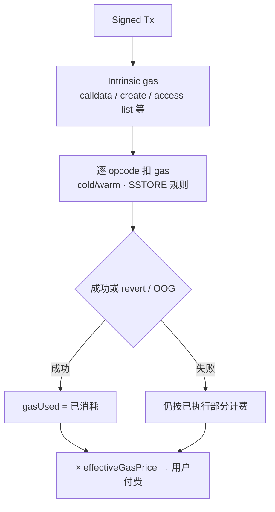

# Gas / Fee 计费与多链费用差异

## 30 秒版（开场）

> **Gas units** 衡量 EVM 执行与访问资源的消耗；**用户付费** 还要乘上费用市场给出的单价，并在 L2 上叠加 **L1 数据/证明相关费用**。
> 后端必须拆开三件事：`gasUsed`（执行计量）、`effectiveGasPrice` / tip+baseFee（单价）、以及链特有的 **DA / blob / energy** 附加项。
> `eth_estimateGas` 只是当前状态下的模拟上限提示，不是上链保证；跨链不能把一切抽象成 `gasPrice × gasLimit`。

## 3 分钟版（精讲深度）

1. **EVM 怎么计**：交易先付 **intrinsic gas**（与 calldata/访问列表等相关），再按 opcode 与 cold/warm 访问规则扣执行 gas；耗尽或 revert 仍可能已消耗部分 gas。
2. **怎么换成钱（EIP-1559）**：用户设 `maxFeePerGas` / `maxPriorityFeePerGas`；块内 `baseFee` 由协议调整。实际单价大致是 `min(maxFee, baseFee + tip)`，总费用 ≈ `gasUsed × effectiveGasPrice`（再加链特有附加项时另算）。
3. **多链差异**：OP Stack / Arbitrum 等 L2 常见「L2 执行 + L1 数据费」；Bitcoin 是 vbytes×feerate；TRON 是 Bandwidth/Energy；Cosmos/Sui/Aptos 各有 gas/compute budget。Go 服务应按 **chain adapter 的 fee policy** 估算、封顶、bump 与记账。

## 10 分钟版（原理 + 图示）

### 先分清：计量单位 vs 计价单位

| 概念 | 含义 | 后端常见字段 |
|------|------|--------------|
| **Gas units** | EVM 资源消耗量 | `gas`、`gasUsed`、`gasLimit` |
| **Fee market price** | 每单位 gas 的 wei 单价 | `baseFeePerGas`、`maxPriorityFeePerGas`、`effectiveGasPrice` |
| **User payment** | 用户实际扣款 | receipt 费用；L2 可能拆成 execution + L1 data |
| **Budget / ceiling** | 业务风险上限 | `gasLimit`、`maxFeePerGas`、TRON `fee_limit` |

```text
EVM L1（概念）:
  txFee ≈ gasUsed × effectiveGasPrice

不要写成:
  txFee = gasPrice × gasLimit   # gasLimit 是上限，不是实际用量
```

### EVM Gas 如何累加（概念模型）



讲解要点（数字随 fork / EIP 变，**背相对关系，不背死表**）：

- **Intrinsic gas**：即使几乎无执行，交易本身也有底价；calldata 非零字节通常更贵。
- **Execution gas**：`SLOAD`/`SSTORE`、账户访问、日志、调用深度等都计费；EIP-2929 后 **cold 首次访问** 贵于 warm。
- **SSTORE**：成本取决于「原值 → 新值」与退款规则（随 EIP-3529 等调整）；不要用一份过期的固定 opcode 表做生产预算。
- **Refund**：存在上限与规则约束；估算与对账应以 **receipt `gasUsed`** 为准，不要自己「手工加退款」当账本。

与合约侧优化的分工见 [S-SOLID-05](../13-solidity-contracts/S-SOLID-05-gas-optimization.md)：那边减少 **gas units**；这边决定 **units × price + 链附加费** 如何进入产品报价与热钱包预算。

### EIP-1559：单价怎么定

| 字段 | 角色 |
|------|------|
| `baseFeePerGas` | 协议按块调整；通常被销毁（具体燃烧/分配以目标链为准） |
| `maxPriorityFeePerGas` | 给建设者/验证者的小费上限 |
| `maxFeePerGas` | 用户愿付的总单价上限（含 base + tip） |
| `gasLimit` | 本笔允许消耗的 gas 上限；余额需能覆盖最坏情况 `gasLimit × maxFee`（再加 value） |

有效单价（直观写法）：

```text
effectiveGasPrice ≈ min(maxFeePerGas, baseFeePerGas + maxPriorityFeePerGas)
```

后端策略：

- 报价用 **近期 baseFee 预测 + tip 策略 + 安全边际**，并设业务 **fee ceiling**。
- Replacement / bump 见 [S-NODE-05](../19-node-rpc-staking/S-NODE-05-relayer-transaction-manager.md)：同 nonce 提价受 mempool policy 约束，不是「加一点就一定替换成功」。

### `eth_estimateGas` 能做什么、不能做什么

| 能 | 不能 |
|----|------|
| 在**指定状态**（默认 pending/latest 视节点）下模拟执行，给出 gas 提示 | 保证上链时状态不变、一定成功 |
| 帮助设置 `gasLimit` 的起点 | 代替 L2 的 L1 data fee 完整报价（许多链要额外 RPC/公式） |
| 暴露明显 revert（视节点错误信息） | 覆盖所有 provider 差异与历史 state 缺失 |

生产建议：

1. `estimate` → 乘安全系数或加绝对 buffer → 写入策略配置（按合约/方法/链版本）。
2. 对「依赖预言机/池状态/allowance」的路径，估算失败要区分 **业务 revert** 与 **节点/状态问题**。
3. 最终以 receipt 入账；模拟成功 ≠ 上链成功。

### L2：为什么「同合约」在 L1/L2 费用结构不同

多数 EVM L2 用户费用大致拆成：

```text
totalFee ≈ L2_execution_fee + L1_data_or_proof_related_fee
```

| 部分 | 通常计量什么 | 后端直觉 |
|------|----------------|----------|
| L2 execution | L2 上的 gasUsed × L2 gas price | 类似「便宜的 EVM 执行」 |
| L1 data / DA | 把交易数据或承诺落到 L1/DA 的成本（calldata 或 blob 等） | **随批量、压缩、blob 市场波动**；往往主导大 calldata 交易成本 |
| 证明相关（部分 ZK） | 证明生成/提交的间接成本可能体现在费用或延迟里 | 不要假设「ZK 一定比 Optimistic 更便宜」 |

**OP Stack 族（概念）**：官方文档将费用拆为 execution 与 L1 data 等组成部分；具体系数、标量、是否走 blob 以目标链与版本为准，Go 侧应调用链提供的费用估计或解析 receipt 中的费用字段，而不是硬编码一篇博客里的常数。

**Arbitrum（概念）**：有自身的 gas/费用会计（含 L1 成分的估算与定价机制）；同样以官方 docs 与节点返回为准。

更广的 L2/桥上下文见 [S-BC-07](./S-BC-07-l2-cross-chain-bridge.md)、[S-BC-11](./S-BC-11-rollup-finality-da-proof-security.md)。

### 多链费用模型对照（后端必分表）

| 体系 | 计量 | 计价直觉 | 常见坑 |
|------|------|----------|--------|
| **Ethereum L1** | gas units | EIP-1559 base + tip | 用 `gasLimit` 当实际费用；忽略 cold/warm |
| **EVM L2（OP/Arb 等）** | L2 gas + L1 data 成分 | execution 便宜，DA 常主导 | 只 `estimateGas` 就对用户报价 |
| **Polygon PoS 等侧链/其他 EVM** | 多仍用 gas + 本地 fee market | 参数与以太坊主网不同 | 假设与主网同一 baseFee 曲线 |
| **Bitcoin** | vbytes / weight | feerate × vsize；fee=输入−输出 | 套用 gas 字段；见 [S-WALLET-02](../17-multichain-wallet/S-WALLET-02-bitcoin-utxo-psbt-fee-bump.md) |
| **TRON** | Bandwidth + Energy | 不足则烧 TRX；合约有 `fee_limit` | 当成 `gasPrice×gasLimit`；见 [S-WALLET-12](../17-multichain-wallet/S-WALLET-12-tron-trc20-resource-transaction.md) |
| **Cosmos SDK** | gas | `gas × gasPrice`（denom 按链） | 忽略仿真与 memo/sequence；见钱包 Cosmos 篇 |
| **Sui / Aptos** | compute / gas budget | budget 上限 + 单价；模型在演进 | 用 EOA nonce 思维硬套；见 [S-WALLET-05](../17-multichain-wallet/S-WALLET-05-sui-aptos-state-model.md) |

能力矩阵总览：[S-WALLET-01](../17-multichain-wallet/S-WALLET-01-chain-adapter-capability-matrix.md)。

### Go 后端落地清单


- **按链配置**：RPC、chainId、fee 模型枚举、buffer、ceiling、bump 阶梯，禁止全局一套常数。
- **展示与记账**：对用户显示「预估区间」；账本记 **实际扣款** 与币种（ETH/BNB/TRX/…）。
- **4337**：UserOp 还有 verification / call / preVerification 与 Paymaster 赞助路径，见 [S-BC-08](./S-BC-08-erc4337-account-abstraction.md)。
- **基础账户模型**：[S-BC-01](./S-BC-01-blockchain-evm-basics.md)。

## 生产场景

- **CEX/钱包提现报价**：先按目标链 fee model 估算，再加运营缓冲；高峰只升 tip/feerate，不无限抬 `gasLimit`。
- **L2 合约部署 / 大批量 mint**：关注 calldata/blob 成分；L1 上「省 storage」的优化在 L2 上收益排序可能反过来（[S-SOLID-05](../13-solidity-contracts/S-SOLID-05-gas-optimization.md)）。
- **Relayer / 归集**：nonce 域内 fee bump 与预算熔断（[S-NODE-05](../19-node-rpc-staking/S-NODE-05-relayer-transaction-manager.md)）。
- **Gas 代付**：Paymaster / 热钱包代付要单独预算池与允许名单，防止被刷空。

## 排查与工具

- Receipt：`gasUsed`、`effectiveGasPrice`、L2 浏览器上的 L1 fee 分解（字段名因链而异）
- `eth_maxPriorityFeePerGas`、`eth_feeHistory`（支持情况因 provider 而异）
- Foundry `forge test --gas-report`、`evm.codes` 查 opcode 相对成本
- 对比：**同一 calldata** 在 L1 vs L2 的费用结构，而不是只看 gasUsed 数字大小

## 架构取舍

| 激进低 fee | 保守高 buffer |
|------------|---------------|
| 用户体验好、易卡 mempool / 失败重试 | 成功率高、成本与资金占用上升 |
| 适合可延迟、可替换交易 | 适合提现、清算、强制交易 |

原则：**SLA 决定策略档位**；策略版本化进配置，随 fork / L2 参数变更回归。

## 深挖问答

1. **`gasLimit` 设太高有什么代价？** → 发送前余额需覆盖 `gasLimit × maxFee` 的最坏扣款；过高占用资金，但成功时仍只按 `gasUsed` 计费（另计链附加规则时除外）。
2. **为什么 L2 上 `gasUsed` 很低，账单仍可能不低？** → L1 data/DA 成分常与 calldata 规模和 blob/calldata 市场相关，不只看 L2 execution gas。
3. **`estimateGas` 成功但上链 OOG？** → 状态变化、另一笔交易抢先、节点估计与打包时不一致；应用 buffer，并对关键路径做模拟+监控。
4. **失败交易为什么还要付钱？** → 节点已做校验与部分执行；不计费会变成免费 DoS。
5. **多链能否统一 `EstimateFee(to, data)`？** → 只能做门面；内部必须委派到各链 adapter，返回结构化费用分解与币种，而不是一个无语义的整数。
6. **和 [S-BC-07](./S-BC-07-l2-cross-chain-bridge.md)「L2 Gas 谁付」？** → 用户通常付 L2 综合费用；桥接/强制退出另有 L1 成本与延迟，不能混进同一笔「普通 L2 tx」报价。

## 反模式与事故

- **全链共用一套 `gasPrice`/`gasLimit` 常量** → 错链、大面积失败或资金浪费
- **用 `gasLimit × maxFee` 当用户展示的「实际费用」** → 投诉与对账混乱
- **忽略 L2 L1 data fee** → 报价系统性偏低
- **把 TRON/BTC 费用塞进 EVM gas 字段** → 签名与广播前校验崩坏
- **无限 fee bump 抢打包** → 热钱包被抽干（缺 ceiling / circuit breaker）

## 延伸阅读

- [Gas and Fees (ethereum.org)](https://ethereum.org/en/developers/docs/gas/)
- [EIP-1559](https://eips.ethereum.org/EIPS/eip-1559)
- [OP Stack transaction fees](https://docs.optimism.io/stack/transactions/fees)
- [Arbitrum gas and fees](https://docs.arbitrum.io/arbos/gas)
- [S-BC-01 EVM 基础](./S-BC-01-blockchain-evm-basics.md) · [S-SOLID-05 Gas 优化](../13-solidity-contracts/S-SOLID-05-gas-optimization.md) · [S-WALLET-01 能力矩阵](../17-multichain-wallet/S-WALLET-01-chain-adapter-capability-matrix.md)
