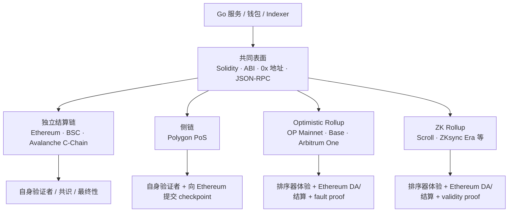

# EVM 公链全景速览：L1、侧链、Rollup 与接入差异

## 30 秒版（开场）

> **EVM 链不是“一条以太坊换了名字”**。它们通常共享 Solidity、ABI、`0x` 地址、交易签名与一部分 JSON-RPC，但可能使用完全不同的共识、排序器、数据可用性、最终性、费用市场、系统合约和跨链桥。
> 先按 **独立 L1 / 侧链 / Rollup L2** 分类，再问六件事：谁排序、谁执行、数据放哪、谁确认正确、何时不可逆、资产怎么进出。
> Go 后端可以复用 ABI/RPC 基础设施，不能复用一套写死的 chain ID、手续费、确认数、RPC 能力和代币地址。

## 先建立一张图



最重要的纠偏：**EVM 只回答“交易如何执行和修改状态”，不回答“谁出块、哪条历史有效、数据是否可用、什么时候能安全入账”。**

## 3 分钟分类法

| 类型 | 安全与结算主要来自哪里 | 典型网络 | 工程直觉 |
|------|------------------------|----------|----------|
| **独立 L1 / 独立结算链** | 自己的验证者和共识 | Ethereum、BNB Smart Chain、Avalanche C-Chain | EVM 可相似，共识、最终性和节点实现可完全不同 |
| **侧链** | 侧链自己的验证者；可把 checkpoint 锚定到 Ethereum | Polygon PoS | checkpoint 不等于“每笔交易由 Ethereum 重新执行或证明” |
| **Optimistic Rollup L2** | 数据与状态承诺提交到 Ethereum；错误声明可被 fault proof 挑战 | OP Mainnet、Base、Arbitrum One | 排序器快速确认、L1 数据落地、L1 finality、提款可用是不同时间点 |
| **ZK Rollup L2** | 数据/承诺与 validity proof 提交到 Ethereum | Scroll、ZKsync Era 等 | sequencer 已收录不等于 proof 已提交并在 L1 finalized |

[Ethereum 官方扩容文档](https://ethereum.org/en/developers/docs/scaling/)也明确区分：Rollup 将执行移到 L2 并把数据提交到 L1；sidechain 是并行运行、拥有独立安全模型的链。

## 代表网络速查

> 下表是心智模型，不是吞吐、费用或“谁更好”的排行榜。主网 chain ID 相对稳定，但分叉能力、费用参数、RPC 和桥合约会升级；上线前仍以目标网络官方文档与运行时探测为准。

| 网络 | 类型 / 执行环境 | 主网 chain ID / Gas 资产 | 最需要记住的差异 |
|------|-----------------|---------------------------|--------------------|
| **Ethereum** | PoS L1 / EVM 规范基准 | `1` / ETH | `latest`、`safe`、`finalized` 是不同安全级别；receipt 成功不等于 finalized |
| **BNB Smart Chain** | 独立链 / EVM + Parlia PoSA | `56` / BNB | Geth API 高度兼容但存在 BSC 专有 finality、blob 与 RPC 行为；不能照搬 Ethereum 确认策略 |
| **Avalanche C-Chain** | Avalanche Primary Network 的 EVM 链 / Coreth + Snowman++ | `43114` / AVAX | EVM 在 Coreth 中执行，最终性来自 Snowman 系列共识；还有 Avalanche 原子跨链与专有 API 语境 |
| **Polygon PoS** | EVM sidechain / Bor + Heimdall v2 | `137` / POL | milestone 负责 Polygon 链内最终性，checkpoint 用于 Ethereum 锚定和桥；它不是 Ethereum Rollup |
| **OP Mainnet** | Optimistic Rollup / OP Stack | `10` / ETH | 有 `unsafe`、`safe`、`finalized` head；普通 L2 交易 finality 与 L2→L1 提款挑战期不是一回事 |
| **Base** | Optimistic Rollup / OP Stack | `8453` / ETH | 与 OP Mainnet 同技术家族，不代表配置、升级、排序器和治理完全相同；L1 data fee 需计入总费用 |
| **Arbitrum One** | Optimistic Rollup / Nitro + ArbOS | `42161` / ETH | Nitro、Delayed Inbox、ArbGas 与系统 precompile 形成自己的执行/费用/RPC 边界，不是 OP Stack 换 chain ID |
| **Scroll** | ZK Rollup / zkEVM | `534352` / ETH | L2 执行后还要经历 batch、数据提交、proof 生成与 Ethereum 验证；这些状态要分开建模 |
| **ZKsync Era** | ZK Rollup / EraVM + EVM bytecode interpreter | `324` / ETH | EraVM 不是原生 EVM 栈机；原生编译路径、系统合约、部署与 gas 语义存在差异，“能跑 Solidity”不等于字节级完全相同 |

官方架构入口：
[BSC](https://docs.bnbchain.org/bnb-smart-chain/introduction/) ·
[Avalanche Coreth](https://build.avax.network/docs/primary-network/coreth-architecture) ·
[Polygon PoS](https://docs.polygon.technology/pos/overview) ·
[OP Stack 差异](https://docs.optimism.io/op-stack/protocol/differences) ·
[Base 协议](https://docs.base.org/base-chain/specs/protocol/overview) ·
[Arbitrum Nitro](https://docs.arbitrum.io/nitro-whitepaper.pdf) ·
[Scroll](https://docs.scroll.io/en/technology/) ·
[ZKsync Era](https://docs.zksync.io/zksync-network/zksync-era)。

## “兼容 EVM”到底兼容什么

### 通常可以复用

- Solidity/Vyper 的主要开发范式、ABI 编解码、event topic 与 calldata。
- EOA 的 secp256k1 地址与签名工具链；同一私钥在多条常见 EVM 链上通常导出同一地址。
- `eth_call`、`eth_sendRawTransaction`、receipt、logs 等核心 JSON-RPC 形状。
- Go 的 `go-ethereum` 基础类型、ABI 包、合约 binding 与通用签名能力。

### 必须逐链验证

| 维度 | 为什么不能想当然 |
|------|------------------|
| **EVM fork / opcode** | 各链激活 Ethereum EIP 的时间不同，也可能增加 precompile、system contract 或自定义交易类型 |
| **字节码与部署** | 某些 ZK VM 使用自定义编译/部署路径；`CREATE2`、code hash、debugger 行为可能有边界差异 |
| **JSON-RPC** | 核心方法近似不代表 `safe`/`finalized`、trace、archive、filter、批量和订阅都可用 |
| **费用** | L1 常见 execution fee；Rollup 还可能有 L1 data / DA / operator 成分；Gas 资产也不同 |
| **mempool / 排序** | 独立 L1 可有公开 mempool；Rollup 常先进入中心化或受控 sequencer，MEV 与失败模式不同 |
| **最终性** | PoS finality、BFT finality、Snowman acceptance、sidechain milestone、Rollup L1 finality 不是同一语义 |
| **重组** | “等 N 块”只能是业务风险策略；不同链的协议 finality 与 reorg 恢复方式不同 |
| **地址与资产** | 地址格式相同不代表账户余额、合约、USDC/USDT 或桥接资产是同一个对象 |
| **桥与提款** | canonical bridge、第三方流动性桥、L2→L1 原生提款有不同信任、延迟与失败状态 |

更细的费用拆解见 [S-BC-13](./S-BC-13-gas-fee-multichain.md)，Rollup 安全边界见
[S-BC-11](./S-BC-11-rollup-finality-da-proof-security.md)。

## 一笔交易不是只有“成功 / 失败”

### 独立链的常见状态

```text
signed → broadcast → mempool → included(latest) → safe/accepted → finalized → business credited
```

### Rollup 的常见状态

```text
signed
  → sequencer accepted / preconfirmed
  → included in L2 block (unsafe)
  → batch/data posted to L1 (safe/anchored)
  → L1 origin finalized (L2 finalized)
  → proof/challenge conditions satisfied
  → L2→L1 withdrawal executable
```

这几个状态不能压成一个布尔值：

- `receipt.status == 1`：只说明这笔交易在那个块的 EVM 执行没有 revert。
- `latest`：只是当前节点看到的头，可能尚未获得更强共识保证。
- `safe` / `finalized`：含义由目标协议定义，且 provider 未必支持。
- “可给用户展示”“可记账”“可放币”“可从 L2 提回 L1”是四个业务决策，可使用不同 watermark。

OP Mainnet 官方文档特别说明：普通 L2 交易随其数据所在的 Ethereum 批次获得 finality；常说的约 7 天挑战期主要约束原生 L2→L1 提款，而不是说所有 L2 交易七天后才生效。参见
[OP transaction finality](https://docs.optimism.io/op-mainnet/network-information/transaction-finality)。

## Go 后端该怎么抽象

不要只维护这张表：

```go
// 过度简化：只能“连上 RPC”，不能安全地经营资金状态。
type Chain struct {
	Name    string
	RPC     string
	ChainID int64
}
```

至少要让 **身份、能力与策略** 分层：

```go
type ChainFamily string
type FeeModel string
type FinalityMode string

type ChainIdentity struct {
	Environment   string // mainnet / testnet / local；不能只靠名称判断
	ChainID       string // 用十进制字符串或 big.Int，避免跨语言精度问题
	GenesisHash   string // 启动握手时核对，防止 RPC 指错链
	SettlementID  string // Rollup 的父结算链；独立链可为空
}

type RPCCapabilities struct {
	SafeTag          bool
	FinalizedTag     bool
	FeeHistory       bool
	WebSocketLogs    bool
	DebugTrace       bool
	MaxLogBlockRange uint64
}

type ChainPolicy struct {
	Family               ChainFamily
	FeeModel              FeeModel
	Finality              FinalityMode
	CreditConfirmations   uint64 // 仅作为显式业务策略或 fallback
	HighValueFinalityOnly bool
	NativeAsset           string // 展示字段，不作为资产唯一标识
}
```

生产中再补充：RPC provider 池、超时/重试、fee ceiling、replacement 规则、系统合约、canonical bridge、token allowlist、链暂停开关与观测指标。完整 Adapter 视角见
[S-WALLET-01](../17-multichain-wallet/S-WALLET-01-chain-adapter-capability-matrix.md)。

### 启动时做一次链身份与能力握手

1. `eth_chainId` 必须等于受控配置。
2. `eth_getBlockByNumber("0x0", false)` 的 genesis hash 必须匹配环境指纹。
3. 探测 `safe`、`finalized`、`eth_feeHistory`、WebSocket 与 trace 能力；**方法不存在要降级，不要伪装成空结果**。
4. 对 Rollup 再校验 parent chain、关键 system/bridge contract 地址与 code hash（按升级治理设计版本化 allowlist）。
5. 同一链至少准备两个独立故障域的 RPC；高价值读请求按 [S-NODE-02 RPC HA](../19-node-rpc-staking/S-NODE-02-rpc-ha-quorum-hedging-cache.md) 做一致性校验。

## 资产与签名的四个高危误区

### 1. 同地址 ≠ 同账户状态

同一私钥在 Ethereum、BSC、Base 上常得到同一 `0x...` 地址，但 nonce、余额、合约代码和权限委托各自独立。一次链上的 approve 不会自动授权另一条链。

### 2. 同 symbol ≠ 同资产

资产主键至少应是：

```text
(environment, chain_id, contract_address)
```

跨链资产还要记录 `origin_chain`、`origin_token`、mint/burn 或 lock/mint 机制和 bridge issuer。`USDC`、`USDC.e`、第三方包装 USDC 不能只按 symbol 合并。

### 3. chain ID 保护交易，不包办所有授权重放

EIP-155 legacy 交易与后续 typed transaction 会把 chain ID 纳入签名域；EIP-712、Permit、订单或 bridge message 仍需自己的 domain separator、verifying contract、nonce、deadline 与消费记录。详见
[S-BC-03](./S-BC-03-tx-signing-key-mgmt.md)。

### 4. 合约地址不能跨链复制粘贴

同一个地址在另一条链上可能无代码、是不同代码，或恰好落入 system/predeploy 地址空间。调用前应把 `(chain, address, expected code hash / implementation)` 纳入发布清单。

## 到一条新 EVM 链工作的第一天

按这个顺序扫盲，半天内能形成可用认知：

1. **身份**：主网/测试网 chain ID、genesis、原生 Gas 资产、官方 explorer 与官方 RPC 说明。
2. **类型**：独立链、侧链、Optimistic Rollup 还是 ZK Rollup；父结算链与 DA 在哪里。
3. **出块与最终性**：谁排序、是否单 sequencer、有哪些 head tag、协议 finality 与业务确认策略分别是什么。
4. **费用**：legacy / EIP-1559、L1 data/DA/operator fee、估算 API、bump 与 fee ceiling。
5. **EVM 差异**：支持到哪个 fork、precompile/system contract、交易类型、合约大小/tx gas 限制、编译器与 CREATE2 行为。
6. **RPC 能力**：archive、trace、state diff、WebSocket、logs range、batch 限制、速率限制和错误语义。
7. **资金入口**：canonical bridge、官方 token list、原生提款状态机、第三方桥风险。
8. **故障演练**：RPC 分叉/滞后、reorg、sequencer 停止、L1 拥堵、fee 激增、交易 unknown、桥暂停与链升级。

## 最小排查命令

下面只做只读探测；生产 endpoint 不应硬编码在仓库：

```bash
# 链身份
curl -sS -X POST "$EVM_RPC_URL" \
  -H 'content-type: application/json' \
  --data '{"jsonrpc":"2.0","id":1,"method":"eth_chainId","params":[]}'

# 最新块；把 latest 换成 safe / finalized 可探测 provider 能力
curl -sS -X POST "$EVM_RPC_URL" \
  -H 'content-type: application/json' \
  --data '{"jsonrpc":"2.0","id":2,"method":"eth_getBlockByNumber","params":["latest",false]}'
```

`eth_chainId` 返回十六进制，例如 `0x1`；不要把 `net_version`、Avalanche network ID 与 EVM chain ID 混为一谈。公开 RPC 常有速率、历史数据和方法限制，只适合开发探测。

## 架构取舍

| 一套通用 EVM Client | 按链完全复制服务 |
|---------------------|------------------|
| 复用高，但容易把差异藏在 `if chainID` 和默认值里 | 隔离强，但代码、修复和观测重复 |
| **推荐边界**：共享 transport、ABI、签名原语和观测框架；把 fee、finality、RPC capability、bridge、token policy 做成显式 adapter | 只有合规隔离、独立团队或极特殊 VM 时才值得物理拆分 |

## 反模式与事故

- **所有链统一等 12 confirmations**：快终局链被无谓延迟，Rollup/侧链又可能没有得到你以为的安全保证。
- **receipt 成功立即给高价值充值放币**：忽略 canonical/finality、RPC 假头和合约资产 allowlist。
- **只用 chain ID 选签名策略**：没校验 genesis、目标合约、环境和业务 intent，可能连错 fork 或错误 RPC。
- **把 OP Stack 链当完全相同**：忽略升级版本、fee 参数、operator fee、predeploy、sequencer 与治理差异。
- **把所有 zkEVM 当字节级等价**：编译、部署、opcode、gas、trace 和 system contract 边界可能不同。
- **用 token symbol 做主键**：包装资产或伪造同名 token 被错误入账。
- **把 canonical bridge 当“无风险传送门”**：仍需理解验证机制、暂停/升级权、提款延迟和 L1 故障。

## 深挖问答

1. **EVM 兼容链为什么还能有不同共识？** → EVM 是执行状态转移的规则；共识决定交易顺序与 canonical history，两者是不同层。
2. **Polygon PoS 为什么不应直接叫 Ethereum L2 Rollup？** → 它用自己的验证者共识执行并确认交易，向 Ethereum 提交 checkpoint；Ethereum 不通过 Rollup proof 为每个状态转移兜底。
3. **Base 和 OP Mainnet 都是 OP Stack，可以共用所有配置吗？** → 不能。可共享协议适配代码，但 chain ID、RPC、升级、费用参数、system contract、排序器和治理必须逐链配置与探测。
4. **Rollup 上看到 receipt 后能立刻入账吗？** → 可先展示“已收录”，但资金信用策略应区分 unsafe、L1 data posted/safe、L1 finalized 与提款可用状态，并按金额分层。
5. **同一 Solidity 合约一定能原样部署到所有 EVM 链吗？** → 不一定。检查 fork/opcode、precompile、编译器、字节码/合约大小、CREATE2、system address、gas 与工具链差异。
6. **为什么 `ethclient` 能连上仍不代表接入完成？** → Transport 和核心 RPC 通了，不代表 fee、finality、trace、logs 范围、重组、桥和资产身份策略正确。
7. **一个充值资产应该怎么唯一标识？** → 至少用 environment + chain ID + contract address；跨链包装资产再保存 origin 与 bridge 关系。
8. **确认数还有用吗？** → 有，可作为明确的业务风险 watermark 或 provider 不支持协议标签时的 fallback；但不能冒充目标链的协议 finality。

## 推荐阅读顺序

1. [S-BC-01 EVM 基础](./S-BC-01-blockchain-evm-basics.md)：先懂执行层。
2. **本文**：建立链族与差异地图。
3. [S-BC-13 Gas / Fee](./S-BC-13-gas-fee-multichain.md) + [S-BC-02 Go RPC](./S-BC-02-go-ethereum-rpc.md)：能接链。
4. [S-BC-03 签名](./S-BC-03-tx-signing-key-mgmt.md) + [S-BC-04 ABI / Event](./S-BC-04-contract-abi-events.md)：能读写合约。
5. [S-BC-05 Reorg / Indexer](./S-BC-05-indexer-reorg.md)：能安全消费链上数据。
6. [S-BC-07 L2 / 桥](./S-BC-07-l2-cross-chain-bridge.md) + [S-BC-11 Rollup 安全](./S-BC-11-rollup-finality-da-proof-security.md)：理解 L2 与跨链安全边界。

## 延伸阅读

- [Ethereum EVM](https://ethereum.org/en/developers/docs/evm/)
- [Ethereum Scaling](https://ethereum.org/en/developers/docs/scaling/)
- [BSC Introduction](https://docs.bnbchain.org/bnb-smart-chain/introduction/)
- [Avalanche Coreth Architecture](https://build.avax.network/docs/primary-network/coreth-architecture)
- [Polygon PoS Overview](https://docs.polygon.technology/pos/overview)
- [OP Stack Differences from Ethereum](https://docs.optimism.io/op-stack/protocol/differences)
- [Arbitrum Nitro Whitepaper](https://docs.arbitrum.io/nitro-whitepaper.pdf)
- [Scroll Architecture](https://docs.scroll.io/en/technology/)
- [ZKsync Era](https://docs.zksync.io/zksync-network/zksync-era)
