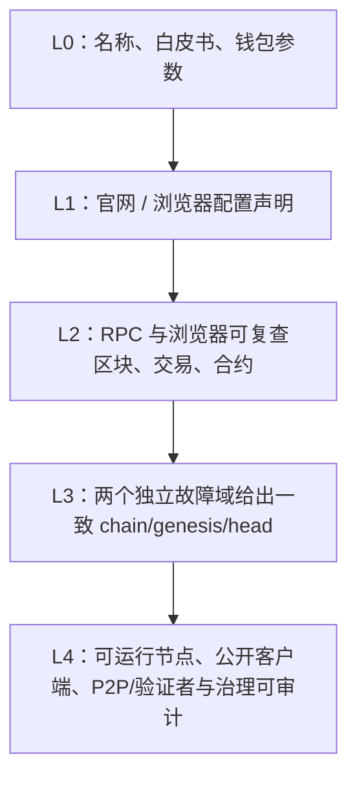

# 如何验证一条 EVM 公链：身份、活性、共识与资产证据

## 30 秒版（开场）

> **Chain ID 不是一条链的全球唯一身份证，也不能证明它是主网或去中心化公链。**
> 接入前至少核验四层：`chain ID + genesis hash/chain config` 确认身份，连续区块与时间戳确认活性，
> 验证者/出块者与独立节点确认共识和故障域，`chain + contract address + code/权限` 确认资产。
> 官网、浏览器和钱包配置属于声明；RPC、区块 lineage、合约字节码属于可复查观测；自己运行节点并与
> 多个独立来源比对，才是更强证据。

## 先拆开四个经常混用的词

| 说法 | 最低含义 | 不能自动推出 |
|------|----------|--------------|
| **EVM 链** | 能执行某种 EVM 兼容交易/字节码 | 与 Ethereum 同安全性、同 RPC 能力 |
| **网络在线** | 至少有节点能返回持续增长的 canonical head | 公网 RPC 正常、所有节点健康 |
| **主网** | 项目方把该环境视作承载真实状态/资产的生产网络 | 资产有价值、协议成熟、不会重置 |
| **公链/公开网络** | 公众能读取或提交交易（具体门槛需说明） | 无许可验证、验证者分散、治理去中心化 |

因此，“浏览器能打开”只能证明一个网站在线；“区块持续增长”能证明某条账本在运行；“单个地址长期
出块”反而提示共识可能高度集中。技术尽调必须把这些结论分开写。

## 一条链的身份指纹

```text
NetworkIdentity =
  environment
  + chain_id
  + genesis_hash
  + chain_config / fork schedule
  + consensus / validator network
```

### Chain ID 的真实作用

[EIP-155](https://eips.ethereum.org/EIPS/eip-155) 把 chain ID 纳入交易签名，主要用于跨链重放保护；
[EIP-695](https://eips.ethereum.org/EIPS/eip-695) 定义 `eth_chainId` 来读取节点当前配置的签名域。
但 [EIP-1344](https://eips.ethereum.org/EIPS/eip-1344) 明确指出 chain ID 由客户端实现者和链社区
人工选择，并不存在一个能强制全世界不重复的协议注册中心。

所以：

- chain ID 相同，可能是同一网络，也可能是碰撞、分叉或两个独立网络；
- chain ID 不同，通常表示不同签名域，但仍不能证明网络质量；
- `net_version` 是 network ID 语境，不能代替 `eth_chainId`；
- chain ID 撞号会削弱交易、EIP-712 签名和部分跨链消息的域隔离，应视为安全债务。

### Genesis hash 为什么重要

创世块定义链的初始状态和一部分协议配置。Geth 自定义网络文档也要求各节点共享 genesis 与共识配置，
初始化后得到确定的 genesis hash。对应用来说，`eth_getBlockByNumber("0x0", false)` 的 `hash`
是比网络名称、币种符号更强的环境指纹。

它仍不是万能的：两个恶意或误配置节点可以复制相同 genesis 后各自形成隔离网络，所以生产环境还要
校验当前 head hash、父子关系、检查点/验证者网络和独立来源。

## 五层证据模型



| 层级 | 能合理声称什么 | 常见缺口 |
|------|----------------|----------|
| L0 | 项目“宣称要做一条链” | 还没有运行证据 |
| L1 | 配置了某个品牌、chain ID 和币种 | 浏览器可能只是模板，数据可能不更新 |
| L2 | 某条账本确实运行，存在可复查状态 | 可能只有一个运营方和一个数据源 |
| L3 | 单一网关/机房故障不会改变观察结论 | 多 endpoint 可能实际共用同一上游 |
| L4 | 外部参与者能独立验证历史和共识 | 仍需评估验证者集中度、升级和密钥治理 |

不要用高层宣传材料替代底层证据，也不要因为尚未达到 L4 就武断说“链不存在”。正确表述是：
**已验证到哪一层，哪部分仍未知。**

## 15 分钟只读核验清单

### 1. 身份与协议

```bash
rpc_call() {
  curl -sS --max-time 8 -H 'content-type: application/json' \
    --data "{\"jsonrpc\":\"2.0\",\"id\":1,\"method\":\"$1\",\"params\":$2}" \
    "$EVM_RPC_URL"
}

rpc_call eth_chainId '[]'
rpc_call eth_getBlockByNumber '["0x0",false]'
rpc_call web3_clientVersion '[]'
```

记录十进制/十六进制 chain ID、完整 genesis hash、客户端实现与版本。不要只截图，要保存带时间戳的
原始 JSON 或 hash，便于以后发现网络重置、误连测试网或网关切错上游。

### 2. 活性，不只看“能返回 latest”

连续三次、跨越数个目标出块周期查询：

```bash
rpc_call eth_blockNumber '[]'
rpc_call eth_getBlockByNumber '["latest",false]'
rpc_call eth_syncing '[]'
```

检查高度是否推进、块时间是否接近当前时间、`parentHash` 是否连续。一个节点能返回旧块但高度长期不动，
只是“HTTP 活着”，不是链或节点健康。

### 3. 多源交叉验证

至少从以下两类来源比较同一高度的 block hash：

- 自建节点或不同运营商的 RPC；
- 官方/第三方浏览器 API；
- 可验证的 checkpoint、轻客户端或共识 API（目标链支持时）。

多域名不等于多故障域。应追问运营主体、ASN/云区、客户端类型、节点数据库和负载均衡上游是否独立。

### 4. 共识与去中心化

观察最近数百/数千块的 proposer/miner 分布只是第一步：

- 验证者集合从哪里读取，是否能独立加入和退出？
- 出块权重如何计算，是否有 BFT quorum、stake、epoch 或 signer allowlist？
- 单个运营方、托管商或密钥控制了多少权重？
- 客户端、genesis、bootnodes、升级流程是否公开？
- 停掉一个 proposer、一个 RPC、一个机房后，出块和读取分别发生什么？

“地址数量多、交易数量多、代币 holder 多”都不能替代验证者/共识证据，因为这些数据可由单一出块者
在许可链上产生。

### 5. 资产身份与权限

原生币由协议账本计价，没有 ERC-20 合约地址；包装币和稳定币则是合约资产。资产主键至少是：

```text
(environment, chain_id, genesis_hash, contract_address)
```

同名 `AUSD`、`USDT` 或 `WAGI` 可以被任何人部署。核验时读取 bytecode、verified source、proxy
implementation、owner/admin/minter/pauser/blacklist 权限、totalSupply 和关键事件；“稳定币”还需要
储备、铸赎、预言机、托管与审计证据，名字里有 USD 不构成稳定机制。

## Go 服务的启动身份守卫

不要把一次人工核验变成永不过期的 Wiki 结论。每次进程启动、配置变更和 endpoint 切换都做机器校验：

```go
type ExpectedChain struct {
	ChainID     *big.Int
	GenesisHash common.Hash
}

func VerifyChain(ctx context.Context, c *ethclient.Client, want ExpectedChain) error {
	gotID, err := c.ChainID(ctx)
	if err != nil {
		return fmt.Errorf("chain id: %w", err)
	}
	if gotID.Cmp(want.ChainID) != 0 {
		return fmt.Errorf("wrong chain id: got %s want %s", gotID, want.ChainID)
	}

	genesis, err := c.HeaderByNumber(ctx, big.NewInt(0))
	if err != nil {
		return fmt.Errorf("genesis: %w", err)
	}
	if genesis.Hash() != want.GenesisHash {
		return fmt.Errorf("wrong genesis: got %s want %s", genesis.Hash(), want.GenesisHash)
	}
	return nil
}
```

生产版还应返回 endpoint、observed head/hash、safe/finalized head、lag 和探测时间。验证失败应 fail closed，
禁止发送交易或确认充值，不能“打印 warning 后继续”。

## 案例：chain ID `31415926` 为什么不能单独定案

这是一个很好的认知纠偏案例。以下是 **2026-08-13 对 AISO/AGI 的只读观测快照**，
不是对未来状态或项目商业可信度的背书：

| 证据 | 当时观测 | 可以推出 |
|------|----------|----------|
| Explorer 环境配置 | `NEXT_PUBLIC_NETWORK_ID=31415926`、币种 `AGI`、`IS_TESTNET=false` | 浏览器运营方把它配置成 AGI 主网 |
| Genesis | `0xe218d110e98f60816d7a27fdc4d598fd914cbc927582b24984657de65598c1cf` | 可与别的同 chain ID 网络区分 |
| 区块 API | 高度与时间戳持续推进 | 至少一条账本和 indexer 当时仍活跃 |
| 公网 RPC | `https://rpc.agikingrpc.shop` 当时返回 502 | 公网入口/上游故障；不能单独推出整链停摆 |
| 出块地址抽样 | 抽查历史和近期区块均为同一地址 | 强中心化信号；验证者分散尚未证明 |
| AUSD 搜索 | 存在多个同名合约；`0x8fc6...C123` 有已验证源码 | 合约存在不等于“官方唯一”或储备稳定性成立 |

同时还存在 chain ID 撞号：

- Filecoin 官方钱包配置把 `31415926` 用作 **Filecoin Local testnet**；
- 另一条公开运行的 EVM 网络也可以配置相同 chain ID，因为协议没有全球强制去重；
- AISO 浏览器的环境配置声明 `NEXT_PUBLIC_NETWORK_ID=31415926`、主币 `AGI`、`IS_TESTNET=false`；
- 通过浏览器 API 还能观察到创世块、持续增长的区块和交易，这比单纯官网声明更强；
- 若公网 RPC 暂时 `502`，但浏览器索引仍前进，合理推断是两者使用了不同节点/网络路径，不能推断整链停摆；
- 若抽样区块长期只有同一个出块地址，只能确认账本活跃，不能据此证明验证者分散。

因此严谨结论不是“它一定是 Filecoin”或“项目方说是主网所以一定是去中心化公链”，而是把身份写成：

```text
chain_id + genesis_hash + 当前 canonical checkpoint + 目标网络配置
```

并把“运行事实”“项目命名”“主网定位”“去中心化程度”分别评级。案例数据会随时间变化，复核时以当时的
RPC、浏览器区块和验证者证据为准。

## 上线准入表

| 检查项 | 最低准入 | 失败动作 |
|--------|----------|----------|
| Chain ID / genesis | 两者都匹配受控配置 | 禁止读写业务流量 |
| Head 活性 | 高度和时间戳在阈值内推进 | endpoint 摘除，告警 |
| 多源一致 | 同高度 hash 一致或差异可解释 | 高价值路径 fail closed |
| 共识说明 | 能说清算法、验证者集合和 finality | 提高确认门槛/限制额度 |
| 官方资产 | 唯一合约、代码与权限已核验 | 不展示、不充值、不 approve |
| 重放隔离 | chain ID 无碰撞，或有额外 domain 防护 | 禁止通用离线签名/桥接 |
| 运维能力 | 节点、快照、升级、回滚和联系人明确 | 不承诺 SLA |

## 深挖问答

1. **chain ID 和 genesis hash 都相同，就一定是同一条链吗？**
   不一定。两个隔离网络可以从同一 genesis 启动后分叉。还要比较近期 finalized/canonical checkpoint、
   chain config、P2P/验证者网络。
2. **浏览器实时出块，为什么 RPC 还能 502？**
   浏览器 indexer 可能走内网节点或独立 fallback；公网域名经另一层 Caddy/Nginx 和另一个节点池。
3. **一个验证者能不能叫公链？**
   需要先定义“公链”。它可以公网可读写，但在抗审查、容错和无需许可验证维度是中心化的；不要把可访问性
   与去中心化程度混成一个布尔值。
4. **区块浏览器可以作为真相源吗？**
   它是有价值的独立投影，但不是共识本身；索引可能滞后、走错链或数据库被改。高价值判断要回到节点和共识证据。
5. **为什么代币 symbol 不能做主键？**
   symbol 不唯一且通常可任意设置；必须绑定链环境和合约地址，代理合约还要记录 implementation/admin 变化。

## 反模式与事故

- 只按 chain ID 自动入库，撞号后把另一条链的资产展示成目标资产。
- 只检查 RPC HTTP 200，节点已经落后数万块仍被判健康。
- 把浏览器首页统计当作验证者分散证明。
- 只核对代币名称和 symbol，用户向仿冒合约充值或授权。
- endpoint 切换时不重新校验 genesis，生产服务悄悄连到测试网或重置后的链。

## 延伸阅读

- [EIP-155：交易重放保护](https://eips.ethereum.org/EIPS/eip-155)
- [EIP-695：`eth_chainId`](https://eips.ethereum.org/EIPS/eip-695)
- [EIP-1344：CHAINID 与碰撞风险](https://eips.ethereum.org/EIPS/eip-1344)
- [EIP-1898：按 block hash 固定查询状态](https://eips.ethereum.org/EIPS/eip-1898)
- [Geth 自定义网络与 genesis](https://geth.ethereum.org/docs/fundamentals/private-network)

## 相关链接

- [EVM 公链全景](./S-BC-14-evm-chains-landscape-integration.md)
- [交易、确认与最终性](./S-BC-16-transaction-lifecycle-finality-reorg.md)
- [RPC 节点与浏览器高可用](./S-BC-17-rpc-node-explorer-ha-runbook.md)
- [RPC HA / Quorum](../19-node-rpc-staking/S-NODE-02-rpc-ha-quorum-hedging-cache.md)
