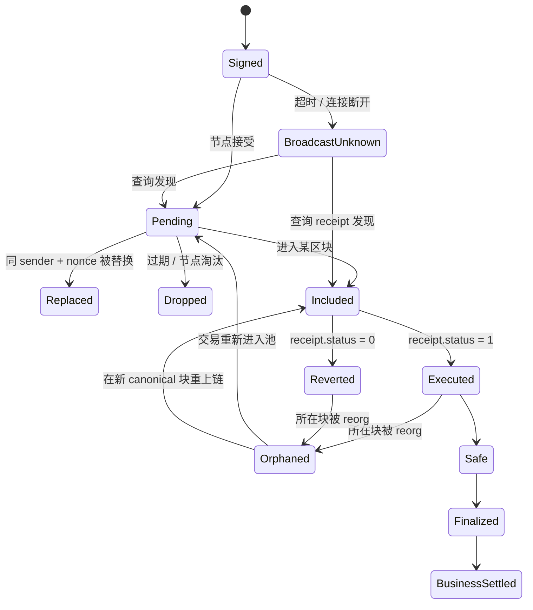

# EVM 交易生命周期：Pending、Receipt、确认、最终性与重组

## 30 秒版（开场）

> **拿到 tx hash 不代表节点已长期保存，拿到 receipt 不代表业务可结算，`receipt.status=1` 也不代表区块已最终确认。**
> 正确状态链是：已签名 → 已广播 → 节点接受/传播 → pending → included → EVM success/revert →
> canonical → safe/finalized → 业务入账。交易可能被 dropped、同 nonce replacement，已上链块也可能 reorg；
> 所以必须保存 `txHash + blockNumber + blockHash`，按目标链的 finality 模型推进状态，而不是写死“12 确认”。

## 一笔交易至少有三套状态



| 状态面 | 解决的问题 | 典型字段 |
|--------|------------|----------|
| **传播/池状态** | 节点是否知道交易、是否准备打包 | local submission、pending、dropped、replaced |
| **执行状态** | EVM 执行成功还是 revert | receipt、`status`、gas used、logs |
| **共识/业务状态** | 所在块是否 canonical、达到何种不可逆程度 | block hash、safe/finalized、业务 watermark |

把三套状态压成 `SUCCESS/FAILED`，会导致广播超时重复签名、reorg 重复入账、revert 被当作到账，或者刚出块就放币。

## 从签名到 pending

### Signed 只代表本地构造完成

签名后的 raw transaction 已经确定 sender、nonce、chain ID、目标、value、data、gas 参数和签名。
在 EIP-155/typed transaction 语境下，同一 raw bytes 对应确定 tx hash。此时网络可能完全没见过它。

### Broadcast 的成功边界

`eth_sendRawTransaction` 返回 tx hash，说明该 RPC 节点接受了请求；不保证：

- 交易已传播到所有节点；
- 一定能被 proposer 看到或打包；
- fee 足够、nonce 前序已齐；
- 节点重启后仍保留它；
- 交易最终成功执行。

请求超时时，结果是 **UNKNOWN**，不是失败。先用本地已知 tx hash 查询多个 endpoint，再决定是否重播
**完全相同的 raw bytes**。不要重建一笔“差不多”的交易，否则可能产生 nonce/金额差异。

### Pending 不是全网统一事实

每个节点 mempool 都是局部视图。某 provider 查不到 pending 交易，可能只是没收到或已淘汰；另一个节点
仍可能持有它。WebSocket `newPendingTransactions` 也是该节点的观察流，不是持久队列或共识日志。

## Nonce、卡单与 Replacement

同一账户的交易按 nonce 排序。nonce `N` 未打包时，`N+1` 即使 fee 很高也可能被卡住。业务系统要区分：

- `latest nonce`：canonical 链已执行到哪里；
- `pending nonce`：某节点把本地 mempool 也算进去的视图；
- `reserved nonce`：交易管理器持久化分配、但可能尚未上链的本地事实。

替换交易通常使用相同 sender 与 nonce，并提高费用；替换后的 payload 可以相同（加速）或不同（取消/改意图）。
因此业务主键不能只用 tx hash：一次业务意图可能产生多个 candidate tx hash，而链上最终最多执行其中一个 nonce。

```text
business_intent_id
  ├── candidate tx A (nonce 42, low fee)
  └── candidate tx B (nonce 42, replacement)
          └── canonical execution
```

## Included 与 Receipt 到底证明什么

`eth_getTransactionReceipt` 返回非空，说明该节点在某个区块中看到了交易执行结果。关键字段包括：

- `transactionHash`：交易身份；
- `blockNumber`、`blockHash`：这次观察绑定的区块；
- `status=0x1`：EVM 执行未 revert；
- `status=0x0`：执行 revert，状态变化和该调用产生的 logs 不生效，但 gas 仍消耗；
- `logs`：成功执行产生的事件，仍需随区块 canonical/finality 状态推进。

`status=1` 只回答执行问题，不回答：业务语义是否正确、收到的 token 是否官方、合约是否被代理升级、
价格是否可接受、区块是否会 reorg。

## Confirmations 不等于 Finality

传统确认数通常计算为：

```text
confirmations = canonical_head_number - tx_block_number + 1
```

它只是交易区块后面又接了多少块。不同共识下，它可能是概率风险近似、BFT finality 之后的冗余展示，
也可能在单验证者链上几乎不增加独立安全性。

Ethereum Execution API 明确区分：

| Block tag | 语义 |
|-----------|------|
| `latest` | 当前节点观察到的 canonical head，正常情况下也可能 reorg |
| `safe` | 在诚实多数及同步假设下可认为安全的块 |
| `finalized` | 已获得加密经济最终性的块，非异常社会协调不应回滚 |

Ethereum PoS 用 checkpoint 和至少三分之二 stake 的 supermajority link 推进 justified/finalized。
其他 EVM 链可能使用 PoA、IBFT/QBFT、Snowman、独立 PoS 或 Rollup 安全模型，不能把 Ethereum 的 tag
和时间常量直接复制过去。

## Reorg 时真正发生了什么

同一个高度只能在某一时刻有一个 canonical block hash，但旧块仍可能被节点短期保留。reorg 后：

1. 原 `blockNumber -> old blockHash` 映射失效；
2. 原块中的交易和 logs 变成 orphaned；
3. 交易可能回到 mempool、在新块重新执行，也可能消失或被 replacement 取代；
4. 相同 tx hash 若重上链，新的 `blockHash`、位置和确认状态会变化；
5. 已触发的链下记账、发货或提现无法靠 EVM 自动撤回，必须有冲正/补偿机制。

[EIP-1898](https://eips.ethereum.org/EIPS/eip-1898) 允许部分状态查询绑定 block hash，并可要求
`requireCanonical`，用于避免一组查询跨越 reorg 后读到不一致状态。provider 不支持时，应用至少要在操作前后
重查高度对应 hash。

## 业务状态机：观察、确认和结算分层

建议持久化：

```text
tx_intent(id, chain, sender, nonce, raw_tx_hash, state)
tx_candidate(intent_id, tx_hash, raw_bytes_ref, fee, submitted_at)
tx_observation(chain, tx_hash, block_number, block_hash, receipt_status, canonical)
chain_watermark(chain, observed_head, safe_head, finalized_head)
ledger_effect(intent_id, status, reversal_of, idempotency_key)
```

### 充值

```text
SEEN → EXECUTED → CANONICAL → SAFE/FINALIZED → CREDITED
                      ↘ ORPHANED → RECHECK / REVERSE
```

- 首次看到 event 只创建 observation；
- 核对合约地址、topic、from/to、amount 和 receipt status；
- 按链别、资产和金额风险推进到 safe/finalized；
- 入账用 `(chain identity, tx hash, log index, event semantics)` 幂等；
- reorg 穿过已入账水位时产生冲正流水，不直接删除审计记录。

### 提现/Relayer

```text
CREATED → NONCE_RESERVED → SIGNED → SUBMITTED_UNKNOWN/PENDING
        → INCLUDED_SUCCESS → FINALIZED → COMPLETED
        → INCLUDED_REVERT  → FAILED/RETRY_BY_POLICY
```

不要把 RPC timeout 标成 `FAILED` 后立刻分配新 nonce；先恢复原 tx hash 和 intent 状态。

## 不同链的“确认策略”

| 链类型 | 应优先使用的证据 | 常见误区 |
|--------|------------------|----------|
| PoW / 概率最终性 | 累积工作/确认深度 + 风险模型 | 把固定 N 当绝对不可逆 |
| Ethereum PoS | `safe` / `finalized` checkpoint | receipt 出现即 finalized |
| BFT / PoA | 协议 commit/finality + validator quorum | 多等块就能弥补单 signer 风险 |
| Optimistic Rollup | L2 inclusion、L1 data/derivation、L1 finality、提款状态 | 把挑战期说成所有交易确认时间 |
| ZK Rollup | L2 inclusion、batch/DA、proof 与 L1 verification/finality | sequencer 收录即证明已验证 |

确认策略应是配置数据，而不是散落在代码里的 `if chainID == ... { confirmations = 12 }`。至少按
链、环境、资产、金额档位、入账/放币动作分别配置，并保留人工暂停开关。

## Go 侧 canonical 检查骨架

```go
func ReceiptCanonical(ctx context.Context, c *ethclient.Client, tx common.Hash) (*types.Receipt, bool, error) {
	r, err := c.TransactionReceipt(ctx, tx)
	if errors.Is(err, ethereum.NotFound) {
		return nil, false, nil // 可能 pending、dropped，或当前 endpoint 未见过
	}
	if err != nil {
		return nil, false, err
	}

	h, err := c.HeaderByNumber(ctx, r.BlockNumber)
	if err != nil {
		return nil, false, err
	}
	return r, h.Hash() == r.BlockHash, nil
}
```

这只是一次快照检查。生产 worker 还要持续校验 parent lineage、维护 watermarks、支持共同祖先回退，并把
finality 查询和业务记账放在可恢复事务中。完整模型见 [S-BC-05](./S-BC-05-indexer-reorg.md)。

## 深挖问答

1. **RPC 返回 tx hash 后可以认为广播成功吗？**
   只能认为这个 endpoint 接受了 raw tx；仍需记录 raw bytes/hash，并监控传播、打包和 replacement。
2. **receipt 一会儿有、一会儿没有是什么原因？**
   可能是 endpoint 视图不同、节点落后、reorg、provider 缓存或索引延迟。用 block hash 和多源证据定位。
3. **`status=0` 是否可以重发完全相同交易？**
   已在 canonical 链执行过就消耗了 nonce，原 raw tx 不能再次生效。应分析 revert，并以新 nonce 创建新的业务尝试。
4. **为什么 100 个确认也不证明单验证者链去中心化？**
   后续 100 个块可能仍由同一密钥产生；块数增加不等于独立共识参与者增加。
5. **tx hash 能否作为充值唯一键？**
   还要有 log index/event semantics；一笔交易可产生多次同类 Transfer，reorg observation 还要保留 block hash lineage。
6. **finalized 后绝对不能回滚吗？**
   它是在目标协议安全假设下的强保证；严重共识故障、客户端 bug 或社会协调仍是系统级例外，业务需要灾难处置边界。

## 反模式与事故

- 看到 tx hash 就扣款或发货，交易最终 dropped。
- 只查 `eth_getTransactionByHash`，不核 receipt status 和 canonical block hash。
- RPC timeout 后重新构造并签名，产生两个不同 candidate 和 nonce 混乱。
- 用 `latest - N` 统一处理所有 EVM 链、所有金额和 Rollup 提款。
- reorg 时删除充值记录，不留原 observation 和冲正审计链。
- WebSocket 断线后不从持久水位补扫，永久漏单。

## 延伸阅读

- [Ethereum 交易生命周期](https://ethereum.org/developers/docs/transactions/)
- [Ethereum PoS 与 finality](https://ethereum.org/developers/docs/consensus-mechanisms/pos/)
- [Execution API block tags](https://ethereum.github.io/execution-apis/api/methods/eth_getBlockByNumber/)
- [EIP-1898：按 block hash 查询](https://eips.ethereum.org/EIPS/eip-1898)

## 相关链接

- [链上索引器：扫块、重组与幂等](./S-BC-05-indexer-reorg.md)
- [Gas / Fee 与多链费用](./S-BC-13-gas-fee-multichain.md)
- [Relayer 交易管理器](../19-node-rpc-staking/S-NODE-05-relayer-transaction-manager.md)
- [Rollup 安全边界](./S-BC-11-rollup-finality-da-proof-security.md)
