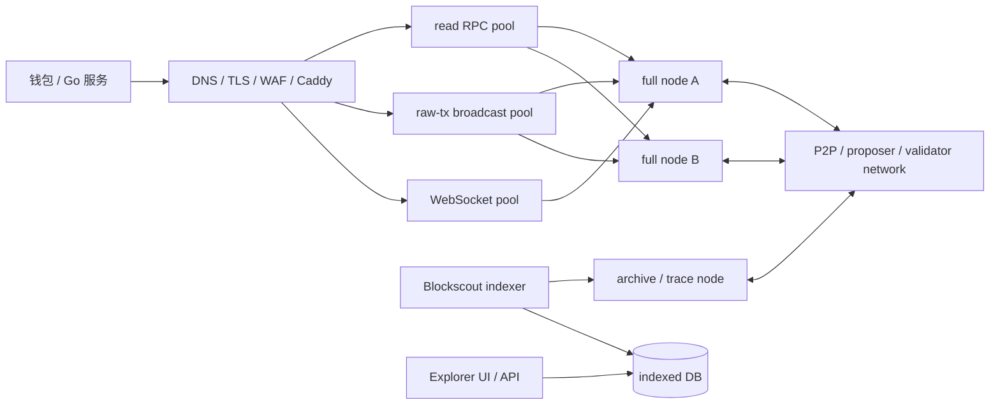

# RPC 节点与区块浏览器：生产架构、高可用与 502 恢复

## 30 秒版（开场）

> **域名返回 502，通常只说明反向代理没有从上游 RPC 拿到有效响应，不等于整条链停了。**
> 生产架构要拆分公网网关、普通 full RPC、archive/trace、WebSocket、P2P 共识和 Blockscout indexer；
> 健康检查不能只看端口和 `eth_chainId`，还要验证 genesis、head 新鲜度/持续推进、sync 状态和多源 hash。
> 恢复时先保数据：定位 proxy upstream → 查进程/容器、磁盘、OOM、日志、端口 → 本机语义探测 →
> 核对链身份与同步高度 → 再纳入流量；不要一上来删 `chaindata` 或重新初始化 genesis。

## 先看清数据路径



这张图解释了一个常见现象：公网 RPC 经 Caddy 指向节点 A，浏览器 indexer 走内网 archive 节点 B。
A 挂掉时公网返回 502，但 B 仍同步，浏览器仍会持续出现新区块。反过来，浏览器索引器或数据库挂了，也可能
出现“RPC 正常、浏览器不更新”。

## 节点角色不要混成一个池

| 角色 | 主要请求 | 资源特征 | 隔离理由 |
|------|----------|----------|----------|
| 普通读取节点 | block、receipt、balance、call | 延迟敏感、中等 IO | 不应被 trace/backfill 拖死 |
| 广播节点 | `eth_sendRawTransaction` | 低吞吐但资金敏感 | 需要审计、限速和多播策略 |
| WebSocket 节点 | `newHeads`、logs subscription | 长连接、状态性强 | 与短 HTTP 请求的负载模型不同 |
| Archive/trace | 历史 state、debug/trace | 高磁盘、高 CPU/IO | 必须独立并发预算和超时 |
| Explorer indexer 上游 | block、receipt、trace、balance | 持续批量读取 | catch-up 会形成巨大背景流量 |

Blockscout 官方要求 JSON-RPC 遵循 Execution API，并说明 WebSocket 可订阅 `newHeads`，否则会轮询
`eth_blockNumber`；其配置还区分 HTTP、fallback、trace、`eth_call` 和 WS endpoint。说明“浏览器”
本质上是依赖节点的索引系统，不是链本身。

## 四层健康检查

### L1：进程与端口

- systemd/container 是否 running，退出码和重启次数；
- RPC 端口是否监听，Caddy upstream 地址和容器网络是否正确；
- 磁盘空间/inode、内存、OOM、FD 是否耗尽；
- P2P 端口、RPC 端口和 metrics 端口不要混淆。

只能证明服务“存在”，不能证明它在正确链上同步。

### L2：RPC 语义

```json
{"jsonrpc":"2.0","id":1,"method":"eth_chainId","params":[]}
{"jsonrpc":"2.0","id":2,"method":"eth_getBlockByNumber","params":["0x0",false]}
{"jsonrpc":"2.0","id":3,"method":"eth_getBlockByNumber","params":["latest",false]}
{"jsonrpc":"2.0","id":4,"method":"eth_syncing","params":[]}
```

要求 chain ID、genesis 匹配；latest 有完整 hash/parent/timestamp；JSON-RPC error 和 transport error 分开统计。

### L3：新鲜度与推进

```text
head_age_seconds = now - latest.timestamp
head_progress     = height(t2) > height(t1)
sync_lag          = reference_height - endpoint_height
```

目标链暂停出块时 `head_progress=false` 不一定是节点故障，所以还要和独立 reference 比较。单节点自身不能证明
自己没有落后或困在少数分叉。

### L4：一致性与业务能力

- 同一高度在独立 endpoint 的 block hash 是否一致；
- `safe`/`finalized`、archive、trace、fee history、batch、logs range 是否满足该业务池；
- 代表性 `eth_call` 是否成功，不能只测轻量的 `eth_chainId`；
- 广播池是否接受完全相同 raw tx，返回 `already known` 也应规范化为可接受结果。

## Caddy 双上游示意

```caddyfile
rpc.example.com {
    reverse_proxy 10.0.1.11:8545 10.0.2.12:8545 {
        lb_policy least_conn
        lb_try_duration 2s
        fail_duration 30s
        max_fails 2
        unhealthy_status 5xx

        health_uri /
        health_method POST
        health_headers {
            Content-Type application/json
        }
        health_request_body `{"jsonrpc":"2.0","id":1,"method":"eth_chainId","params":[]}`
        health_body `"result"\s*:\s*"0xEXPECTED"`
        health_interval 10s
        health_timeout 3s
        health_fails 2
        health_passes 2
    }
}
```

这只是 edge 的第一道摘除。Caddy 支持 active/passive health check、负载均衡和 retry，但更完整的 genesis、
head progress 和多源 hash 检查应由独立 health agent 完成，再通过服务发现/配置控制 endpoint 是否入池。

注意：

- `0xEXPECTED` 必须替换为目标链十六进制 chain ID；
- 两个容器在同一宿主机、同一磁盘和同一云区，不是两个故障域；
- WebSocket 需要连接级 sticky、断线重连与持久水位补扫；
- 写请求不要依赖代理盲目重试并重新构造交易，应用层只多播相同 raw bytes；
- 配置变更先 `caddy validate`，再 reload，不要为了改 upstream 中断所有连接。

## 公网 RPC 安全边界

Geth 官方建议防火墙不要直接向不可信网络暴露 RPC 端口，并按 namespace 显式启用 API。公网通常只开放
必要的 `eth,net,web3` 子集；`admin`、`personal`、Engine API、宽泛 `debug/trace` 不应直接暴露。

至少配置：

- TLS、认证/配额、请求体大小、batch 数量和单 IP/租户限流；
- method allowlist 与 method-specific 并发、timeout、计费；
- 禁止将 signer/keystore 解锁能力放在公网 RPC 节点；
- CORS/vhost 不是身份认证；
- P2P 对外端口与 JSON-RPC 访问控制分开；
- trace/archive 使用内部 endpoint 和独立资源池。

## `502 Bad Gateway` 无损恢复 Runbook

### 0. 先判断影响面

```text
DNS/TLS 正常 + Caddy 返回 502
  ├─ 浏览器高度仍推进 → 公网 upstream/路径故障概率高
  └─ 浏览器也停止      → 检查 indexer 上游、节点与全链出块
```

记录故障开始时间、最后健康高度/hash、最近发布或机器变更。先把失败 endpoint 从流量池摘除，有健康上游就切流，
不要边承载业务边做破坏性修复。

### 1. 确认代理实际上游

```bash
sudo systemctl status caddy --no-pager -l
sudo journalctl -u caddy -n 200 --no-pager
sudo rg -n 'reverse_proxy|rpc.example.com' /etc/caddy/Caddyfile
sudo caddy validate --config /etc/caddy/Caddyfile
```

日志中的 `connection refused`、timeout、DNS、TLS handshake、EOF 对应不同层次。不要只重启 Caddy；如果 Caddy
本身能稳定返回 502，它通常正在诚实报告上游失败。

### 2. 检查宿主机与节点进程

```bash
date
df -h
df -ih
free -h
sudo systemctl --failed --no-pager
docker ps -a --format 'table {{.Names}}\t{{.Status}}\t{{.Image}}'
sudo ss -lntp
```

Docker 节点再查：

```bash
docker inspect --format \
  '{{.State.Status}} exit={{.State.ExitCode}} oom={{.State.OOMKilled}} error={{.State.Error}}' \
  <rpc-container>
docker logs --tail 300 <rpc-container>
```

常见根因包括：磁盘/inode 满、OOMKilled、数据库锁/损坏、错误 datadir、端口未映射、容器 DNS/网络变化、
客户端升级不兼容、进程退出但没有 restart policy。Docker 官方提供 `on-failure`、`always`、
`unless-stopped` 等 restart policy；它们能恢复进程退出，不能修复磁盘满、错误配置或 crash loop。

### 3. 绕过代理做本机语义探测

```bash
curl --max-time 5 -H 'content-type: application/json' \
  --data '{"jsonrpc":"2.0","id":1,"method":"eth_chainId","params":[]}' \
  http://127.0.0.1:8545
```

| 结果 | 优先排查 |
|------|----------|
| Connection refused | 进程未运行、监听地址/端口错误 |
| Timeout | 进程卡死、IO/CPU 饱和、请求队列或防火墙 |
| 本机正常、Caddy 502 | upstream 地址、容器网络、TLS/Host、代理超时 |
| chain ID/genesis 不符 | 错 datadir、错配置或连错网络，禁止入池 |
| 高度落后/`eth_syncing` | P2P、共识客户端、磁盘性能、checkpoint |

### 4. 恢复顺序

1. 保存日志、配置、镜像/二进制版本、datadir 路径和最后高度；
2. 处理明确的资源或配置根因；
3. 使用服务管理器/compose 正常重启节点，不手工开第二个争抢同一 datadir 的进程；
4. 本机验证 chain ID、genesis、head、sync、peer/共识状态；
5. 与健康节点比较同高度 hash，等待 lag 进入阈值；
6. 小流量纳入读取池，观察错误率/延迟/推进，再开放写入与 WebSocket；
7. 复盘 restart policy、告警、容量、snapshot 与第二故障域。

禁止在未确认根因和备份前执行：删除 `chaindata`、`geth removedb`、`docker compose down -v`、重新 `init`
genesis。这些动作可能把可恢复故障升级成全量重同步或不可逆数据丢失。

## Blockscout 的独立健康

浏览器至少有三种 lag：

```text
chain head - explorer indexed head
explorer indexed head - API visible head
API visible head - frontend/cache visible head
```

排查浏览器时分别看 indexer 日志、RPC fallback、PostgreSQL、API 和前端缓存。Blockscout REST API 是 UI
的数据入口，可用 `/api/v2/blocks`、`/api/v2/transactions`、`/api/v2/stats` 做观测，但这些结果来自索引库，
不能替代节点 canonical/finality 核验。

## 生产 SLO 与告警

| 指标 | 告警含义 |
|------|----------|
| `rpc_requests_total{method,code,endpoint}` | method-specific 错误与限流 |
| `rpc_latency_seconds{method,endpoint}` | P95/P99 尾延迟、trace 拖垮普通读 |
| `head_height/head_age_seconds` | 节点落后或全链停止 |
| `head_hash_disagreement` | endpoint 在不同 fork/错误网络 |
| `safe_finalized_lag` | finality 停滞而 latest 仍增长 |
| `peer_count/sync_distance` | P2P 或同步退化；阈值按客户端/链定义 |
| `disk_free/inodes/io_latency` | 节点最常见容量事故前兆 |
| `container_restarts/oom_kills` | crash loop 或内存不足 |
| `explorer_index_lag` | 浏览器投影落后，不等于链停 |

Geth 可通过 `--metrics` 在受控地址暴露指标。方法清单和名称会随客户端版本变化，监控必须结合目标客户端
版本验证，不能只复制一套 Ethereum/Geth dashboard 到所有 EVM 链。

## 深挖问答

1. **为什么负载均衡后仍会全部 502？**
   上游可能都在同一宿主机/磁盘/云区，或 Caddy 配错了共同端口；也可能健康检查只测 HTTP，没有摘除语义失效节点。
2. **`eth_chainId` 成功为什么还不健康？**
   它几乎不访问重状态；节点可能落后、卡在错误 fork、receipt/trace 已不可用。要验证 head 新鲜度、推进和代表性方法。
3. **公网 RPC 是否应该开放 `debug_traceTransaction`？**
   通常不直接开放；它资源昂贵、攻击面大，应进受控 trace 池，做认证、限流和长任务治理。
4. **能否让 Caddy 自动重试 `eth_sendRawTransaction`？**
   只重复完全相同请求体在协议上通常可幂等，但资金服务更适合在应用层保存 raw bytes、记录每个 endpoint 响应并多播，
   避免代理策略不透明或未来引入重新签名。
5. **两台节点足够高可用吗？**
   取决于故障域和一致性目标。至少确认独立宿主/磁盘/区、P2P 路径和运维控制；高价值读取还需多源分歧检测。
6. **浏览器可不可以作为 RPC fallback？**
   它的 REST API适合查询索引结果，不提供完整、实时、一致的 EVM JSON-RPC 语义；只能用于观测/交叉验证，不能透明替代。

## 反模式与事故

- 公网域名只指向一个节点，没有健康摘除和备用上游。
- 两个“节点”共享同一 datadir、宿主机或磁盘，故障时一起消失。
- 普通读、trace、历史 backfill 和 explorer 共用一个无并发隔离的 endpoint。
- 自动重启掩盖 OOM/crash loop，节点反复损坏或永远追不上 head。
- 恢复后只看到 HTTP 200 就立即承载提现，没有核对 genesis/head hash。
- 直接暴露 `admin`、Engine API 或解锁账户接口到公网。

## 延伸阅读

- [Geth JSON-RPC Server](https://geth.ethereum.org/docs/interacting-with-geth/rpc)
- [Geth API / 网络安全](https://geth.ethereum.org/docs/fundamentals/security)
- [Caddy reverse_proxy 与健康检查](https://caddyserver.com/docs/caddyfile/directives/reverse_proxy)
- [Blockscout 节点/RPC 要求](https://docs.blockscout.com/setup/requirements/node-tracing-json-rpc-requirements)
- [Docker restart policy](https://docs.docker.com/engine/containers/start-containers-automatically/)

## 相关链接

- [RPC HA：Quorum、Hedging 与缓存](../19-node-rpc-staking/S-NODE-02-rpc-ha-quorum-hedging-cache.md)
- [Ethereum 节点架构与同步](../19-node-rpc-staking/S-NODE-01-ethereum-node-architecture-sync.md)
- [公链身份核验](./S-BC-15-evm-chain-identity-verification.md)
- [链上数据 Backfill / Trace](../19-node-rpc-staking/S-NODE-04-chain-data-platform.md)
