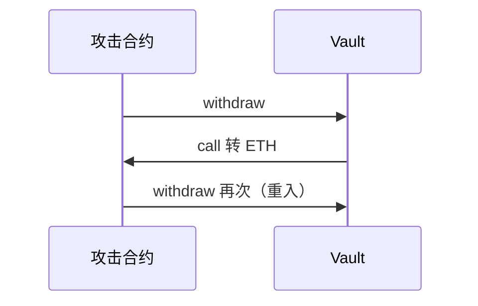

# 合约安全：重入、权限与 OWASP

## 30 秒版（开场）

> 智能合约由链上共识执行，错误通常不可由后端热修复，且常直接控制资产。安全回答不能只背“重入”：应覆盖 **访问控制、业务逻辑、预言机、精度、外部调用、签名重放和升级面**。CEI 与 `ReentrancyGuard` 是重入防线，但 Go 层风控不能替代链上硬约束。

## 3 分钟版（精讲深度）

1. **是什么**：风险分类优先参考持续维护的 OWASP Smart Contract Top 10 / SCSVS；SWC 仅用于理解历史编号。
2. **为什么**：一次漏洞 = 全额损失；Review 是架构师核心职责。
3. **怎么做**：先定义协议不变量和信任边界，再做最小权限、CEI/重入锁、安全外部调用、预言机与精度防护；配合静态分析、fuzz、invariant 和主网 fork 测试。

## 10 分钟版（原理 + 图示）



**Checks-Effects-Interactions（CEI）**

```solidity
function withdraw(uint256 amount) external nonReentrant {
    require(balances[msg.sender] >= amount); // Checks
    balances[msg.sender] -= amount;            // Effects
    (bool ok,) = msg.sender.call{value: amount}(""); // Interactions
    require(ok);
}
```

本仓库示例：[ReentrancyGuard.sol](https://github.com/twodog-tt/Golang-development-manual/blob/master/examples/solidity/ReentrancyGuard.sol)

**OWASP Smart Contract Top 10（2026）**

| 类别 | 讲解时应讲的防线 |
|------|------------------|
| SC01 访问控制 | 每条管理路径都鉴权；RBAC、两步权限转移、Multisig + Timelock |
| SC02 业务逻辑 | 状态机与经济不变量；异常路径、边界状态和组合调用测试 |
| SC03 预言机操纵 | 多源/稳健价格、TWAP、freshness、偏差与流动性检查 |
| SC04 闪电贷促成攻击 | 闪电贷只是资金放大器；修复同交易价格操纵和业务不变量缺口 |
| SC05 输入校验 | 地址、数量、数组长度、deadline、签名参数和状态前置条件 |
| SC06 未检查外部调用 | 检查 low-level call；ERC20 用 `SafeERC20` 兼容非标准返回 |
| SC07 算术/舍入/精度 | 固定单位、明确舍入方向、处理 dust；关注除法顺序和 decimal 差异 |
| SC08 重入 | CEI + `nonReentrant`；覆盖跨函数、跨合约和 read-only reentrancy |
| SC09 溢出/下溢 | Solidity 0.8+ 默认检查，但仍审计 `unchecked`、窄类型转换和 assembly |
| SC10 代理/升级 | 初始化、升级鉴权、存储布局校验、Timelock 与可审计升级流程 |

SWC Registry 自身已明确说明：内容自 2020 年后未充分更新，可能不完整且含错误或关键遗漏。因此可以在场景里，说 “SWC-107 重入”，但不应把 SWC 当作当前完整安全基线，也不应笼统回答“Solidity 0.8+ 全部用 SafeMath”。

**权限模型**

- `Ownable`：单管理员
- `AccessControl`：角色 `bytes32` + `onlyRole`
- **Timelock + Multisig** 管升级与参数

## 生产场景

- 发送原生 ETH：通常使用 `.call{value: ...}("")` 并检查返回值，再配合 CEI/重入锁；不要依赖 `transfer` 的固定 2300 gas 假设
- 调 ERC20：使用 `SafeERC20` 处理不返回 bool 等非标准 token；这与 ETH 的 `transfer`/`call` 是两类问题
- 签名授权：EIP-712 domain 应绑定 `chainId`、`verifyingContract`，并校验 nonce 与 deadline，防跨链/跨合约重放
- 闪电贷攻击：单 tx 内价格操纵（见 [S-SOLID-07](./S-SOLID-07-defi-patterns.md)）
- 代理 admin 误留 implementation 函数

## 排查与工具

- Slither、Aderyn、Mythril
- Echidna 模糊测试属性
- 主网 fork 测试（Foundry）

## 深挖问答

1. **read-only reentrancy？** → 跨合约视图在 callback 中读 stale 价格。
2. **tx.origin 为何禁用？** → 钓鱼中间合约。
3. **delegatecall 风险？** → 在错误 context 执行，storage 错乱。
4. **Go 后端如何配合？** → 链下风控 + 链上硬规则；见 S-SOLID-08。

## 反模式与事故

- **先转账后改余额** → 重入
- **EOA 单 owner 直接控升级/资金** → 私钥单点；使用两步转移、多签和延时
- **把 `private` 状态当秘密** → 链上 storage 可读取
- **依赖 `selfdestruct` 删除代码/存储** → EIP-6780 后通常只转余额；除“创建同一交易内销毁”等例外，不再是通用删除原语

## 延伸阅读

- [OWASP Smart Contract Top 10](https://scs.owasp.org/sctop10/)
- [OWASP Smart Contract Security Verification Standard](https://scs.owasp.org/SCSVS/)
- [SWC Registry（历史分类，非当前完整基线）](https://swcregistry.io/)
- [Slither](https://github.com/crytic/slither)
- [EIP-6780：SELFDESTRUCT 语义变化](https://eips.ethereum.org/EIPS/eip-6780)
