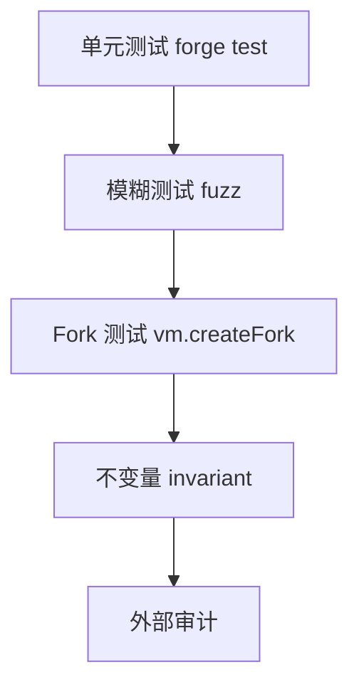

# Foundry 测试与审计清单

## 30 秒版（开场）

> **Foundry**（forge）支持 **单元测试、fuzz、fork、invariant**。交付前要组合
> 静态分析、属性测试、权限/升级演练、部署参数复核与人工审计。任何工具、覆盖率或
> 审计报告都只能降低风险，不能证明合约“绝对安全”。

## 3 分钟版（精讲深度）

1. **是什么**：`forge test`、`forge script`、Solidity 写测试（cheatcodes）。
2. **为什么**：已最终确认的交易不能像普通数据库那样随意回滚，漏洞修复还受
   upgradeability、治理和资产迁移约束；测试是多层防线之一，不是最后保证。
3. **怎么做**：单测 + fuzz + 主网 fork 集成 + 外部审计。

## 10 分钟版（测试金字塔）



**Foundry 示例**

```solidity
function testWithdraw() public {
    vault.deposit{value: 1 ether}();
    vault.withdraw(1 ether);
    assertEq(address(vault).balance, 0);
}

function testFuzz_Deposit(uint96 amount) public {
    vm.assume(amount > 0);
    vault.deposit{value: amount}();
    assertEq(vault.balances(address(this)), amount);
}
```

**Cheatcodes 常用**

| 命令 | 用途 |
|------|------|
| vm.prank | 模拟 msg.sender |
| vm.deal | 给 ETH |
| vm.roll / warp | 块高/时间 |
| vm.createFork | 主网状态 |

**架构师审计清单（发布前）**

- [ ] 对 Slither 等静态分析结果逐项 triage；“没有 high”不等于没有漏洞
- [ ] 关键资产不变量、权限边界、失败路径有单测 + fuzz/invariant；覆盖率仅作缺口信号
- [ ] 升级布局 validate（若 proxy）
- [ ] 权限、timelock/multisig、pause 与恢复流程
- [ ] Oracle stale/decimals/sequencer、外部回调和经济攻击场景
- [ ] 事件完整供 Go 索引
- [ ] pin solc、optimizer、via-IR、EVM target、依赖 commit、fork block 与部署参数
- [ ] 文档：部署地址、chainId、实现/代理、角色、参数范围和验证方法

## 生产场景

- CI 使用与部署一致的 solc/optimizer/via-IR/EVM 配置；不能只在 CI 临时打开
  `--via-ir` 而部署使用另一套字节码
- 部署 script：`forge script` + multisig 执行
- fork 测试固定 block number，并记录 RPC/链状态假设；“今天 fork 通过”不保证未来
  外部协议版本仍兼容

## 深挖问答

1. **Hardhat vs Foundry？** → Foundry 快、Solidity 测；Hardhat TS 生态。
2. **invariant 测试？** → handler 随机调函数，assert 全局性质（如总供应守恒）。
3. **如何测 reentrancy？** → 攻击合约 mock 在 fallback 再入。
4. **Go 与 Foundry 分工？** → 合约 Foundry；集成 Go+simulated/abigen。

## 反模式

- **仅 happy path 测试**
- **把主网 fork 当成完整测试** → fork 只覆盖某个历史状态，仍需 mock、边界、
  adversarial 与 invariant 测试
- **把外部审计当免责保证** → 修复项、部署字节码和审计 commit 不一致仍会失效

## 代码示例

本仓库 ERC20 可用 Foundry 另建 `test/`（与 `go test` 并行）；SimpleToken 见 `examples/senior/erc20bind/contract/`。

## 延伸阅读

- [Foundry Book](https://book.getfoundry.sh/)
