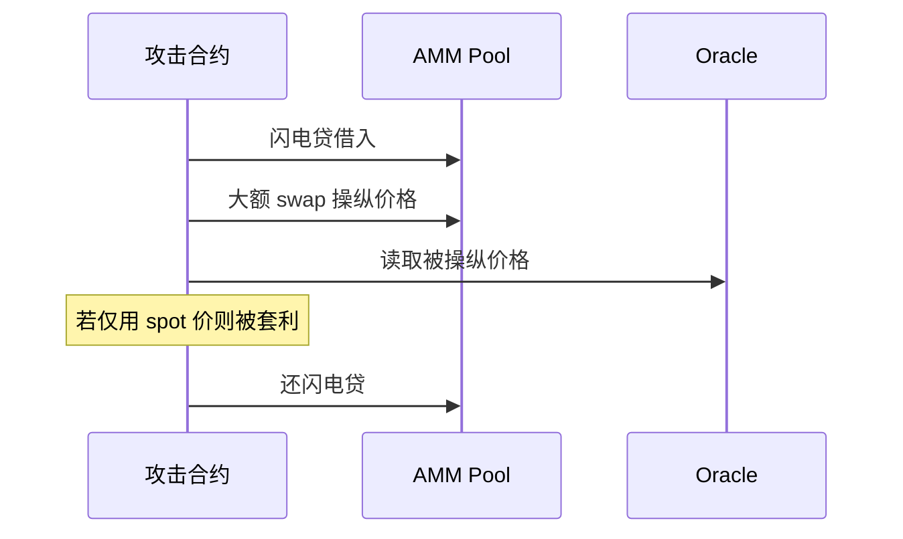

# DeFi 合约模式：AMM / Oracle / 闪电贷

## 30 秒版（开场）

> DeFi 架构师要懂 **AMM 恒定乘积、Oracle 喂价、闪电贷单 tx 原子性**。Solidity 层定 **价格与清算规则**；Go 层做 **聚合展示与风控**，不能替代链上数学（[S-SOLID-08](./S-SOLID-08-contract-go-boundary.md)）。

## 3 分钟版（精讲深度）

1. **是什么**：Uniswap 类 x*y=k；Chainlink aggregator；Aave flashLoan callback。
2. **为什么**：常见深挖「如何设计链上 swap / 如何避免 oracle 操纵」。
3. **怎么做**：根据资产流动性、延迟容忍和威胁模型选择 Oracle；绑定准确的网络、
   feed 地址、base/quote 与 decimals，按该 feed 的 heartbeat/deviation 和业务风险检查
   `answer`、`updatedAt`、范围与异常偏离；适用 L2 还检查 sequencer uptime 和恢复
   grace period。闪电贷回调验证调用方并保持业务不变量。

## 10 分钟版

**AMM（经典 Uniswap V2 池、输入费率 0.3% 的简化公式）**

```
amountOut = (amountIn * 997 * y) / (x * 1000 + amountIn * 997)
```

这里的 `x/y` 是 swap 前储备，且假设标准 ERC-20 行为。不同协议费率、
fee-on-transfer/rebasing token、集中流动性或 hook 模型不能直接套用该公式。



- **V3 集中流动性**：架构更复杂，Gas 不同

- **无常损失（IL）**：LP 相对 HODL 的机会成本

**Oracle**

| 类型 | 优点 | 风险 |
|------|------|------|
| 聚合数据 Feed（如 Chainlink） | 可聚合多个数据源/节点并提供链上接口 | 应用仍依赖具体 feed；可能 stale、暂停、异常或小数位误用 |
| AMM TWAP | 提高瞬时操纵成本 | 不自动安全；窗口、池深、成交量和操纵预算决定强度，并引入延迟 |
| 现货池价 | 无依赖 | 易被闪电贷操纵 |

**闪电贷**

```solidity
function executeOperation(...) external returns (bool) {
    // 先验证 msg.sender 是预期 Pool，并校验 initiator/参数。
    // 执行业务后授权或归还 principal + premium。
    return true;
}
```

- 单 tx 内必须 **归还**；否则整 tx revert
- 闪电贷本身是无抵押的原子流动性原语，不是漏洞；它会放大依赖可操纵价格、
  错误份额计算或缺少访问控制的既有漏洞

## 生产场景

- 清算 bot：Solidity 规则 + Go 读取链上状态、事件或可用的 pending tx 信号触发；
  是否能可靠看到 mempool 取决于链和 RPC
- 价格：关键操作避免直接使用单池 spot；按风险组合经过验证的 feed、TWAP、
  deviation/circuit breaker 与 fallback，而不是机械地“二选一”

## 深挖问答

1. **MEV 与 DeFi？** → sandwich 攻击；架构上 private RPC/滑点保护。
2. **ERC-4626 vault？** → 标准化收益凭证。
3. **跨链 DeFi？** → 桥 + 双链流动性（[S-BC-07](../12-blockchain-web3/S-BC-07-l2-cross-chain-bridge.md)）。

## 反模式

- **单 DEX spot 作清算价**
- **Oracle 只检查 price > 0** → 还应绑定 feed/quote 资产与 decimals，校验
  `updatedAt`、业务 staleness、范围和异常偏离；没有所有 feed 通用的过期秒数。
  在适用 L2 上还要检查 sequencer uptime 与恢复宽限期
- **看到 flash loan 就判定漏洞** → 应指出被放大的具体状态或经济不变量

## 延伸阅读

- [Uniswap V2 Concepts](https://docs.uniswap.org/contracts/v2/concepts/core-concepts/pools)
- [Chainlink Data Feeds](https://docs.chain.link/data-feeds)
- [14 DEX/CEX：AMM 与 LP](../14-dex-cex-engineering/S-EXCH-06-dex-amm-liquidity.md)
- [S-EXCH-29 Staking / LM / Farm](../14-dex-cex-engineering/S-EXCH-29-defi-staking-liquidity-mining-yield.md)
- [S-EXCH-30 Uniswap V2/V3](../14-dex-cex-engineering/S-EXCH-30-uniswap-v2-v3-protocol.md)
- [S-EXCH-31 DEX Tech Lead 白板](../14-dex-cex-engineering/S-EXCH-31-dex-tech-lead-whiteboard.md)
