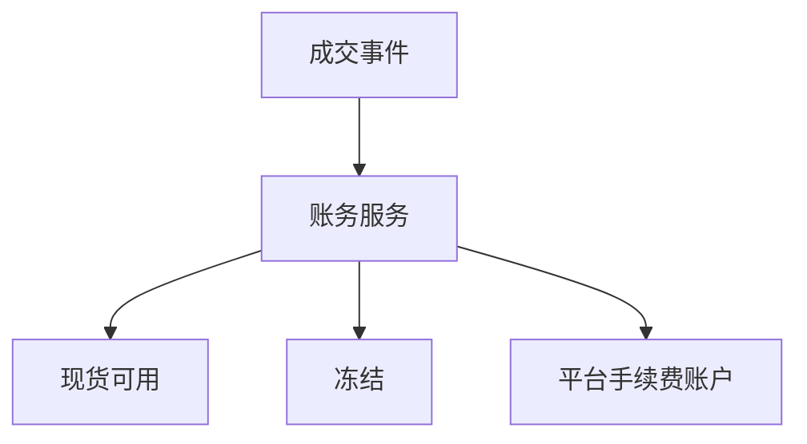

# 账户体系与资金账务（复式记账）

## 30 秒版（开场）

> 交易所资金 **不能** 只改 `users.balance` 一行：每笔业务要生成一个不可变的过账批次和两条或多条分录。若采用“余额增减量”模型，必须保证 **每个资产分别守恒**；不要把会计借/贷方向与代码里的正负号混为一谈。生产关键词：**唯一业务键、单库 ACID、不可变流水、冲正、对账不平零容忍**。

## 3 分钟版（精讲深度）

1. **是什么**：每笔业务生成两条或多条 posting；在同一资产内，借方合计等于贷方合计。工程上也可表达成 signed delta，此时每个资产的 delta 合计为零。
2. **为什么**：审计、监管、排障；常考察是否懂「钱从哪来到哪去」。
3. **怎么做**：`posting_batch` 保存唯一业务键，`ledger_entry` 只 INSERT；账户余额是事务内同步维护的物化值，并持续用流水、快照和外部资产做对账。

## 10 分钟版



**账户类型（常见）**

| 账户 | 说明 |
|------|------|
| SPOT_AVAILABLE | 现货可用 |
| SPOT_FROZEN | 挂单冻结 |
| MARGIN | 合约保证金 |
| INTEREST | 理财/借贷 |

**成交示例（signed delta，不是财务会计科目的借/贷方向）**

假设买方支付 `1000 USDT`，卖方 USDT 手续费 `1 USDT`；卖方交付 `0.01 BTC`，买方 BTC 手续费 `0.00001 BTC`。费率仅用于展示守恒关系：

| 资产 | 账户 | delta |
|------|------|------:|
| USDT | 买方可用 | -1000 |
| USDT | 卖方可用 | +999 |
| USDT | 平台手续费账户 | +1 |
| BTC | 卖方可用 | -0.01 |
| BTC | 买方可用 | +0.00999 |
| BTC | 平台手续费账户 | +0.00001 |

校验必须是 `Σ USDT delta = 0`、`Σ BTC delta = 0`，不能把 BTC 与 USDT 数量直接相加后声称“总和为零”。真实系统还需根据 maker/taker、手续费币种和折扣规则生成分录。

**Go 实现要点**

```go
func (s *LedgerService) Post(ctx context.Context, bizID string, entries []Entry) error {
    if err := validateBalancedByAsset(entries); err != nil {
        return err
    }

    return s.db.Transaction(func(tx *gorm.DB) error {
        fingerprint := hashEntries(entries)
        // INSERT ... ON CONFLICT DO NOTHING，依赖
        // UNIQUE(tenant_id, biz_type, biz_id) 原子抢占幂等键。
        created, err := insertPostingBatch(tx, bizID, fingerprint)
        if err != nil {
            return err
        }
        if !created {
            // 同一个 key 只有请求内容也一致时才算幂等重放；
            // 不同内容必须返回 IdempotencyConflict。
            return verifyExistingFingerprint(tx, bizID, fingerprint)
        }

        // 对 tenant/account/asset 等完整资源键排序后加行锁，
        // 降低并发扣款与锁顺序死锁。
        if err := lockAccountsInOrder(tx, entries); err != nil {
            return err
        }
        for _, e := range entries {
            if err := insertEntry(tx, bizID, e); err != nil {
                return err
            }
            if err := applyBalanceDelta(tx, e); err != nil {
                return err // 包含可用余额不得为负、版本号等约束
            }
        }
        return markPostingBatchCommitted(tx, bizID)
    })
}
```

- 幂等键通常为 `(tenant_id, biz_type, biz_id)`，例如 `trade_id` / `withdraw_id`；同时保存请求/分录 fingerprint，防止同 key 不同内容被静默吞掉
- 金额使用最小单位整数，或使用明确库、精度、scale、舍入与溢出策略的 decimal；
  不能只写一个 `decimal.Decimal` 类型名就认为金额语义已经完整
- 已过账分录不 UPDATE/DELETE；撤销错误交易要写一笔引用原批次的 **reversal**
- 用户可用/冻结余额应与分录同事务更新；平台手续费等热点总账户可分片，报表再异步汇总
- 写账与发 MQ 事件之间用 transactional outbox，避免“账已记、事件丢失”

## 生产场景

- **站内划转**：现货 → 合约，双边账务
- **活动赠币**：平台营销账户 → 用户
- **差错调整**：需审批 + 审计留痕

## 深挖问答

1. **余额与流水不一致？** → 冻结相关出金，定位首个不一致批次；用不可变流水与快照重建并告警，不能静默改流水。
2. **与撮合顺序？** → 成交事件带唯一 trade/settlement ID；账务幂等消费。若业务要求成交即资金生效，应把结算状态机与撮合顺序明确设计，不能只说“最终会重试”。
3. **分布式事务？** → 单服务本地事务优先；跨服务用 Saga（[S-DIST-05](../middleware/distributed/S-DIST-05-distributed-transaction.md)）。
4. **冻结怎么实现？** → 可用→冻结转移，非直接减可用。

## 反模式

- **UPDATE balance 无流水** → 无法审计
- **float 记账** → 精度纠纷
- **并发扣款既无原子条件更新，也无锁/串行化约束** → 可能超卖余额
- **先查 biz_id 再插入** → 并发下重复过账
- **直接修改历史流水纠错** → 审计链断裂；应追加冲正分录

## 延伸阅读

- 本手册 [S-ARCH-04 幂等](../03-system-design/S-ARCH-04-idempotency.md)
- [Martin Fowler：Accounting Patterns](https://martinfowler.com/eaaDev/AccountingNarrative.html)
