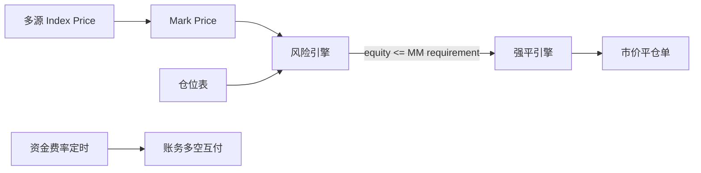

# 合约交易：保证金、强平、资金费率

## 30 秒版（开场）

> **永续合约** = 杠杆仓位 + **标记价格** 算盈亏 + **资金费率** 多空平衡 + **强平** 防穿仓。Go 后端：**标记价服务、风险引擎、强平队列、保险基金**。讲解关键词：**逐仓/全仓、维持保证金、ADL 自动减仓**。

## 3 分钟版（精讲深度）

1. **是什么**：不交割的衍生品；仓位、保证金、未实现盈亏实时变化。
2. **为什么**：CEX 合约团队核心考点；与现货撮合分离。
3. **怎么做**：从多源现货构造 Index，再结合基差等规则得到 Mark Price；按交易所规则计算账户权益与维持保证金需求。权益不足以覆盖维持保证金时触发强平。

## 10 分钟版

**核心公式（简化表达）**

- 未实现盈亏（多）≈ `(markPrice - entryPrice) * size`
- 仓位名义价值 `notional = abs(size) * markPrice`
- 账户权益 `equity = walletBalance + unrealizedPnL - 未结费用/资金费`
- 维持保证金需求 `MM = Σ(分层 MMR * notional - maintenanceAmount) + 预留平仓费用`（具体字段依交易所）
- 通用触发语义：`equity <= MM requirement` 时进入强平

不要死记“保证金率低于某值”这一种方向：有的平台定义 `equity / notional`，低于阈值触发；有的平台定义 `MM / equity`，达到 `100%` 触发。讲解时应先声明指标定义，再说阈值。

**逐仓 vs 全仓**

| 模式 | 风险隔离 |
|------|----------|
| 逐仓 | 以该仓位分配的 isolated margin + UPNL 承担风险 |
| 全仓 | 同一保证金资产或风险单元内的余额与仓位盈亏共享 |

分层风险限额会让大仓位使用更高的 MMR；因此强平价不是只由“杠杆倍数”决定，还受仓位档位、挂单占用、手续费、资金费和保证金模式影响。

**资金费率**

- 永续锚定现货：多空定期支付
- `fundingRate > 0` → 多付空
- 结算周期由产品定义，常见 1h/4h/8h，不能写成协议固定值
- 资金费通常是多空之间转移，平台是否抽取费用取决于产品规则

**强平流程**

1. 行情、成交、资金划转等事件触发风险重算，并用周期扫描兜底
2. 冻结风险单元，取消可释放保证金的挂单
3. 支持分级清算的平台会优先部分减仓/降低风险档位；否则按该平台规则接管或平掉仓位
4. 实际平仓价差于 bankruptcy price 产生的缺口按平台规则由清算费、保险基金承担
5. 保险基金仍不足时，才可能进入 ADL/社会化损失等尾部机制

**Liquidation Price vs Bankruptcy Price**

- liquidation price：触发风险引擎接管的标记价格
- bankruptcy price：仓位保证金理论上耗尽的价格

两者不能混用；清算引擎的成交价还可能因为订单簿深度产生滑点。

## 生产场景

- **插针**：使用基于稳健 Index 与基差规则构造的 Mark Price，而非直接用最新成交价
- **极端行情**：熔断、仅减仓模式、上调维持保证金率
- **Go 实现**：标记价流带版本/时间戳；风险计算按账户或风险单元串行化，强平命令必须幂等

## 深挖问答

1. **标记价操纵？** → 多源加权、异常剔除。
2. **穿仓谁承担？** → 先按平台规则使用清算费用/保险基金；不足时才进入 ADL 或社会化损失机制。
3. **交割合约？** → 有到期日，结算价交割。
4. **与 DEX 永续？** → 链上 vault + keeper 强平（[S-EXCH-06](./S-EXCH-06-dex-amm-liquidity.md) 不同范式）。

## 反模式

- **用最新成交价强平** → 插针误杀
- **强平与账务不同步** → 负余额
- **只按固定 MMR 算所有仓位** → 忽略风险限额档位，大仓位风险被低估
- **把 liquidation price 当实际成交价** → 低估滑点与保险基金风险

## 延伸阅读

- [S-EXCH-16 永续撮合与仓位引擎](./S-EXCH-16-perpetual-matching-position.md)
- [S-SOLID-07 DeFi 模式](../13-solidity-contracts/S-SOLID-07-defi-patterns.md)（链上清算对比）
- [Bybit：USDT 合约强平价与维持保证金示例](https://www.bybit.com/en/help-center/article/Liquidation-Price-USDT-Contract)
