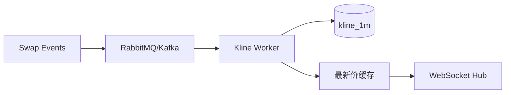

!!! tip "⭐ 重点准备"
    Web3 交易所 / 钱包方向高频题，见 [重点专题](../../web3-exchange-wallet-focus.md)。

# 链上成交事件驱动 K 线与行情聚合

## 30 秒版（开场）

> DEX 无中心化撮合日志，**K 线来自 canonical Swap/Trade 事件**。窗口由块时间戳归属，但同一窗口内的 open/close 应按链上顺序 `(block_number, transaction_index, log_index)` 决定，不能按 MQ 到达顺序。生产关键词：**精度归一、唯一事件、事务聚合、reorg 重算**。

## 3 分钟版（精讲深度）

1. **是什么**：1m/5m/1h K 线 = 窗口内 open/high/low/close/volume。
2. **为什么**：链上 DEX 后端核心读模型；与 CEX 撮合日志聚合不同，**数据源是 logs**。
3. **怎么做**：先把标准化成交写入 canonical trade 表，再按 `(chain_id, pair_id, interval, window_start)` 事务更新聚合；提交后推送带版本号的 K 线更新。

## 10 分钟版（聚合逻辑）



**事件顺序与价格标准化**

- `block.timestamp` 用来确定窗口 `[windowStart, windowEnd)`；同一窗口的先后顺序用 `(blockNumber, transactionIndex, logIndex)`
- EVM 日志的 MQ 到达顺序、RPC 批量返回完成顺序都不能作为 open/close 依据
- 先固定 `base/quote` 方向，并按 token decimals 归一：`price = normalizedQuoteAmount / normalizedBaseAmount`
- 原始链上整数和聚合金额使用定点数/decimal，禁止 `float64`

**OHLCV 更新（单窗口）**

```go
type ChainOrder struct {
    BlockNumber uint64
    TxIndex     uint
    LogIndex    uint
}

func ApplySwap(e SwapEvent) error {
    return db.Transaction(func(tx Tx) error {
        // UNIQUE(chain_id, tx_hash, log_index)；
        // 与 K 线更新放在同一事务，避免 exists -> insert 竞态和半成功。
        inserted, err := tx.InsertCanonicalTradeIfAbsent(e)
        if err != nil || !inserted {
            return err
        }

        price, baseVolume := normalizeTrade(e)
        order := ChainOrder{e.BlockNumber, e.TxIndex, e.LogIndex}
        k := tx.GetKlineForUpdate(e.PairID, e.Interval, e.WindowStart)
        if k == nil {
            return tx.InsertKline(NewKline(price, baseVolume, order))
        }

        k.High = max(k.High, price)
        k.Low = min(k.Low, price)
        k.Volume = k.Volume.Add(baseVolume)
        if order.Before(k.OpenOrder) {
            k.Open, k.OpenOrder = price, order
        }
        if order.After(k.CloseOrder) {
            k.Close, k.CloseOrder = price, order
        }
        k.Version++
        return tx.UpdateKline(k)
    })
}
```

| 难点 | 处理 |
|------|------|
| reorg 回滚 K 线 | 将受影响 trade 标为 orphaned，按 canonical 原始成交重算所有受影响窗口（[S-BC-05](../12-blockchain-web3/S-BC-05-indexer-reorg.md)） |
| 多 Pair 价格源 | 固定 pair 的 base/quote 与 decimals；跨报价币换算另做派生指标 |
| 高并发写同一窗口 | 按 pair/interval 分区消费，或数据库行锁/CAS；事件幂等与聚合必须原子 |
| 迟到事件 | 比较 ChainOrder 后修正 open/close，并发布更高 version 的更新 |

## 生产场景

- **DEX 平台**：Token 买卖事件 + 外盘 Swap 统一入流水表
- **排行榜**：24h volume 物化视图或 Redis ZSET
- **市场异动**：窗口内涨跌幅超阈值推 [S-EXCH-11](./S-EXCH-11-websocket-market-hub.md)

## 深挖问答

1. **1m K 线边界？** → `[t, t+60s)` 左闭右开，用 canonical block timestamp 归窗；open/close 再按 block/tx/log 顺序。
2. **历史回补？** → 从 cursor 重扫；与实时流合并要防双计（幂等键）。
3. **与 CEX K 线差异？** → CEX 应从撮合的 durable、有序成交事实流聚合，而不是
   直接依赖某台机器的内存；DEX 从 canonical 链上成交投影聚合，额外面对链延迟与 reorg。

## 反模式

- 用 `eth_getLogs` 直接给 C 端查 K 线 → RPC 打爆
- 不处理 reorg → K 线永久错误
- 按 MQ 到达顺序覆盖 Close → 迟到事件使图表失真
- 只存 OHLCV 不存标准化原始成交 → reorg 或算法修正时无法可靠重算

## 延伸阅读

- [S-BC-05 索引器](../12-blockchain-web3/S-BC-05-indexer-reorg.md)
- [S-BC-04 事件解析](../12-blockchain-web3/S-BC-04-contract-abi-events.md)
