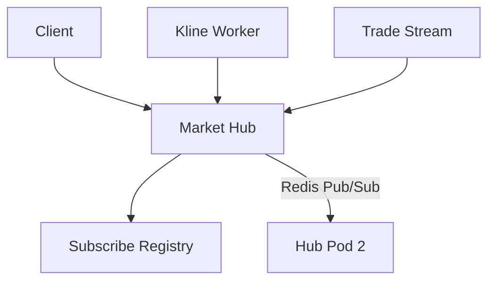

!!! tip "相关主题"
    场景地图见 [Web3 交易所与钱包](../../web3-exchange-wallet-focus.md)。

# WebSocket 行情 Hub 与连接治理

## 30 秒版（开场）

> **行情 Hub** 管理订阅关系并把 K 线、成交和盘口更新推给客户端。Go 常用每连接
> 一个 read pump + 一个唯一 write pump，订阅 registry 则分片或串行管理。
> 生产关键词：**序号协议、有界发送队列、慢消费者策略、快照恢复、跨 Pod fan-out**。

## 3 分钟版（精讲深度）

1. **是什么**：客户端 SUB `kline:TOKEN:1m` → Hub 注册 → 聚合服务产出 tick → Hub Write。
2. **为什么**：HTTP 轮询延迟高；交易用户需要 **毫秒级** 推送。
3. **怎么做**：公开行情可匿名，私有账户流必须鉴权；用 Ping/Pong 和 read/write
   deadline；所有 data/control frame 经单一 write pump。Redis Pub/Sub 可用于
   可丢失的实时 fan-out，但没有持久化/重放，恢复必须依赖快照和序号；关键流用
   可重放 broker 或专用 market-data bus。

## 10 分钟版（Hub 结构）

**订阅模型**

| Topic 示例 | 数据 |
|------------|------|
| `kline:{token}:{interval}` | OHLCV 更新 |
| `trade:{token}` | 逐笔成交 |
| `ticker:{token}` | 24h 涨跌量 |
| `alert:market` | 异动广播 |

**连接治理 checklist**

- 收到 Pong 时延长 read deadline；间隔和超时按网络环境配置，不死记固定倍数
- Hub 只向每连接的有界 send channel 入队；write pump 设置 write deadline 并调用
  `WriteJSON/WriteMessage`。不能用 `select` 直接中断一个已经阻塞的 WebSocket write
- 队列满时按 topic 选择丢弃中间 ticker、合并 depth，或直接断开慢客户端并要求重同步；
  私有订单/余额消息不能静默丢弃
- 优雅关闭尽力发送 close frame（如 going away）并停止接新连接；对端未响应时仍需
  在 deadline 后强制关闭
- 指标：`ws_connections`、`subscribe_count`、`write_queue_depth`

## 生产场景

- **连接恢复**：先订阅并缓存 delta，获取带序号快照，再丢弃不新的 delta 并连续
  应用；发现 gap 就重来。简单“先 HTTP 补拉、再 SUB”会在两步之间形成竞态窗口
- **健康检查**：liveness/readiness 只回答进程和关键依赖是否可服务；连接数、
  topic 订阅数放 metrics，避免 health payload 高基数和昂贵聚合
- **运营推送**：Token 毕业/暂停交易状态变更

## 深挖问答

1. **与 [S-NET-05](../06-network-governance/S-NET-05-websocket-gateway.md) 差异？** → NET-05 通用网关；本题 **行情 topic 与交易数据模型**。
2. **单机 10w 连接？** → 连接数本身不是容量结论；还要压测 TLS、消息频率、
   编码、带宽、文件描述符、内核缓冲和慢客户端比例，再按连接或 topic 分片。
3. **消息乱序？** → CEX 每个 stream 使用 epoch + 单调 sequence；DEX 使用
   block/tx/log identity 并额外处理 reorg。`blockNumber` 不能替代同块内顺序，
   客户端也不能只“丢弃旧值”而忽略序号缺口。

## 反模式

- 多 goroutine 同时 `Write` 同一 conn → panic
- 无订阅上限 → 恶意 SUB 全市场拖死 CPU
- 仅 WS 无 HTTP 兜底 → 断线期间丢行情

## 延伸阅读

- [S-NET-05 WebSocket 网关](../06-network-governance/S-NET-05-websocket-gateway.md)
- [S-EXCH-10 K 线聚合](./S-EXCH-10-kline-event-aggregation.md)
