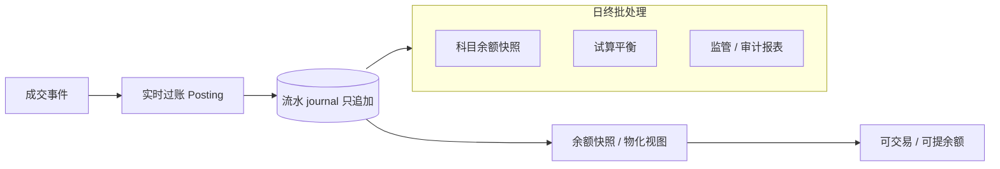
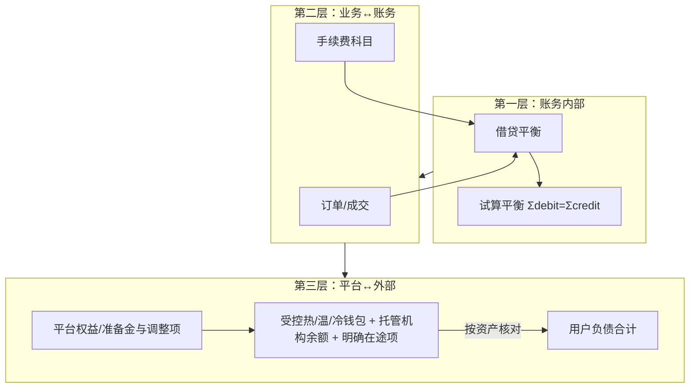
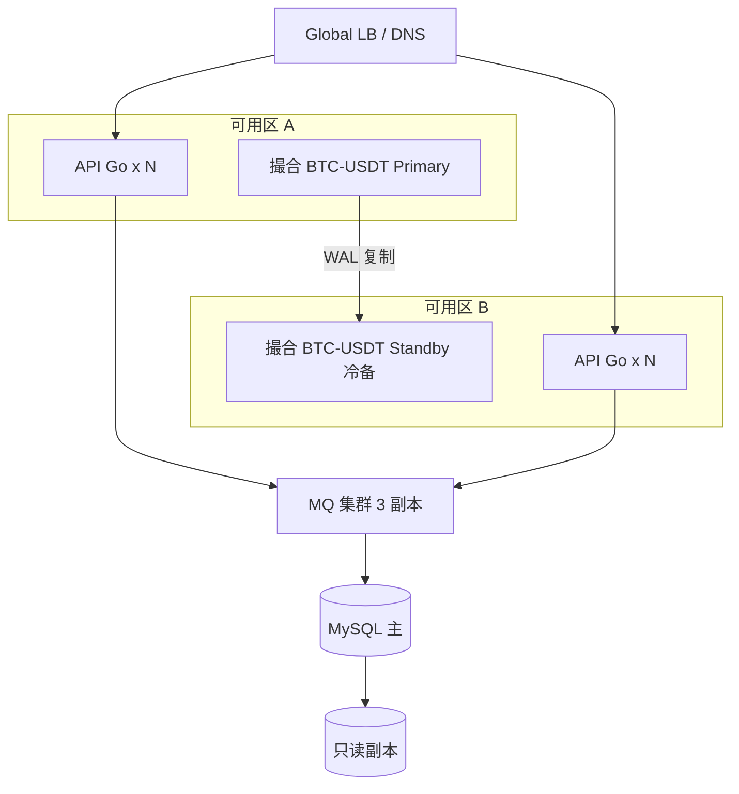

# 交易所清结算、对账与高可用架构

## 30 秒版（开场）

> 交易所首先保证资金正确性，再在明确的不变量内优化性能。架构师需讲清：
> 实时 posting、持续 + 周期对账、受控链上资产与客户负债、单写者/fencing，以及
> 经过演练的 RPO/RTO。多副本或“多活”本身不等于不会双写。

## 3 分钟版（精讲深度）

1. **是什么**：成交后的资金结转、平台内外账目一致、以及交易/资金系统在故障与扩容下的可用性设计。
2. **为什么**：交易所事故多源于 **对账不平、双花、热钱包超提**；核心问题是「如何证明用户的钱是对的」。
3. **怎么做**：流水只追加并以冲正修正；余额由期初与已提交分录可重建；对账独立
   运行。撮合和账务通常保持每个分片单写者，通过 quorum、lease epoch 与 fencing
   做主备切换，而不是无约束双活写入。

## 10 分钟版（原理 + 图示）

### 清结算链路



**T+0 vs T+1**

| 类型 | 交易所常见做法 |
|------|----------------|
| 现货成交 | T+0 实时过账，可立即用于交易 |
| 提现 | T+0 申请 + 链上 T+confirm 块 |
| 法币入金 | T+1 或渠道确认后入账 |
| 返佣 | T+0 累计，T+1 或阈值提现 |

### 三层对账模型



| 对账项 | 频率 | 不平处理 |
|--------|------|----------|
| 流水借贷平衡 | 实时 / 5min | 熔断过账 |
| 成交 vs 账务 | 15min | 补单 / 冲正 |
| 受控总资产 vs 用户负债/平台权益 | 持续增量 + 周期全量 | 按资产/链隔离，无法解释或超 materiality 时暂停相关提现 |
| 链上充值 vs 入账 | 每块 | 延迟入账 |

详见 [S-EXCH-05](./S-EXCH-05-risk-reconciliation.md)、[S-EXCH-03](./S-EXCH-03-account-ledger.md)

### 高可用拓扑（CEX + Web3 托管）



**RPO / RTO 讲解模板（以下数字只能作为需求示例，必须由复制与演练证明）**

| 组件 | RPO | RTO | 手段 |
|------|-----|-----|------|
| 撮合 WAL | 目标 0；只有同步 quorum/复制确认后才能声称 | 分钟级示例 | fencing 旧主、切换 epoch、快照 + 日志重放 |
| 账务 DB | 目标 0～秒级 | 15～30 min 示例 | 同步/半同步复制、备份恢复、事务日志与对账 |
| 行情 WS | 可丢秒级 | 自动 | 多实例无状态 |
| Indexer 游标 | 块级 | 重扫 | 游标 + 补块 |

### 故障域与降级

| 故障 | 降级策略 |
|------|----------|
| 单 symbol 撮合挂 | 仅停该交易对；其他不受影响 |
| 账务 consumer lag | 暂停新开仓 / 暂停提现 |
| RPC 全挂 | 停链上提现；站内交易可继续（CEX） |
| 对账不平 | 先按资产/链/账户隔离；重大或无法定位时启用全局提现 kill switch |
| MQ 不可用 | 各事实源继续写本地 WAL/Outbox 到容量上限；恢复后续传。若账务/风险 lag 破坏安全阈值，应停止相关接单 |

## 生产场景

- **热钱包被盗/疑似失陷**：立即隔离 signer、停止向该地址补资、轮换权限/地址、
  暂停相关链提现并追踪；不能把冷钱包继续补到疑似被控的热钱包
- **重复消费成交** → 数据库唯一约束 + 幂等 posting 实时阻断；周期对账是第二道防线
- **MySQL 主从延迟** → 提现 reservation 只读权威主库/强一致账务接口；不要另维护一份
  无流水约束的“提现可用余额”
- **大促扩容**：API/WS 水平扩；撮合可重新分配不同 symbol，同一订单簿不能简单加写实例

## 排查与工具

- **Metrics**：`ledger_posting_latency`、`reconciliation_diff`、`withdraw_pending_count`
- **审计**：流水表不可 UPDATE；操作人 + 审批流
- **工具**：Grafana 对账大盘、链上余额脚本、Metabase 监管报表

## 架构取舍

| 方案 | 何时选 |
|------|--------|
| 单库账务 | 写入量、锁竞争、恢复时间和合规隔离均满足时；不以用户数单指标决策 |
| 按 user_id 分库 | 账务 QPS 瓶颈 |
| 单元化（用户全链路同单元） | 超大规模、监管分区 |
| 链上 Merkle 证明储备 | 提供某一时点资产/负债包含性的证据；还需证明地址控制、负债完整性、隐私/负余额处理，且不能单独证明持续偿付能力 |

## 深挖问答

1. **为什么流水不能改只能冲正？** → 审计与监管；改账不可追溯。
2. **用户余额存在哪？** → 流水为准；余额表是缓存，可重建。
3. **提现双重扣款怎么防？** → 账务数据库唯一业务键 + 原子 reservation、持久化
   状态机、签名 payload 幂等和 nonce/UTXO reservation。分布式锁只能辅助串行化，
   不能替代这些事实约束（[S-DIST-02](../middleware/redis/S-DIST-02-distributed-lock.md)）。
4. **撮合和 DB 同时挂？** → 先 fence 旧主并确定最后 durable epoch/sequence，再恢复
   快照 + WAL、核对事件发布 offset 和账务已过账位置；对账通过前保持相关市场受限。
5. **Web3 所 PoR 和账务关系？** → PoR 证明储备 ≥ 负债；不能替代复式记账。

## 反模式与事故

- **余额字段直接 UPDATE 无流水** → 无法对账
- **对账脚本与过账同进程** → 互相拖死
- **热钱包余额人工改库** → 刑事级风险
- **无全局提现熔断** → 对账不平仍放行

## 代码示例

```go
// 示意：每个 Transfer 都在同一资产内从一个科目转到另一个科目，
// from/to 两侧金额相等；真实实现还要处理冻结科目、手续费与舍入。
func PostTrade(ctx context.Context, tx *gorm.DB, t TradeEvent) error {
    transfers := []LedgerTransfer{
        {
            Asset: "USDT", From: reserved(t.BuyerID), To: available(t.SellerID),
            Amount: t.QuoteAmount, Ref: t.TradeID + ":quote",
        },
        {
            Asset: "BTC", From: reserved(t.SellerID), To: available(t.BuyerID),
            Amount: t.BaseAmount, Ref: t.TradeID + ":base",
        },
    }
    return postTransfersIdempotent(tx, transfers) // unique(ref)，同事务更新 journal + balance
}
```

## 延伸阅读

- [S-EXCH-03 复式记账](./S-EXCH-03-account-ledger.md)
- [S-EXCH-05 风控对账](./S-EXCH-05-risk-reconciliation.md)
- [S-EXCH-13 CEX 端到端架构](./S-EXCH-13-cex-end-to-end-architecture.md)
- [AWS Disaster Recovery](https://aws.amazon.com/disaster-recovery/)
- [Google SRE - SLO](https://sre.google/sre-book/service-level-objectives/)

## 相关链接

- [交易所资金概念地图](../../maps/exchange-funds.md)
- [账本](./S-EXCH-03-account-ledger.md)
- [充提钱包](./S-EXCH-02-deposit-withdraw-wallet.md)
