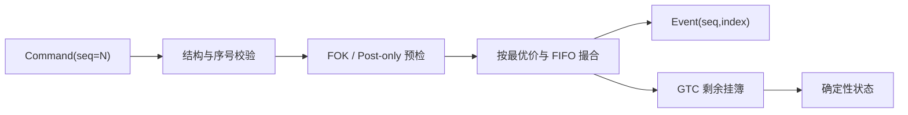

# Go 可运行确定性撮合引擎：价格时间优先与订单语义

## 30 秒版（开场）

> 我会先把撮合实现成 **单写者、外部单调序号、定点整数、确定性事件** 的状态机。
> 买盘价高优先、卖盘价低优先，同价 FIFO；成交采用簿上 maker 价格。GTC 可挂簿，
> IOC 取消剩余，FOK 必须在产生任何外部成交前证明全量可成交，Post-only 会吃单则拒绝。
> STP 在成交前按受信任账户 scope 执行 cancel-maker/taker/both。相同命令序列从空状态
> 重放，订单簿、成交 ID 和事件 ID 必须完全相同。

## 3 分钟版（精讲深度）

1. **排序边界**：入口给每个 order book 的下单、撤单分配连续 `sequence`，同一本簿只由一个 writer 应用。
2. **精度边界**：价格和数量用最小单位整数；`tickSize`、`stepSize` 在入口归一化，禁止热路径
   使用 `float64`。整数仍要限制范围，并对 `price × quantity`、累计深度和手续费做显式
   overflow 检查或使用足够宽的定点表示。
3. **优先级**：先比较价格，再比较进入该价格档的顺序。部分成交后的 maker 保留原队列位置。
4. **订单语义**：FOK 做深度预检；Post-only 在修改订单簿前判断；IOC 不把剩余量挂簿。
5. **STP**：每张订单带服务端确定的 account scope；FOK 预检必须模拟相同 STP 规则。
6. **确定性输出**：示例用 `(command sequence, event index)` 生成事件 ID，用状态内单调计数生成 `tradeID`。

可运行实现位于 `examples/senior/matchingengine/`：

```bash
go test -race ./examples/senior/matchingengine/...
```

## 10 分钟版（原理 + 图示）



### 核心不变量

| 不变量 | 如何验证 |
|--------|----------|
| 命令连续 | 只接受 `lastSequence + 1` |
| 同价 FIFO | price level 内按入场顺序保存订单 |
| maker 价成交 | 交易价格取 resting order 的价格 |
| 不超量成交 | 每次成交量为双方 remaining 的最小值 |
| 算术不溢出 | 校验输入上界，并对 notional、累计量和费用使用 checked arithmetic |
| FOK 原子语义 | 预检可成交量，不足时不修改 maker |
| Post-only 不做 taker | 若当前最优对手价可交叉则拒绝 |
| STP 不产生 trade | 同账户交叉只产生 STP/cancel 事件，账本不记成交 |
| 重放一致 | 比较快照/状态的稳定 hash |

### 为什么时间戳不能直接当顺序

多个网关的时钟会漂移，纳秒时间也可能相同；数据库自增 ID 又可能晚于实际接纳顺序。
应由撮合分区的 sequencer 产生权威序号。接收时间可以保留用于审计，但不能替代
撮合优先级。

### 幂等与业务拒绝

格式错误、缺字段和序号跳跃属于 **命令信封错误**，不能写入状态日志。重复
`clientOrderId`、Post-only 交叉、FOK 深度不足属于已经排序的 **业务结果**，应输出
确定性拒绝/取消事件；否则重放时可能因外围状态不同而得到另一种结果。

### 示例的复杂度边界

示例为突出正确性，价格档使用有序 slice，新增/删除档位可能是 O(n)。生产实现可改成
跳表、树、分段数组或定制结构，但替换数据结构不能改变订单语义和重放结果。

新增 `AccountID` 与 STP policy 后，snapshot schema 已升为 version 2；旧 snapshot
不能静默按新结构恢复。STP 的身份 scope 在生产中应由认证与机构配置生成，而不是信任
客户端自报字段。

## 生产场景

- 每个 symbol 或撮合分区维护单写者；热门 symbol 独占分区，冷门 symbol 可共用进程。
- OMS 在进入撮合前完成账户级 `clientOrderId` 幂等、资金预留和产品规则版本选择。
- 行情、账务和审计消费不可变事件；发布允许重试，下游按稳定事件 ID 幂等。
- 变更撮合规则时记录规则版本，并用历史命令做双版本 shadow replay。

## 排查与工具

保存触发问题的最小命令前缀，离线重放并比较每个 sequence 的状态 hash。重点检查：
首个分叉序号、订单规则版本、整数精度、非确定性 map 遍历、随机数和 wall clock 依赖。

## 架构取舍

单写者不是“整个交易所单线程”，而是把 **一本订单簿的冲突写** 串行化。跨 symbol
可水平扩展。若为了吞吐让多个 goroutine 同时写同一本簿，就必须提供等价的全序与
冲突证明，通常得不偿失。

## 深挖问答

1. **FOK 能否先部分成交再回滚？** → 不能产生外部可见成交；可预检，或在不可见临时状态中原子提交。
2. **成交为什么用 maker 价？** → 常见 price-time venue 以簿上价格成交，但最终以交易所规则为准。
3. **重复 order ID 怎么处理？** → 已进入全序后输出稳定拒绝事件；入口还应按账户与 client ID 去重。
4. **改单怎么做？** → 先定义保留或丢失时间优先级的产品规则；很多场景可建模为 cancel + new。
5. **FOK 遇到同账户 maker 怎么办？** → 预检按同一 STP policy 模拟；不能把自有流动性算作可成交量。
6. **如何测试公平性？** → 固定命令向量、同价 FIFO、部分成交留位、重放 hash 和属性测试。

## 反模式与事故

- 用 goroutine 调度或本机时间决定先后顺序。
- 用 `float64` 计算价格、数量或手续费。
- 认为“换成整数”就自动解决溢出、单位和舍入问题。
- FOK 产生部分成交后再补一个 cancel 伪装成原子。
- Post-only 在成交后才检查 maker/taker 身份。
- 用客户端可伪造的 account ID 作为 STP scope。
- 把该教学实现宣称为已覆盖市价保护、冰山单、decrement-and-cancel 和生产级性能结构。

## 代码示例

```go
events, err := engine.Apply(matchingengine.Command{
    Sequence: 2,
    Type:     matchingengine.CommandNewOrder,
    NewOrder: &matchingengine.NewOrder{
        OrderID:       "buy-1",
        ClientOrderID: "client-buy-1",
        AccountID:     "account-42",
        Side:          matchingengine.Buy,
        Price:         10100, // 定点整数，不是 float64
        Quantity:      3,
        TimeInForce:   matchingengine.IOC,
        STP:           matchingengine.STPCancelTaker,
    },
})
```

完整代码及测试见 `examples/senior/matchingengine/`。它覆盖 GTC、IOC、FOK、
Post-only、STP 三种取消策略、撤单、重复请求、快照恢复、确定性 hash 与 microbenchmark；
未实现 decrement-and-cancel、生产级性能结构与全部订单类型。

## 延伸阅读

- [S-EXCH-01 CEX 撮合引擎与订单簿架构](./S-EXCH-01-cex-matching-engine.md)
- [S-EXCH-18 WAL、快照与确定性回放](./S-EXCH-18-wal-snapshot-replay.md)
- [S-EXCH-21 STP 自成交防护](./S-EXCH-21-self-trade-prevention-surveillance.md)
- [S-EXCH-22 集合竞价与性能验证](./S-EXCH-22-call-auction-performance-validation.md)
- [Coinbase Matching Engine](https://docs.cdp.coinbase.com/exchange/concepts/matching-engine)
- [Coinbase Order API](https://docs.cdp.coinbase.com/api-reference/exchange-api/rest-api/orders/create-new-order)
