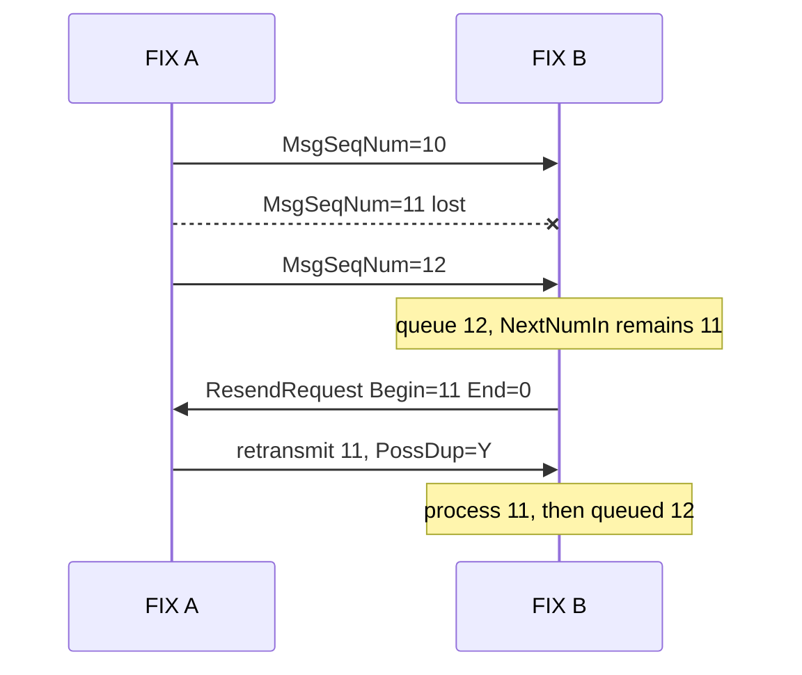

# FIX Session：序号、Resend、Gap Fill 与断线恢复

## 30 秒版（开场）

> FIX session 的可靠性核心是跨 TCP 连接持久化的 `NextNumIn/NextNumOut`，不是
> “连上 socket 就从 1 开始”。收到 `MsgSeqNum > NextNumIn` 时先缓存高序号消息并发
> `ResendRequest`，缺口补齐前不能乱序交给业务。响应恢复时，可重放的 application
> message 保留原 `MsgSeqNum`，设置 `PossDupFlag=Y` 和 `OrigSendingTime`；不重放的
> session message 用 `SequenceReset-GapFill` 跳过。应用重新发一笔未确认订单是新的
> application resend，通常使用新 session sequence，必须与 session retransmission
> 区分并做业务幂等。

## 3 分钟版（精讲深度）

1. **连接不等于 session**：Logon、消息交换/恢复、Logout 发生在 transport connection
   上，但 session sequence 可跨多次连接延续。
2. **高序号**：排队，不得先处理；请求 `[NextNumIn, EndSeqNo]`，`EndSeqNo=0` 常表示之后全部。
3. **重传**：原 application message 使用原 sequence，标记 possible duplicate。
4. **Gap Fill**：Heartbeat、TestRequest、Logon 等通常不重放，用 `NewSeqNo` 指向下一期望值。
5. **低序号**：没有 `PossDupFlag=Y` 通常是严重 session 错误；有该标记时仍要判断是否已处理。

可运行状态机：

```bash
go test -race ./examples/senior/fixsession/...
```

## 10 分钟版（原理 + 图示）



### 两个计数器

| 状态 | 含义 | 持久化时机 |
|------|------|------------|
| `NextNumIn` | 下一条期望收到的 `MsgSeqNum` | 协议验收并可靠交给持久化处理边界，或合法 Gap Fill 后 |
| `NextNumOut` | 下一条新消息要使用的 `MsgSeqNum` | 与原始 outbound message 原子持久化 |

如果只持久化计数器、不保存可重传 outbound store，收到 ResendRequest 后无法恢复原始
application message；如果只保存消息、不原子推进计数器，崩溃后可能复用 sequence。

### Session retransmission 与 application resend

| 行为 | Session retransmission | Application resend |
|------|------------------------|--------------------|
| 触发者 | 对端 ResendRequest / session recovery | 业务未收到 ACK，按 ROE 决定重发 |
| `MsgSeqNum` | 使用原序号 | 消耗新的 `NextNumOut` |
| 标记 | `PossDupFlag=Y`、原始发送时间 | 可使用 `PossResend` 等应用约定 |
| 去重层 | session 先保证顺序，业务仍检查重复 | 业务按 ClOrdID/ExecID 等判断 |

不能因为 FIX 有 sequence 就省掉订单幂等。网络断开时，发送方可能不知道对端业务是否已
接收；相同订单意图重新提交必须遵循双方 Rules of Engagement。

### Gap Fill 与 Reset 不同

- `SequenceReset(35=4, GapFillFlag=Y)` 用于跳过明确不重放的连续范围，必须按序处理，
  `NewSeqNo` 是跳过后下一条期望序号。
- `GapFillFlag=N` 的 Reset 是异常恢复手段：接收方按官方规则不以其 `MsgSeqNum`
  触发缺口恢复，而以 `NewSeqNo` 调整下一期望值；发送方承担跳过 application message
  的后果。
- `NewSeqNo` 不能让接收方序号倒退。相等至少应告警，小于当前值应拒绝且不修改状态。

示例只重传 application message、gap-fill 所有 session message；完整 FIX 标准允许
`Reject(35=3)` 和 `XMLnonFIX(35=n)` 等少数 session message 重传，生产实现必须通过
官方 session test cases 和双方 ROE。

### Heartbeat 不是完整性证明

Heartbeat/TestRequest 证明连接在一定程度上可交互；消息完整性仍由 `MsgSeqNum` 检查。
收到及时 heartbeat 但 application sequence 有 gap 时，仍必须恢复，不能把连接健康当作
订单流完整。

## 生产场景

- sequence、outbound store 与业务订单写入采用明确的 crash-consistency 顺序。
- 每个 SenderCompID/TargetCompID/session qualifier 独立维护状态，不跨 session 共用计数。
- Logon 时核对 reset policy、NextExpectedMsgSeqNum 和交易日边界，禁止双方未约定就重置。
- Drop Copy 与 order-entry session 分开对账，按 ExecID/OrderID 构建业务事实。
- 监控 sequence gap、resend range、recovery duration、duplicate rate、TestRequest timeout。

## 排查与工具

保留原始 FIX 报文、接收/发送时间、session ID 和 durable sequence watermark。排查时按
`MsgSeqNum` 重建时间线，区分“从未发送、已发送未落盘、对端未收到、对端已收到但 ACK
丢失”。只看应用日志中的订单 ID 无法定位 session 缺口。

## 架构取舍

请求缺口之后全部消息实现简单，但可能重传大量数据；只请求精确缺口需缓存高序号消息并
正确处理嵌套 gap。双方应在 ROE 中固定算法、缓存窗口、session reset 和 aged order
是否重放，不能运行时各自猜测。

## 深挖问答

1. **TCP 已保证有序，为何还要 MsgSeqNum？** → TCP 重连不恢复上一连接未确认边界，应用还需要跨连接缺口检测。
2. **重传为何不能用新序号？** → session retransmission 要填原缺口；新的序号属于 application resend。
3. **所有消息都重传吗？** → 通常重传约定的 application message，session message 用 Gap Fill 跳过。
4. **低序号直接忽略可以吗？** → 没有 PossDup 是协议错误；有 PossDup 也要验证已处理和业务幂等。
5. **每天 Logon 都能 ResetSeqNumFlag=Y 吗？** → 只能按双方 ROE；不一致可能造成重复订单或丢恢复能力。

## 反模式与事故

- 每次 TCP reconnect 都把 sequence 清零。
- 收到 12 时先把订单交给业务，再请求缺失的 11。
- 重传时生成新的订单 ID 或覆盖原始 SendingTime，不标 PossDup。
- 用 SequenceReset-Reset 隐藏丢失的 application messages。
- 将 session 收到一次等同于业务副作用 exactly-once。

## 代码示例

```go
actions, err := session.Receive(message)
for _, action := range actions {
    if action.Type == fixsession.ActionSendResendRequest {
        // 发送 35=2，BeginSeqNo=action.BeginSeqNo
    }
}
```

`examples/senior/fixsession/` 覆盖乱序缓存、ResendRequest、application retransmission、
session gap-fill、duplicate 和 sequence reset 防倒退。它不是完整 FIX codec 或认证实现。

## 延伸阅读

- [FIX Session Layer](https://www.fixtrading.org/standards/fix-session-layer-online/)
- [FIX Session Layer Test Cases](https://www.fixtrading.org/standards/fix-session-testcases-online/)
- [S-EXCH-13 CEX 端到端架构](./S-EXCH-13-cex-end-to-end-architecture.md)
