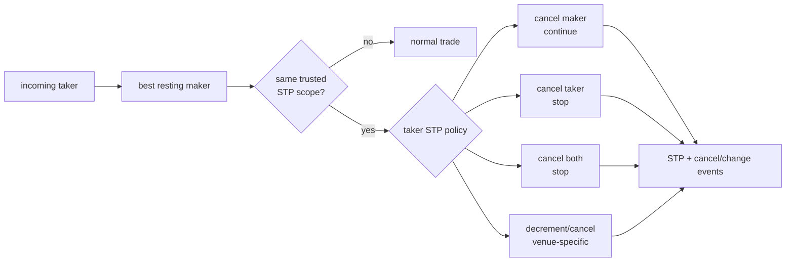

# STP 自成交防护：撮合语义、账户边界与监控合规

## 30 秒版（开场）

> STP 必须在撮合全序内、产生 trade 之前比较受信任的 self-match scope，例如 account、
> firm 或配置的 SMP group。触发后按 venue 规则 cancel maker、cancel taker、cancel both，
> 或 decrement-and-cancel；策略通常取 aggressor/taker 指令，但不是行业统一规则。STP
> 只阻止指定 scope 的两张订单直接成交，不等于已经解决 wash trading：关联账户协同、
> 制造虚假深度、撤单操纵仍需独立 surveillance。所有 STP 动作必须产生确定性事件，
> 但绝不能生成成交、手续费或账本过账。

## 3 分钟版（精讲深度）

1. **身份来源**：STP scope 来自认证账户、机构关系和风控配置，不能信任客户端随意传入
   `account_id`。
2. **决定点**：在 taker 与当前 maker 即将成交时检查，属于撮合状态机，不是异步事后撤销。
3. **策略**：Cancel Maker 继续向后撮合；Cancel Taker 停止 incoming；Cancel Both 同时撤销。
4. **组合语义**：FOK、Post-only、市价单、改单和冰山单都要规定 STP 先后顺序。
5. **下游事件**：发布 `SELF_TRADE_PREVENTED` 与相应 cancel/change，账务只消费真实 trade。

示例撮合器支持三种取消策略：

```bash
go test -race ./examples/senior/matchingengine/...
```

## 10 分钟版（原理 + 图示）



### 常见模式

| 模式 | Resting maker | Incoming taker | 是否继续匹配 |
|------|---------------|----------------|--------------|
| Cancel Maker | 全撤 | 保留 | 通常继续 |
| Cancel Taker | 保留 | 全撤 | 否 |
| Cancel Both | 全撤 | 全撤 | 否 |
| Decrement & Cancel | 按可自成交量减少/撤销 | 同步减少/撤销 | venue-specific |

Coinbase Exchange 文档列出了 `dc/co/cn/cb`，并说明 taker 指令优先；其他交易场所可能使用
不同命名、默认值和 scope。讲解时应说“以场所规则为准”，不要把某个 API 的四个 flag
称为 FIX 或所有交易所的统一标准。

### 示例实现的明确策略

`examples/senior/matchingengine` 要求每张订单带 `AccountID` 和 STP mode：

- `STPCancelMaker`：撤销簿上同账户 maker，再继续寻找下一张订单。
- `STPCancelTaker`：撤销 incoming 剩余量，maker 保留。
- `STPCancelBoth`：两边都撤销。
- FOK 预检会模拟同一 STP 规则，拒绝时不先修改 maker。
- Post-only 在 STP 前检查“是否会跨价”；这是该示例的产品策略，不是行业定律。
- snapshot schema 升为 version 2，避免新增账户/STP 字段后静默按旧状态恢复。

Decrement-and-cancel 未放进示例，因为市价买单可能按 `funds` 或 `size` 表达，减少哪一个
字段会改变产品语义；生产实现必须把这类规则写入版本化规格和测试向量。

### STP 与订单语义的交叉

| 组合 | 必须先回答的问题 |
|------|------------------|
| FOK + Cancel Maker | 自有 maker 不算可成交量；若外部深度不足，是否允许撤 maker 后仍拒绝？ |
| Post-only + self maker | 先按交叉拒绝，还是先 cancel self maker 再挂簿？ |
| Market buy by funds | decrement 时减少 funds、size 还是两者？ |
| Amend/replace | STP mode 与 scope 是否可变，是否丢时间优先级？ |
| 多 session/子账户 | scope 是用户、portfolio、firm 还是显式 SMP group？ |

这些答案必须由交易规则决定，并进入 deterministic replay；不能由某个网关临时判断。

### 为什么 STP 不等于反操纵

STP 只能识别配置范围内的直接 self match。Wash trading/market manipulation 还可能通过：

- 同一控制人下的不同 KYC 账户或关联机构。
- 两方预先协调成交。
- 大量挂撤单制造虚假深度而不实际成交。
- 在多个 venue 之间制造价格/成交量信号。

因此还需账户关联图、设备/资金来源、行为特征、成交对手集中度、spoofing/layering
检测、case management 和人工审查。STP 事件本身也是 surveillance 输入。

## 生产场景

- 认证层解析 user/account/firm，风控配置计算不可伪造的 `stp_group_id`。
- 撮合日志保存 maker/taker order、scope、policy、规则版本和 prevented quantity。
- 账本与 fee service 只消费 Trade；STP cancel/change 不生成成交、返佣或成交量。
- 行情根据 venue 规则发布 order change/done，不得伪造一笔零价或零量 trade。
- 监控 STP rate、账户对手集中度、跨账户关联和策略异常切换。

## 排查与工具

从最小命令序列重放，确认账户 scope、taker policy、maker FIFO 和规则版本。若出现自成交，
判断是身份映射错误、STP 在撮合之后执行、某订单类型绕过检查，还是主备/回放规则版本不一致。

## 架构取舍

更宽的 STP scope 能降低关联账户误成交，但可能阻止合法的独立策略或做市 desk；更窄
scope 提高灵活性但增加合规和误成交风险。应由产品、法务、风控共同定义，并支持按市场/
机构配置，不能让客户端单方面缩小范围。

## 深挖问答

1. **STP 为什么要在撮合内？** → 异步检查时 trade 已成为外部事实，不能安全“删掉成交”。
2. **策略听 maker 还是 taker？** → 示例和一些 venue 取 taker；最终必须按本场所规则。
3. **Cancel Maker 会不会破坏 FOK？** → FOK 预检必须模拟 STP，拒绝时不产生部分副作用。
4. **STP 是否满足反洗钱/反操纵？** → 不是，只是预防直接 self match 的一道控制。
5. **scope 能由请求传吗？** → 客户可选策略，但身份/scope 必须由服务端认证与配置推导。

## 反模式与事故

- 成交后由异步任务发现同账户，再删除 trade 表记录。
- 只比较 API key，不识别同一 firm 的多 session/portfolio。
- STP cancel 被账务误当成交，产生手续费或返佣。
- FOK 预检把 self maker 算入可成交深度。
- 宣称“有 STP 所以不需要 market surveillance”。

## 代码示例

```go
order := matchingengine.NewOrder{
    OrderID:       "buy-1",
    ClientOrderID: "client-buy-1",
    AccountID:     "account-42", // 生产中由受信任身份映射填充
    Side:          matchingengine.Buy,
    Price:         10100,
    Quantity:      3,
    TimeInForce:   matchingengine.GTC,
    STP:           matchingengine.STPCancelTaker,
}
```

## 延伸阅读

- [Coinbase Exchange matching engine and STP](https://docs.cdp.coinbase.com/exchange/concepts/matching-engine)
- [Coinbase Derivatives FIX self-match prevention](https://docs.cdp.coinbase.com/derivatives/fix/overview)
- [S-EXCH-17 可运行确定性撮合](./S-EXCH-17-runnable-deterministic-matching-engine.md)
