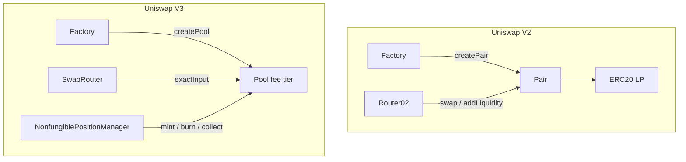
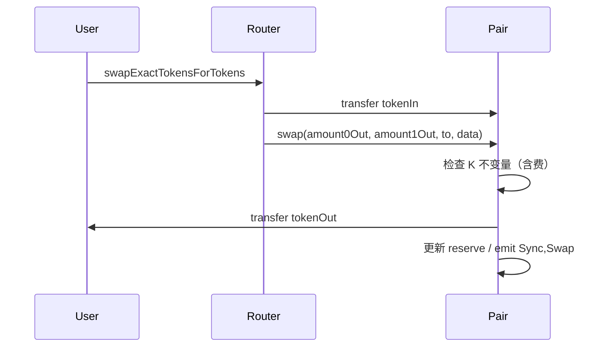
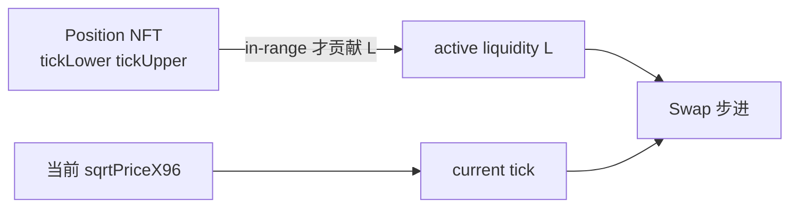
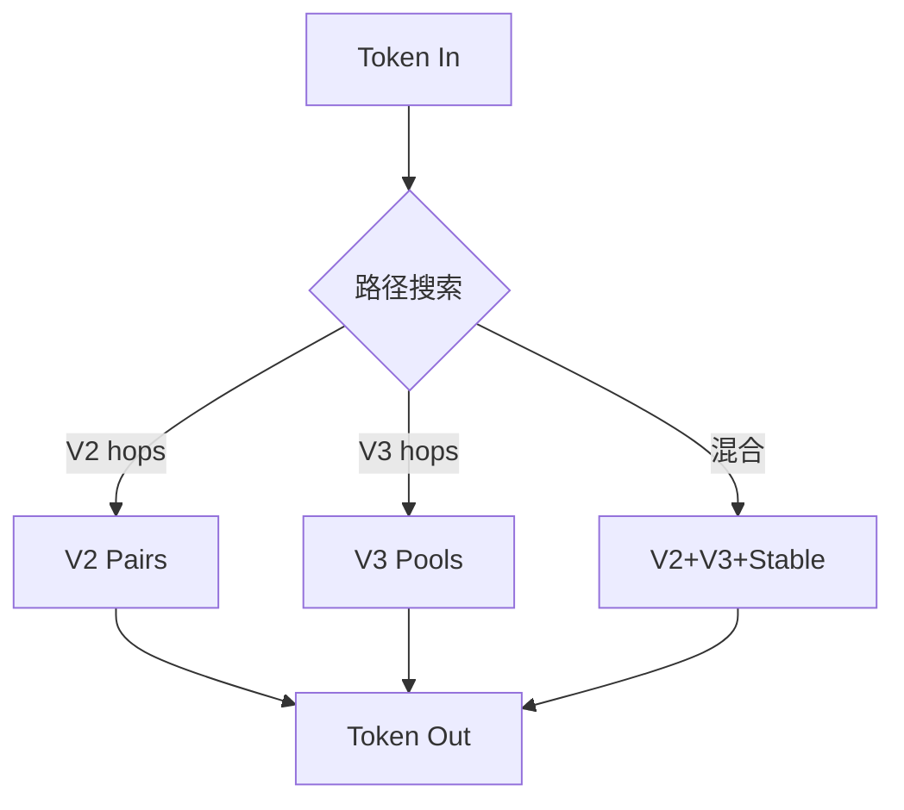

# Uniswap V2 与 V3 协议机制深挖

## 要点卡

[返回模块索引](./index.md)

!!! abstract "30 秒回答"

    Uniswap V2 是 **全区间恒定乘积** AMM：`Factory` 创建唯一 `Pair(token0,token1)`，
    储备 `x,y` 满足曲线，swap 含 0.3% fee，LP 拿可替代 ERC-20 份额。
    V3 把流动性切到 **tick 区间**：同一 pair 可按 **fee tier** 多池，仓位是 NFT；
    核心状态是 `sqrtPriceX96`、当前 **L（active liquidity）**、已初始化 tick。
    Tech Lead 要能讲：**定价公式、手续费去向、跨 tick、Router 路径、假池校验、索引差异**。

**3 分钟展开**

1. **V2 报价**：用 swap 前 reserve，含费公式 `amountOut = amountIn*997*reserveOut / (reserveIn*1000 + amountIn*997)`。
2. **V3 报价**：不能只看池子 ERC20 余额；要沿当前价格与 L 在区间内积分，跨 tick 时 L 变化。
3. **LP**：V2 费用自动进入池子抬高份额价值；V3 费用按 position 累计，需 `collect`。
4. **工程**：Factory `PairCreated`/`PoolCreated` + init code hash 防假池；Indexer 模型从 Sync 升级到 tick/position。
5. **产品**：V3 资本效率高，但出区间变单边、运维重；长尾币未必适合一上来就 V3。

| 记忆槽 | 内容 |
|--------|------|
| V2 一句话 | 一个 pair、一条全曲线、同质化 LP |
| V3 三状态 | `sqrtPriceX96` + active L + initialized ticks |
| 安全 | 校验 Factory / init code hash，不信任任意「叫 Uniswap 的 pair」 |
| 边界 | V3 仍基于恒定乘积思想的虚拟储备，不是彻底抛弃 `x·y=k` |

## 30 秒版（开场）

> 有人问「讲讲 Uniswap」时，不要只背 `x*y=k`。要分层讲清：**Factory → Pool/Pair → Router → LP 凭证 → 报价与结算**，并对比 V2/V3 的状态机与后端索引成本。Pancake 等分叉见 [S-EXCH-27](./S-EXCH-27-pancakeswap-v2-v3-differences.md)。

## 3 分钟版（精讲深度）

1. **是什么**：链上 AMM 协议族；V2 全区间 CPMM，V3 集中流动性 CPMM。
2. **为什么**：DEX Tech Lead 必备协议素养；决定池设计、路由、激励与安全审计范围。
3. **怎么做**：合约侧理解核心不变量；链下做路径报价、事件索引、假池过滤、多 fee tier 选择。

## 10 分钟版（原理 + 图示）

### 协议组件全景

| 组件 | V2 | V3 |
|------|----|----|
| 池工厂 | `UniswapV2Factory` | `UniswapV3Factory` |
| 池实例 | `Pair`（每 pair 通常 1 个） | `Pool`（`token0+token1+fee`） |
| 用户入口 | Router | SwapRouter / Universal Router |
| LP 凭证 | ERC-20 | ERC-721 Position NFT |
| 预言机 | 累计价格 TWAP（需自己采样） | 观察型 oracle 槽位（仍要正确使用） |

### V2：储备、swap 与手续费

**不变量（无费直觉）**：`x * y = k`。实际交易先扣费再更新储备，使有效输入变小。

**标准 0.3% fee 输入侧公式（Uniswap V2）**

\[
amountOut = \frac{amountIn \times 997 \times reserveOut}{reserveIn \times 1000 + amountIn \times 997}
\]

| 考点 | 说明 |
|------|------|
| `token0 < token1` | 地址排序，保证 pair 唯一 |
| `getReserves()` | `(reserve0, reserve1, blockTimestampLast)` |
| `mint/burn` | 按份额增减流动性；第一笔 mint 有 MINIMUM_LIQUIDITY 锁死 |
| TWAP | `price0CumulativeLast` 等，需跨块采样，不能当秒级预言机瞎用 |
| fee-on-transfer | 普通 Router 路径可能失败，需 supportingFeeOnTransfer 变体 |

### V3：集中流动性与核心状态

| 状态 | 含义 |
|------|------|
| `slot0.sqrtPriceX96` | \(\sqrt{P}\) 的 Q64.96 定点数 |
| `liquidity` | **当前价格所在区间** 的 active L |
| `tick` | 离散价格点；tick spacing 与 fee tier 相关 |
| `ticks` 映射 | 每个已初始化 tick 的净流动性 delta |
| `feeGrowthGlobal` | 全局手续费增长；position 用其算未领取费 |

**直觉**

- 价格在 `[tickLower, tickUpper]` 内：position 提供双边流动性并赚费。
- 价格跌破下界：仓位变成几乎全是 token0（依方向约定），**不再赚 swap fee**。
- 跨 tick：按 tick 上记录的 `liquidityNet` 增减 active L，再继续交换。

**Fee tier（以太坊主网常见）**

| fee | 典型用途 |
|-----|----------|
| 0.01% | 稳定币对 |
| 0.05% | 稳定/低波动 |
| 0.30% | 常规 |
| 1.00% | 高波动 / 长尾 |

同一 `USDC/ETH` 可同时存在多个 fee 池，路由要选深度与费率最优组合。

### V2 vs V3 对照表（综合演练）

| 维度 | V2 | V3 |
|------|----|----|
| 曲线 | 全价格区间近似均匀 | 分段集中 |
| 池键 | token0+token1 | token0+token1+fee |
| 报价输入 | reserves | sqrtPrice + L + ticks |
| LP 同质化 | 是 | 否（NFT） |
| 手续费 | 留在池内抬高 k | 单独累计，需 collect |
| Gas | 相对低、路径简单 | mint/swap 跨 tick 更贵 |
| 资本效率 | 低 | 高（在区间内） |
| 索引复杂度 | 低 | 高 |

### 路由与聚合

| 问题 | Tech Lead 答案要点 |
|------|-------------------|
| 为何需要 Router？ | 用户一次授权，多跳原子成交；池子本身只做单池 swap |
| 滑点保护 | `amountOutMin` / `sqrtPriceLimitX96` + deadline |
| 与聚合器关系 | 1inch 等在多协议间拆单；见 [S-EXCH-07](./S-EXCH-07-aggregator-slippage.md) |
| MEV | 公开 mempool 中大额 swap 易被夹；见 [S-EXCH-08](./S-EXCH-08-mev-sandwich.md) |

### 假池与集成安全

| 检查 | 做法 |
|------|------|
| Factory 白名单 | 只认官方 Factory 地址 |
| `CREATE2` / init code hash | `pairFor`/`pool` 地址可链下计算校验 |
| token 排序与小数位 | 错误小数导致报价差几个数量级 |
| 许可池 / 恶意回调 | ERC777 等钩子；限 token 名单 |
| 升级与多链 | 每条链部署地址不同，配置要版本化 |

### 后端索引差异

| 数据 | V2 | V3 |
|------|----|----|
| 价格 | `reserve1/reserve0` | 由 `sqrtPriceX96` 推导 |
| TVL | 两边余额 × 价 | 需按 position 或池余额+协议会计理解 |
| 成交 | `Swap` | `Swap`（含 tick 变化） |
| LP | `Mint`/`Burn` + LP transfer | `IncreaseLiquidity`/`Decrease`/`Collect` + NFT |

## 生产场景

| 场景 | 决策 |
|------|------|
| 新币 Launchpad 毕业 | 波动大可先 V2 全区间；成熟对再引 V3 |
| 稳定币兑换 | V3 0.01%/0.05% 或 Curve 类稳定曲线 |
| 自建 DEX 分叉 | 先抄对 Factory/Router 权限与费用开关，再谈创新 |
| 链下报价 API | 明确「模拟成功 ≠ 上链成交」；给 blockNumber 与时效 |

## 深挖问答

1. **V2 的 k 在有手续费时怎么变？** → 输入扣费后实际注入减少，k 通常随交易缓慢增长（费用留池）。
2. **为何 V3 用 sqrtPrice？** → 便于在集中流动性公式里用定点数高效计算。
3. **出区间后还能 swap 吗？** → 池子仍可交易，只要其他 in-range 流动性或跨 tick 后有 L；该 LP 自己不赚费。
4. **如何验证 pair 真伪？** → Factory + init code hash 派生地址。
5. **V3 oracle 能直接当现价吗？** → 观察值需正确采样与操纵防护，不能当秒级安全价。
6. **和 Pancake 差异？** → 机制同源，部署/fee/周边产品不同（[S-EXCH-27](./S-EXCH-27-pancakeswap-v2-v3-differences.md)）。
7. **Router 多跳失败？** → 中间代币余额、税币、deadline、滑点。
8. **集中流动性与挖矿？** → 激励需适配 NFT（[S-EXCH-29](./S-EXCH-29-defi-staking-liquidity-mining-yield.md)）。

## 反模式

| 反模式 | 后果 |
|--------|------|
| 用池子 ERC20 余额当 V3 报价 | 严重错价 |
| 信任任意「Uniswap Pair」UI | 假池诈骗 |
| 把 TWAP 当即时清算价 | 可被短时操纵或滞后 |
| 认为 V3 一定更好 | 忽略出区间与运维成本 |

## 延伸阅读

- [S-EXCH-06 AMM 与 LP 收益](./S-EXCH-06-dex-amm-liquidity.md)
- [S-EXCH-27 Pancake V2/V3](./S-EXCH-27-pancakeswap-v2-v3-differences.md)
- [S-EXCH-07 聚合与滑点](./S-EXCH-07-aggregator-slippage.md)
- [S-EXCH-08 MEV](./S-EXCH-08-mev-sandwich.md)
- [S-EXCH-29 Staking / LM / Farm](./S-EXCH-29-defi-staking-liquidity-mining-yield.md)
- [S-SOLID-07 DeFi 模式](../13-solidity-contracts/S-SOLID-07-defi-patterns.md)
