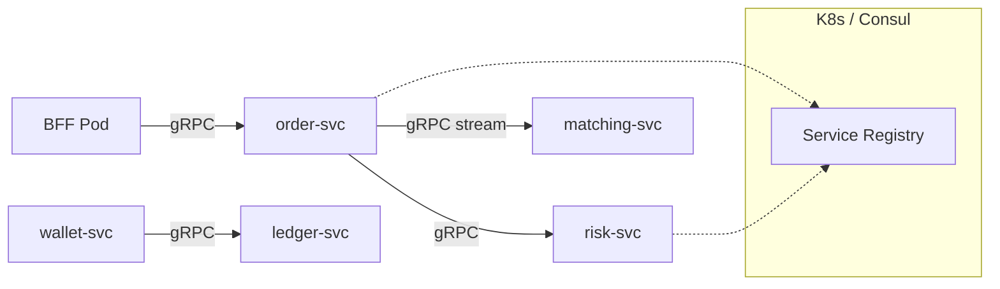

# 服务发现与 gRPC 服务间通信治理

## 30 秒版（开场）

> 交易所内网大量 **gRPC 短链路**（BFF→order、order→risk、wallet→ledger 查询）。服务发现常见：**K8s DNS + Headless Service**、**Consul/etcd**、或 **Mesh（xDS）**。Go 侧必配：**超时、重试（仅幂等）、keepalive、客户端 LB、OTel trace 透传**。关键词：**不用裸 IP、metadata 传 trace_id/user_id**。

## 3 分钟版（精讲深度）

1. **是什么**：微服务实例动态上下线时，调用方如何找到健康实例并完成可靠 RPC。
2. **为什么**：交易链路 P99 敏感；滚动发布频繁；实例数随行情波动。
3. **怎么做**：K8s 内 `order-svc.namespace.svc:50051`；客户端 resolver 订阅 endpoints；每 RPC `context.WithTimeout`。

## 10 分钟版

### 通信拓扑（交易所）



### 服务发现方案对比

| 方案 | 机制 | 交易所适用 |
|------|------|------------|
| K8s ClusterIP | kube-dns 解析 Service | **默认首选** |
| Headless + 客户端 LB | 拿全部 Pod IP 轮询/加权 | 撮合、行情低延迟 |
| Consul/etcd | 独立注册中心 | 多集群、混合云 |
| Istio xDS | Mesh 控制面下发 | 统一 mTLS/重试策略 |

### gRPC Go 治理清单

| 项 | 配置要点 |
|----|----------|
| 超时 | 每笔 RPC `ctx` 超时；BFF 聚合取 **最短子超时之和上限** |
| 重试 | **仅幂等读** 或带 `idempotency-key` 的写；下单 **禁止盲重试** |
| Keepalive | 防 NAT/LB 静默断连；`EnforcementPolicy.MinTime` |
| 负载均衡 | `grpc-go` round_robin + K8s resolver |
| 熔断 | client 侧 `gobreaker` 或 Mesh outlier detection |
| 序列化 | Protobuf；`decimal` 用 string 传输 |
| 元数据 | `traceparent`、`x-user-id`、`x-tenant-id` |

### 交易所 RPC 分类

| 调用 | 超时建议 | 重试 |
|------|----------|------|
| risk-svc 预检 | 50～100ms | 否 |
| ledger 余额查询 | 100ms | 是（读） |
| order 提交 | 200ms | 否（靠 clientOrderId 幂等） |
| wallet 冻结 | 300ms | 谨慎（查状态再重试） |

### K8s Headless 示例（讲解）

- `matching-svc` Headless：`dns:///matching-svc.trading.svc.cluster.local`
- Go `grpc.NewClient` + `round_robin` 负载到各撮合 Pod（每 Pod 负责 symbol 子集时改 **自定义 resolver/自定义 LB policy**）

## 生产场景

- **滚动发布**：readiness 通过后再进 endpoints；BFF 短暂 503 可接受
- **跨 AZ**：优先同 AZ 调用；ledger 写走主 AZ
- **DEX wallet→RPC**：非 gRPC，走 HTTP provider 池 + 熔断

## 深挖问答

1. **gRPC 和 REST 怎么选？** → 见 [S-NET-01](../06-network-governance/S-NET-01-grpc-vs-rest.md)；内网 gRPC，公网 REST。
2. **服务发现挂了怎么办？** → 客户端缓存 endpoints + 指数退避；K8s 本地 watch。
3. **大 payload（深度快照）？** → 压缩 gzip；或走 MQ 推增量。

## 反模式

- 硬编码 Pod IP
- 下单 RPC 默认重试 3 次 → 重复单
- 全链路无 deadline → 级联阻塞

## 代码示例

```go
conn, err := grpc.NewClient(
    "dns:///order-svc.trading.svc.cluster.local:50051",
    grpc.WithDefaultServiceConfig(`{"loadBalancingPolicy":"round_robin"}`),
    grpc.WithStatsHandler(otelgrpc.NewClientHandler()),
)
if err != nil {
    return err
}
defer conn.Close()

client := pb.NewRiskClient(conn)
callCtx, cancel := context.WithTimeout(ctx, 100*time.Millisecond)
defer cancel()
_, err = client.PreCheckRisk(callCtx, req)
```

## 延伸阅读

- [S-NET-01 gRPC vs REST](../06-network-governance/S-NET-01-grpc-vs-rest.md)
- [S-CLOUD-03 OpenTelemetry](../09-cloud-native/S-CLOUD-03-opentelemetry.md)
- [gRPC Go Quick Start](https://grpc.io/docs/languages/go/quickstart/)
