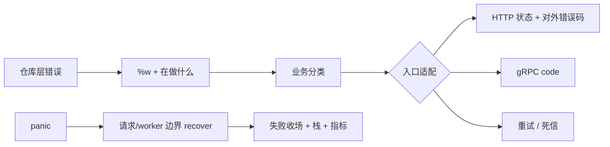

# 错误契约、Wrapping 与 Panic 边界

<a id="oral-card"></a>

## 要点卡

[返回高频核心锚点](../../high-frequency-roadmap.md)

!!! abstract "30 秒回答"

    Go 里的 `error` 不是随便写的一句话日志，而是告诉调用方「接下来该怎么做」的约定。
    对方需要按类型处理的错误，用稳定的哨兵错误、自定义类型或业务错误码；往上抛时用
    `%w` 包住原因，让 `errors.Is` / `errors.As` 还能认出来。`panic` 只留给「程序写坏了」
    或「没法继续保证正确」的情况；`recover` 只能救**当前这个 goroutine**，而且要放在
    请求/worker 边界：记日志、记栈，然后让这笔活失败收场，绝不能 recover 完假装成功。

**3 分钟展开**

1. **先想调用方会怎么做**：余额不足要拒绝、参数错要改请求、数据库抖了要重试、上下文取消要停、
   内部 bug 要告警——不同类型不能混成一句 `"failed"`。
2. **层层往上的分工**：仓库层保留原始原因，并写上「在干什么」（比如 debit）；服务层归类成业务含义；
   HTTP/gRPC/MQ 入口再翻译成状态码、重试或进死信队列。
3. **什么时候用 `%w`**：只有你愿意把「底层那个错误」也当成对外承诺时才 `%w`；否则转成自己的业务错误，
   别把数据库/驱动细节泄漏成公共 API。
4. **日志打一次就够**：谁最终处理或丢掉这个错误，谁打日志；中间层别层层 `log + return`。
   指标用少量固定分类码，别把整段错误原文塞进标签；密码、私钥绝不能进 error 字符串。

| 记忆槽 | 内容 |
|--------|------|
| 三个不变量 | 错误类型决定调用方动作；包装后还能 `Is/As`；panic 之后这笔活不能假装成功 |
| 手画图 | `仓库原因 → 业务分类 → HTTP/gRPC/MQ 映射`；旁路画 `panic → 边界 recover → 失败收场` |
| 项目落点 | 链 RPC / HSM / 发布接口：临时不可用可重试，策略拒绝要明确拒绝，内部不一致要告警并停手 |
| 一个取舍 | 暴露底层哨兵错误方便判断，但也等于长期兼容承诺，换实现会痛 |

**错误表达**

- ❌ 「所有 error 都 `%w`，每层都打日志；recover 一下返回 nil，服务就不会挂。」
- ✅ 「只暴露稳定约定，在处理边界打一次日志；recover 后结束当前请求/任务，按失败处理。」

**自测追问**：什么时候不要用 `%w`？为什么一个 goroutine 救不了另一个 goroutine 的 panic？

## 10 分钟版（原理 + 图示）

把错误想成「快递单」：下面写真实原因，上面贴「给谁看、该怎么处理」。



**对外稳定约定的三种写法**

| 方式 | 适合 | 注意 |
|------|------|------|
| 哨兵错误 `var ErrNotFound` | 就几种固定情况，不需要额外字段 | 一旦公开，换实现也要一直认它 |
| 自定义错误类型 | 还要带字段，比如多久后可重试、资源 ID | 调用方用 `errors.As` 取出 |
| 业务错误码 | 给前端/其他服务看的协议 | 对外码和内部原因分开，别把堆栈塞给客户端 |

```go
var ErrInsufficientBalance = errors.New("insufficient balance")

type RetryableError struct {
    After time.Duration
    Err   error
}

func (e *RetryableError) Error() string { return e.Err.Error() }
func (e *RetryableError) Unwrap() error { return e.Err }

func debit(ctx context.Context, repo Repository, id string) error {
    if err := repo.Debit(ctx, id); err != nil {
        // %w：保留原因，方便上层 errors.Is / As
        return fmt.Errorf("debit account %s: %w", id, err)
    }
    return nil
}
```

`errors.Join` 表示「好几件事同时出错了」，`Is/As` 会顺着错误树找。批量业务（一堆订单里谁成功谁失败）通常还是要逐条结果，不要指望一个 Join 代替明细。

**Typed nil 坑（看起来是 nil，其实不是）**

```go
func bad() error {
    var e *MyError
    return e // 装进 error 接口后，动态类型不是 nil，所以 err != nil
}
```

没有错误时直接 `return nil`，不要把「空的指针」塞进 `error`。

## 生产场景

- **数据库超时**：保留 `context.DeadlineExceeded` 这类原因，入口决定返回超时，并统计「依赖挂了」。
- **重复请求**：返回稳定的冲突结果（如 `ErrConflict`），别只返回含糊的 `"duplicate"` 字符串让人去猜。
- **Web3 签名服务**：HSM 暂时连不上 → 可重试；策略不允许签 → 明确业务拒绝；签名结果对不上 → 高危内部错误，必须失败收场，不能糊弄过去。

## 排查与工具

- 日志带上：在干什么、请求/trace ID、错误链；敏感参数和私钥材料绝不进 error。
- 指标按少量分类码聚合（超时、拒绝、依赖失败…）；原文只进日志。
- panic：记栈、构建版本、请求 ID，并告警；不要对所有 panic 自动傻重试。

## 架构取舍

公开库如果 `%w` 了某个底层哨兵错误，调用方可能开始依赖它——以后你想换数据库驱动，就得继续「假装」还是那个错误。  
所以：**只有打算把底层错误也写进对外约定时才 `%w`**；否则内部自己记日志，对外返回自己的业务错误。

## 深挖问答

1. **什么时候不用 `%w`？** → 不想把底层实现细节变成对外承诺时。
2. **`errors.Is` 和 `==` 差在哪？** → `Is` 会顺着 unwrap/Join 往下找；`==` 只比当前这一层。
3. **recover 之后还能从 panic 那一行继续跑吗？** → 不能。控制流回到边界；边界应结束当前请求/任务。程序状态已经可能坏了，别继续写库、转账。
4. **context 取消/超时要包装吗？** → 可以加上下文说明，但必须保证 `errors.Is(err, context.Canceled)` / `DeadlineExceeded` 仍然为真。
5. **每一层都要打日志吗？** → 不用。谁负责处理或最终丢掉，谁打一次；层层打印只会刷屏。

## 反模式与事故

- `if strings.Contains(err.Error(), "duplicate")`：文案一改逻辑就挂。
- 每层都 `log` 再 `return`：一次故障炸出一串重复日志。
- `recover()` 完返回 `nil`：上层以为成功，资金状态可能已经乱了。
- 用户输错参数、依赖超时也用 `panic`：把普通失败当成程序崩溃。

## 延伸阅读

- [Working with Errors in Go 1.13](https://go.dev/blog/go1.13-errors)
- [Errors are values](https://go.dev/blog/errors-are-values)
- [`errors` package](https://pkg.go.dev/errors)
