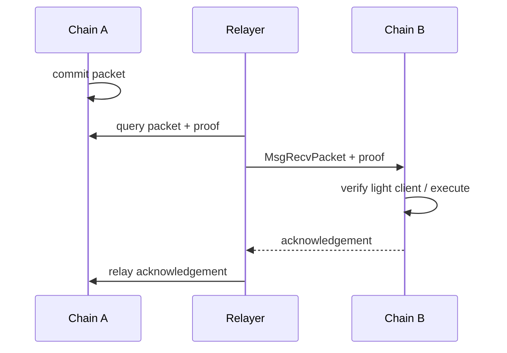

# Cosmos SDK、CometBFT、IBC 与账户 Sequence

## 30 秒版（开场）

> Cosmos SDK 是构建应用链的模块化状态机框架，CometBFT 负责共识与区块生产；不同 Cosmos 链启用的 modules、消息和参数并不相同。普通交易签名会绑定 chain ID、account number、sequence、fee/gas 和 messages，sequence 防重放并约束同一 signer 的并发。IBC 通过链上 light client、connection、channel、packet sequence、timeout 和 acknowledgement 传递已验证消息，relayer 只是搬运 proofs/packets，不是可信托管方。

## 3 分钟版（精讲深度）

1. **应用结构**：`x/bank`、staking、auth、IBC 等 modules 组合成链；不能看到 Cosmos 地址就假设支持同一消息。
2. **交易**：protobuf 编码，body messages + auth info + signatures；gas limit 与 fee denom 按链配置。
3. **Sequence**：同一账户并发广播需要集中 reservation 或链支持的特定扩展；错误恢复要重新查询 committed 与 mempool 状态。
4. **IBC**：packet 有 source/destination port/channel、sequence、data、timeout；目标链验证源链共识 proof。

## 10 分钟版（原理 + 图示）

**Sequence 并发**

账户 sequence 与 EVM nonce 相似之处是防重放和同账户顺序，但 mempool admission、CheckTx/ReCheckTx、fee market 和具体扩展不同。不能直接复用 EVM nonce manager。普通模型下：

1. 读取 account number + current sequence。
2. 持久化预占 sequence 和 unsigned payload。
3. 签名广播；明确 `sync/async/block` 等广播模式语义。
4. 通过 tx hash/事件和 committed sequence 对账。
5. sequence mismatch 时先查旧交易，再决定重签。

部分 SDK 版本/链可能提供 unordered transaction 等扩展，adapter 必须 capability-detect，不能当全生态通用能力。

**IBC token transfer**

源链通常 escrow 原生 token，目标链铸造代表该路径的 voucher；返回原路径时可 burn/unescrow。资产 identity 包含 denom trace/path，不应只按展示 symbol `ATOM/USDC` 合并。Timeout 后要走证明驱动的超时处理，不是简单数据库改失败。

**升级风险**

链升级可能改变 protobuf type URL、module 参数、minimum gas price、地址前缀、IBC channel 和 sign mode。钱包需维护 chain registry 的版本、genesis/network ID 和升级窗口。

## 生产场景

- 交易所充值 memo：某些链/账户模式用 memo/tag 区分用户，漏填可能需要人工归属。
- IBC 充值：同时记录源链 tx、channel/path、packet sequence、目标链 denom trace 和 ack。
- Validator/relayer：sequence 冲突与账户余额不足会阻塞多条操作，需独立运维账户和告警。

## 排查与工具

排查 `account sequence mismatch`、out of gas、insufficient fee、unknown message、timeout、client expired/frozen、channel closed。保存签名 bytes、type URLs、chain ID、account number、sequence 和广播模式。

## 架构取舍

统一 Cosmos adapter 可复用 protobuf、签名和基础查询，但每条链的 module/capability 配置必须独立；过度假设“Cosmos SDK 链都一样”会在升级和 IBC 路径上出事故。

## 深挖问答

1. **CometBFT 和 Cosmos SDK 谁负责什么？** → 前者共识/区块，后者应用状态机与 modules。
2. **Relayer 能伪造 IBC packet 吗？** → 正常协议下目标链验证 proof/light client；relayer 可延迟或不转发，但不能仅凭自述伪造有效状态。
3. **IBC 是普通 bridge multisig 吗？** → 不是；安全依赖链上 light client 和共识假设。
4. **symbol 相同就是同一资产吗？** → 否；denom trace、issuer、chain/path 都参与 identity。
5. **sequence too high 怎么办？** → 查前序是否缺失/未提交，不要无限提高 sequence。

## 反模式与事故

- 只按 Bech32 前缀判断链和资产。
- 同账户多实例各自读取 sequence 后并发签名。
- IBC 只存目标链 tx hash，丢失 packet/channel lineage。
- 链升级后仍用旧 protobuf/type URL，签名内容与展示不一致。

## 延伸阅读

- [Cosmos SDK application architecture](https://docs.cosmos.network/sdk/latest/learn/intro/sdk-app-architecture)
- [Transactions](https://docs.cosmos.network/sdk/latest/learn/concepts/transactions)
- [Accounts](https://docs.cosmos.network/sdk/latest/learn/concepts/accounts)
- [IBC Protocol](https://ibcprotocol.dev/)

